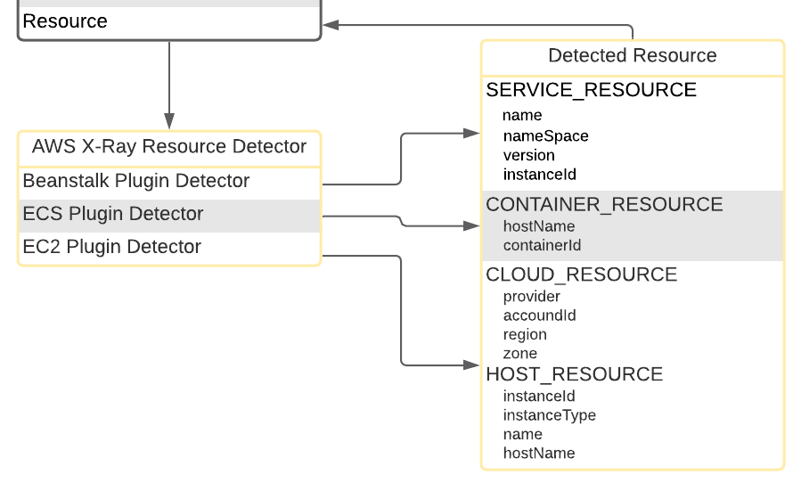

# Implementation Details and Test for AWS EC2 Plugin Resource Detector



## Implementation Details

Current implementation of opentelemetry-js repository follows the IDMSv1 rule while Java implementation follows IDMSv2 rule. So we will update current implementation to follow IDMSv2 rule.
In IDMSv1, it only do these things:

1. build a connection to 'http://169.254.169.254/latest/dynamic/instance-identity/document' to get responded with identity info
2. parse the response body and get attributes
3. assign attributes to corresponding resource constant
4. The corresponding implementation is shown below:

   ```
   const req = http.get(this.AWS_INSTANCE_IDENTITY_DOCUMENT_URI, res => {
      clearTimeout(timeoutId);
      const { statusCode } = res;
      res.setEncoding('utf8');
      let rawData = '';
      res.on('data', chunk => (rawData += chunk));
      res.on('end', () => {
        if (statusCode && statusCode >= 200 && statusCode < 300) {
          try {
            resolve(JSON.parse(rawData));
          } catch (e) {
            reject(e);
          }
        } else {
          reject(
            new Error('Failed to load page, status code: ' + statusCode)
          );
        }
      });
    });
   ```

Different from IDMSv1, in IDMSv2, we will first get the token from endpoint and also detect the host info

1. build a connection to 'http://169.254.169.254/latest/api/token' to get token.

   ```
     private async _fetchToken(): Promise<string> {
       const options = {
         host: this.AWS_IDMS_ENDPOINT,
         path: this.AWS_INSTANCE_TOKEN_DOCUMENT_PATH,
         method: 'PUT',
         timeout: 1000,
         headers: {
           'X-aws-ec2-metadata-token-ttl-seconds': '60',
         },
       };
       return await this._fetchString(options);
     }
   ```
2. using token and connect to 'http://169.254.169.254/latest/dynamic/instance-identity/document' to get identity.

   ```
     private async _fetchIdentity(token: string): Promise<any> {
       const options = {
         host: this.AWS_IDMS_ENDPOINT,
         path: this.AWS_INSTANCE_IDENTITY_DOCUMENT_PATH,
         method: 'GET',
         timeout: 1000,
         headers: {
           'X-aws-ec2-metadata-token': token,
         },
       };
       const identity = await this._fetchString(options);
       return JSON.parse(identity);
     }
   ```
3. using token and connect to ‘[http://169.254.169.254/latest/meta-data/hostname](http://169.254.169.254/latest/meta-data/hostname%E2%80%99)’ to get host info.

   ```
     private async _fetchHost(token: string): Promise<string> {
       const options = {
         host: this.AWS_IDMS_ENDPOINT,
         path: this.AWS_INSTANCE_HOST_DOCUMENT_PATH,
         method: 'GET',
         timeout: 1000,
         headers: {
           'X-aws-ec2-metadata-token': token,
         },
       };
       return await this._fetchString(options);
     }
   ```
7. parse the response body of identity and host info
5. assign attributes to corresponding resource constant

   ```
       try {
         const token = await this._fetchToken();
         const {
           accountId,
           instanceId,
           instanceType,
           region,
           availabilityZone,
         } = await this._fetchIdentity(token);
         const hostname = await this._fetchHost(token);
   
         return new Resource({
           [CLOUD_RESOURCE.PROVIDER]: 'aws',
           [CLOUD_RESOURCE.ACCOUNT_ID]: accountId,
           [CLOUD_RESOURCE.REGION]: region,
           [CLOUD_RESOURCE.ZONE]: availabilityZone,
           [HOST_RESOURCE.ID]: instanceId,
           [HOST_RESOURCE.TYPE]: instanceType,
           [HOST_RESOURCE.NAME]: hostname,
           [HOST_RESOURCE.HOSTNAME]: hostname,
         });
       } catch (e) {
         config.logger.debug(`AwsEc2Detector failed: ${e.message}`);
         return Resource.empty();
       }
   ```

Note that we use `_fetchString()` method to fetch information from `AWS_IDMS_ENDPOINT` and reduce code redundancy.

```
  private async _fetchString(options: http.RequestOptions): Promise<string> {
    return new Promise((resolve, reject) => {
      const timeoutId = setTimeout(() => {
        req.abort();
        reject(new Error('EC2 metadata api request timed out.'));
      }, 1000);

      const req = http.request(options, res => {
        clearTimeout(timeoutId);
        const { statusCode } = res;
        res.setEncoding('utf8');
        let rawData = '';
        res.on('data', chunk => (rawData += chunk));
        res.on('end', () => {
          if (statusCode && statusCode >= 200 && statusCode < 300) {
            try {
              resolve(rawData);
            } catch (e) {
              reject(e);
            }
          } else {
            reject(
              new Error('Failed to load page, status code: ' + statusCode)
            );
          }
        });
      });
      req.on('error', err => {
        clearTimeout(timeoutId);
        reject(err);
      });
      req.end();
    });
  }
```

Just as shown above, `_fetchToken()`, `_fetchIdentity()` and `_fetchHost()` are adjusting their connection and request header content by giving different options to `_fetchString()` method.
Also note that according to https://nodejs.org/api/http.html#http_http_request_options_callback, different from using `http.get()`, when using `http.request()` method, each time we finished this operation we should explicitly call `req.end()`.

## Test

For our EC2 detector, since we are fetching the information from latest AWS instance identity documentation, the content could be dynamic, so directly connecting with real AWS documentation for testing purpose can be really dumb choice.
Here, we choose to use `nock` library: https://github.com/nock/nock. Since it can mock backend and also mock the response when communicating. As shown below

```
const scope = nock('http://myapp.iriscouch.com')
  .get('/users/1')
  .reply(404)
  .post('/users', {
    username: 'pgte',
    email: 'pedro.teixeira@gmail.com',
  })
  .reply(201, {
    ok: true,
    id: '123ABC',
    rev: '946B7D1C',
  })
  .get('/users/123ABC')
  .reply(200, {
    _id: '123ABC',
    _rev: '946B7D1C',
    username: 'pgte',
    email: 'pedro.teixeira@gmail.com',
  })
```

In our case, we are able to use `nock` to assign different response to different paths in order to complete testing part. For instance, if we want to build a successful test case:

```
  describe('with successful request', () => {
    it('should return aws_ec2_instance resource', async () => {
      const scope = nock(AWS_HOST)
        .persist()
        .put(AWS_TOKEN_PATH)
        .matchHeader('X-aws-ec2-metadata-token-ttl-seconds', '60')
        .reply(200, () => mockedTokenResponse)
        .get(AWS_IDENTITY_PATH)
        .matchHeader('X-aws-ec2-metadata-token', mockedTokenResponse)
        .reply(200, () => mockedIdentityResponse)
        .get(AWS_HOST_PATH)
        .matchHeader('X-aws-ec2-metadata-token', mockedTokenResponse)
        .reply(200, () => mockedHostResponse);

      const resource: Resource = await awsEc2Detector.detect({
        logger: new NoopLogger(),
      });

      scope.done();

      assert.ok(resource);
      assertCloudResource(resource, {
        provider: 'aws',
        accountId: 'my-account-id',
        region: 'my-region',
        zone: 'my-zone',
      });
      assertHostResource(resource, {
        id: 'my-instance-id',
        hostType: 'my-instance-type',
        name: 'my-hostname',
        hostName: 'my-hostname',
      });
    });
  });
```

We could use chaining and also verify the request header by using `.matchHeader()` method, and after get `Resource` instance, we can verify the content by using OTel built-in asserting methods like `assertCloudResource` and `assertHostResource`.
Also note that before each test case we ought to stop net connection and clean Nock, while after each test case we could restart net connections:

```javascript
  beforeEach(() => {
    nock.disableNetConnect();
    nock.cleanAll();
  });

  afterEach(() => {
    nock.enableNetConnect();
  });
```