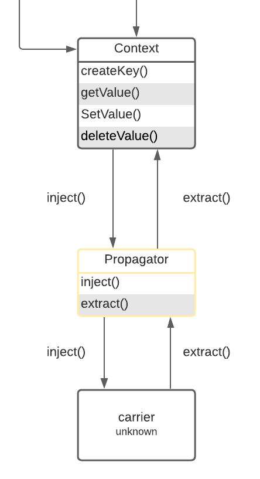

# Implementation Details and Test for AWS X-Ray Propagator



## Implementation Details

Since our goal is to implement a propagator that conforms with the X-Ray trace header format. According to the AWS X-Ray tracing header documentation (link in appendix), an example tracing header shown below:

```
`X-Amzn-Trace-Id: Root=1-5759e988-bd862e3fe1be46a994272793;Parent=53995c3f42cd8ad8;Sampled=1`
```

According to the example tracing header format, we have parameters for tracing header

```
export const AWSXRAY_TRACE_ID_HEADER = 'X-Amzn-Trace-Id';

const TRACE_HEADER_DELIMITER = ';';
const KV_DELIMITER = '=';

const TRACE_ID_KEY = 'Root';
const TRACE_ID_LENGTH = 35;
const TRACE_ID_VERSION = '1';
const TRACE_ID_DELIMITER = '-';
const TRACE_ID_DELIMITER_INDEX_1 = 1;
const TRACE_ID_DELIMITER_INDEX_2 = 10;
const TRACE_ID_FIRST_PART_LENGTH = 8;

const PARENT_ID_KEY = 'Parent';

const SAMPLED_FLAG_KEY = 'Sampled';
const SAMPLED_FLAG_LENGTH = 1;
const IS_SAMPLED = '1';
const NOT_SAMPLED = '0';
```

Corresponding to design doc: [Design Docs for AWS X-Ray Propagator](https://quip-amazon.com/WuqFA7ajKKWz)
Here we further separate implementation details into 3 parts:

1. Implementation details for `inject` function
2. Implementation details for `extract` function
3. Non-Goal: setup AWS X-Ray propagator package in the team repository

### Inject

To complete an `inject` operation, following the steps below,

1. get span from `context`
2. get `spanContext` from span (first 2 steps is separated in Java but combined in JS), after this step we get `spanContext`:
    ```
    export interface SpanContext {
      /**
       * The ID of the trace that this span belongs to. It is worldwide unique
       * with practically sufficient probability by being made as 16 randomly
       * generated bytes, encoded as a 32 lowercase hex characters corresponding to
       * 128 bits.
       */
      traceId: string;
      /**
       * The ID of the Span. It is globally unique with practically sufficient
       * probability by being made as 8 randomly generated bytes, encoded as a 16
       * lowercase hex characters corresponding to 64 bits.
       */
      spanId: string;
      /**
       * Only true if the SpanContext was propagated from a remote parent.
       */
      isRemote?: boolean;
      /**
       * Trace flags to propagate.
       *
       * It is represented as 1 byte (bitmap). Bit to represent whether trace is
       * sampled or not. When set, the least significant bit documents that the
       * caller may have recorded trace data. A caller who does not record trace
       * data out-of-band leaves this flag unset.
       *
       * SAMPLED = 0x1 and NONE = 0x0;
       */
      traceFlags: TraceFlags;
      /**
       * Tracing-system-specific info to propagate.
       *
       * The tracestate field value is a `list` as defined below. The `list` is a
       * series of `list-members` separated by commas `,`, and a list-member is a
       * key/value pair separated by an equals sign `=`. Spaces and horizontal tabs
       * surrounding `list-members` are ignored. There can be a maximum of 32
       * `list-members` in a `list`.
       * More Info: https://www.w3.org/TR/trace-context/#tracestate-field
       *
       * Examples:
       *     Single tracing system (generic format):
       *         tracestate: rojo=00f067aa0ba902b7
       *     Multiple tracing systems (with different formatting):
       *         tracestate: rojo=00f067aa0ba902b7,congo=t61rcWkgMzE
       */
      traceState?: TraceState;
    }
    ```
3. get the `spanId` and `TraceId` from `spanContext` and finally make a AWS X-Ray Tracing Header following the standard format.
4. using `setter` function to set header.

The implementation of these steps is shown:

```
inject(context: Context, carrier: unknown, setter: SetterFunction) {
    const spanContext = getParentSpanContext(context);
    if (!spanContext || !isValid(spanContext)) return;

    const otTraceId = spanContext.traceId;
    const xrayTraceId =
      TRACE_ID_VERSION +
      TRACE_ID_DELIMITER +
      otTraceId.substring(0, TRACE_ID_FIRST_PART_LENGTH) +
      TRACE_ID_DELIMITER +
      otTraceId.substring(TRACE_ID_FIRST_PART_LENGTH);
    const parentId = spanContext.spanId;
    const samplingFlag = spanContext.traceFlags ? IS_SAMPLED : NOT_SAMPLED;
    // TODO: Add OT trace state to the X-Ray trace header

    const traceHeader =
      TRACE_ID_KEY +
      KV_DELIMITER +
      xrayTraceId +
      TRACE_HEADER_DELIMITER +
      PARENT_ID_KEY +
      KV_DELIMITER +
      parentId +
      TRACE_HEADER_DELIMITER +
      SAMPLED_FLAG_KEY +
      KV_DELIMITER +
      samplingFlag;

    setter(carrier, AWSXRAY_TRACE_ID_HEADER, traceHeader);
  }
```

### Extract

As for AWS X-Ray `extract` method, it is far more complicated than `inject` method.

1. First, get the tracing header. Here, the exisiting Java implementation constraint the return type to be “String”, while in JS implementation, the `GetterFunction` type constraint the return value to be “unknown”. This can be fairly essential because all the subsequent process is based on “The returned tracing header is String” assumption. In order to tackle this problem, we add another condition sentence to make sure tracing header is a String type. This part of code is shown below:

    ```
    const traceHeader = getter(carrier, AWSXRAY_TRACE_ID_HEADER);
    if (!traceHeader || typeof traceHeader !== 'string') return INVALID_SPAN_CONTEXT;
    ```
3. Then split the string received and by using delimiter “;” and judge the header to get corresponding info
3. Judge whether the extracted traceId, spanId and traceFlags(optional in JavaScript) is valid or not

    ```
    if (trimmedPart.startsWith(TRACE_ID_KEY)) {
      parsedTraceId = this._parseTraceId(value);
    }
    if (trimmedPart.startsWith(PARENT_ID_KEY)) {
      parsedSpanId = this._parseSpanId(value);
    }
    if (trimmedPart.startsWith(SAMPLED_FLAG_KEY)) {
      parsedTraceFlags = this._parseTraceFlag(value);
    }
    ```
4. Create `spanContex`t by using the information above and validate it

    ```
    const resultSpanContext: SpanContext = {
       traceId: parsedTraceId,
       spanId: parsedSpanId,
       traceFlags: parsedTraceFlags,
       isRemote: true,
     };
     if (!isValid(resultSpanContext)) {
       return INVALID_SPAN_CONTEXT;
     }
    ```
8. Finally use `setExtractedSpanContext(context, spanContext)` to return a extracted content.

The implementation of these steps is shown:

```
  extract(context: Context, carrier: unknown, getter: GetterFunction): Context {
    const spanContext = this.getSpanContextFromHeader(carrier, getter);
    if (!isValid(spanContext)) return context;

    return setExtractedSpanContext(context, spanContext);
  }

  private getSpanContextFromHeader(
    carrier: unknown,
    getter: GetterFunction
  ): SpanContext {
    const traceHeader = getter(carrier, AWSXRAY_TRACE_ID_HEADER);
    // Only if the returned traceHeader is no empty string can be extracted
    if (!traceHeader || typeof traceHeader !== 'string')
      return INVALID_SPAN_CONTEXT;

    let pos = 0;
    let trimmedPart: string;
    let parsedTraceId = INVALID_TRACE_ID;
    let parsedSpanId = INVALID_SPAN_ID;
    let parsedTraceFlags = null;
    while (pos < traceHeader.length) {
      const delimiterIndex = traceHeader.indexOf(TRACE_HEADER_DELIMITER, pos);
      if (delimiterIndex >= 0) {
        trimmedPart = traceHeader.substring(pos, delimiterIndex).trim();
        pos = delimiterIndex + 1;
      } else {
        //last part
        trimmedPart = traceHeader.substring(pos).trim();
        pos = traceHeader.length;
      }
      const equalsIndex = trimmedPart.indexOf(KV_DELIMITER);

      const value = trimmedPart.substring(equalsIndex + 1);

      if (trimmedPart.startsWith(TRACE_ID_KEY)) {
        parsedTraceId = this._parseTraceId(value);
      }
      if (trimmedPart.startsWith(PARENT_ID_KEY)) {
        parsedSpanId = this._parseSpanId(value);
      }
      if (trimmedPart.startsWith(SAMPLED_FLAG_KEY)) {
        parsedTraceFlags = this._parseTraceFlag(value);
      }
    }
    if (parsedTraceFlags === null) {
      return INVALID_SPAN_CONTEXT;
    }
    const resultSpanContext: SpanContext = {
      traceId: parsedTraceId,
      spanId: parsedSpanId,
      traceFlags: parsedTraceFlags,
      isRemote: true,
    };
    if (!isValid(resultSpanContext)) {
      return INVALID_SPAN_CONTEXT;
    }
    return resultSpanContext;
  }
```

### Repository Setup

This part is same as “Setup environment under team repository” section of [Implementation Details and Testing Part for AWS X-Ray IdGenerator](https://quip-amazon.com/CTCbAFNJxsF9)

## Test

Test different functionality, one thing needs to be mentioned here, when we use `setExtractedSpanContext(context, spanContext), getExtractedSpanContext(context)`, both of them in the test part will take use of `Context.ROOT_CONTEXT`, which can be referred in Root Context file (link in appendix).
Another thing needs to be mentioned that to save space usage, all the test cases are using common `carrier` instance, so each time before starting to test, we need to clean the `carrier`

```
  let carrier: { [key: string]: unknown };

  beforeEach(() => {
    carrier = {};
  });
```

Generally, we use the same way in “Test” section of [Implementation Details and Testing Part for AWS X-Ray IdGenerator](https://quip-amazon.com/CTCbAFNJxsF9)
An example is shown below:

```
  describe('.inject()', () => {
    it('should inject sampled context', () => {
      const spanContext: SpanContext = {
        traceId: TRACE_ID,
        spanId: SPAN_ID,
        traceFlags: SAMPLED_TRACE_FLAG,
      };
      xrayPropagator.inject(
        setExtractedSpanContext(Context.ROOT_CONTEXT, spanContext),
        carrier,
        defaultSetter
      );

      assert.deepStrictEqual(
        carrier[AWSXRAY_TRACE_ID_HEADER],
        'Root=1-8a3c60f7-d188f8fa79d48a391a778fa6;Parent=53995c3f42cd8ad8;Sampled=1'
      );
    });
```

## Appendix

The specification for propagators can be found: https://github.com/open-telemetry/opentelemetry-specification/blob/b338f9f63dbf02ff8ebd100e8a847e7bf43e2682/specification/context/api-propagators.md
Javascript propagation API: https://github.com/open-telemetry/opentelemetry-js/blob/master/packages/opentelemetry-api/src/context/propagation/HttpTextPropagator.ts
The standard of format can be found: https://docs.aws.amazon.com/xray/latest/devguide/xray-concepts.html#xray-concepts-tracingheader
Java Implementation: https://github.com/open-telemetry/opentelemetry-java/blob/a59748a904e0cb1e2e4f8df50dd346a82f26ff1e/extensions/trace_propagators/src/main/java/io/opentelemetry/extensions/trace/propagation/AwsXRayPropagator.java#L51
The API to be used can be found:  https://github.com/open-telemetry/opentelemetry-js/tree/master/packages/opentelemetry-api/src/context/propagation
Root Context can be found: https://github.com/open-telemetry/opentelemetry-js/blob/e9b2cf9aeb1daf5ffbab800681bfe1cafc636576/packages/opentelemetry-context-base/src/context.ts