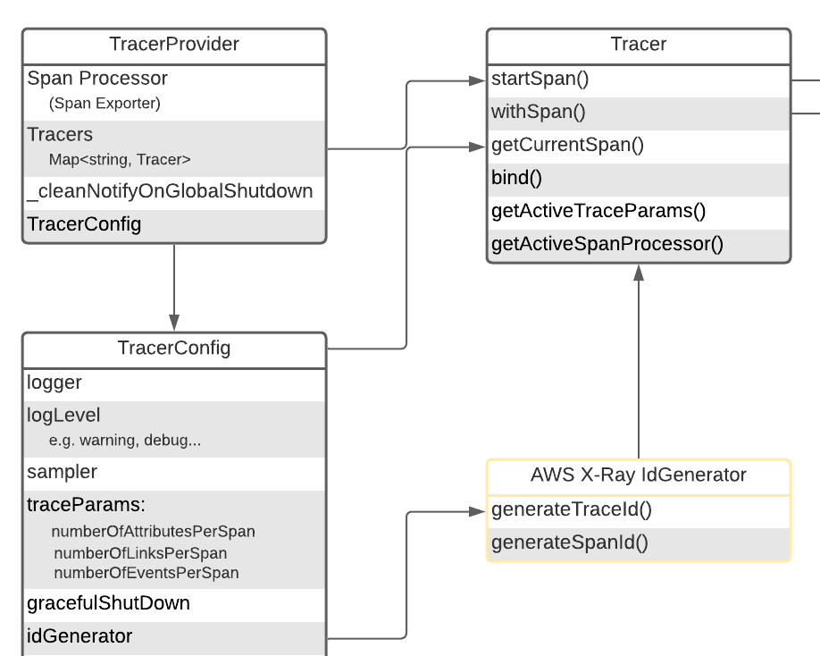

# Implementation Details and Testing Part for AWS X-Ray IdGenerator



## Implementation Details:

Corresponding to Design doc: [Design Docs for AWS X-Ray IdGenerator](https://quip-amazon.com/3b2tAUBJ3TcT)
Implementation details is separated into 3 tasks:

1. First Non-Goals: migrating original IdGeneration function to configurable version
2. Goals: Implementation details of AWS X-Ray IdGenerator
3. Second Non-Goal: setup environment under team repository

### 1. Migrating Original IdGenerator

The implementation details of this task can be further separated into 3 parts:

1. Add standard interface to `opentelemetry-js/packages/opentelemetry-core/trace` for all `IdGenerator`:

    ```
    /** IdGenerator provides an interface for generating Trace Id and Span Id */
    export interface IdGenerator {
      /** Returns a trace ID composed of 32 lowercase hex characters. */
      generateTraceId(): string;
      /** Returns a span ID composed of 16 lowercase hex characters. */
      generateSpanId(): string;
    }
    ```
2. Re-implement `randomIdGenerator`:
    1. Node Version 
        1. Using `crypto` library to generate random bytes:
        
            ```
            import * as crypto from 'crypto';
            import { IdGenerator } from '../../trace/IdGenerator';
            
            const SPAN_ID_BYTES = 8;
            const TRACE_ID_BYTES = 16;
            
            export class RandomIdGenerator implements IdGenerator {
              /**
               * Returns a random 16-byte trace ID formatted/encoded as a 32 lowercase hex
               * characters corresponding to 128 bits.
               */
              generateTraceId(): string {
                return crypto.randomBytes(TRACE_ID_BYTES).toString('hex');
              }
            
              /**
               * Returns a random 8-byte span ID formatted/encoded as a 16 lowercase hex
               * characters corresponding to 64 bits.
               */
              generateSpanId(): string {
                return crypto.randomBytes(SPAN_ID_BYTES).toString('hex');
              }
            }
            ```
    2. Web Version 
        1. Different from node version, since different browser may support different library, in order to make sure we are taking use of a valid crypto library, we do following things:

              ```
              type WindowWithMsCrypto = Window & {
                msCrypto?: Crypto;
              };
              const cryptoLib = window.crypto || (window as WindowWithMsCrypto).msCrypto;
              ```
        2. Also, in web version Javascript, if we do:

              ```
              randomBytesArray.toString('hex')
              ```
        3. This operation will ignore ‘hex’ keyword and directly stringify uint8 numbers in the BytesArray into string. In this case, we need to transfer the uint8 number in BytesArray by hand in the first place:

              ```
              toHex(byteArray: Uint8Array) {
                  const chars: number[] = new Array(byteArray.length * 2);
                  const alpha = 'a'.charCodeAt(0) - 10;
                  const digit = '0'.charCodeAt(0);
              
                  let p = 0;
                  for (let i = 0; i < byteArray.length; i++) {
                    let nibble = (byteArray[i] >>> 4) & 0xf;
                    chars[p++] = nibble > 9 ? nibble + alpha : nibble + digit;
                    nibble = byteArray[i] & 0xf;
                    chars[p++] = nibble > 9 ? nibble + alpha : nibble + digit;
                  }
                  return String.fromCharCode.apply(null, chars);
                }
              ```
        4. Combine all these things together, we have the web version implementation:

              ```
              type WindowWithMsCrypto = Window & {
                msCrypto?: Crypto;
              };
              const cryptoLib = window.crypto || (window as WindowWithMsCrypto).msCrypto;
              const SPAN_ID_BYTES = 8;
              const TRACE_ID_BYTES = 16;
              const randomBytesArray = new Uint8Array(TRACE_ID_BYTES);
              
              export class RandomIdGenerator implements IdGenerator {
                /**
                 * Returns a random 16-byte trace ID formatted/encoded as a 32 lowercase hex
                 * characters corresponding to 128 bits.
                 */
                generateTraceId(): string {
                  cryptoLib.getRandomValues(randomBytesArray);
                  return this.toHex(randomBytesArray.slice(0, TRACE_ID_BYTES));
                }
              
                /**
                 * Returns a random 8-byte span ID formatted/encoded as a 16 lowercase hex
                 * characters corresponding to 64 bits.
                 */
                generateSpanId(): string {
                  cryptoLib.getRandomValues(randomBytesArray);
                  return this.toHex(randomBytesArray.slice(0, SPAN_ID_BYTES));
                }
              
                /**
                 * Get the hex string representation of a byte array
                 *
                 * @param byteArray
                 */
                private toHex(byteArray: Uint8Array) {
                  const chars: number[] = new Array(byteArray.length * 2);
                  const alpha = 'a'.charCodeAt(0) - 10;
                  const digit = '0'.charCodeAt(0);
              
                  let p = 0;
                  for (let i = 0; i < byteArray.length; i++) {
                    let nibble = (byteArray[i] >>> 4) & 0xf;
                    chars[p++] = nibble > 9 ? nibble + alpha : nibble + digit;
                    nibble = byteArray[i] & 0xf;
                    chars[p++] = nibble > 9 ? nibble + alpha : nibble + digit;
                  }
                  return String.fromCharCode.apply(null, chars);
                }
              }
              ```
3. Make `IdGenerator` a configurable component in `TracerProvider`:
    1. In order to do this, we need to add `IdGenerator` attribute to `TracerConfig` and let Tracer to use user-config `IdGenerator`.
        1. In `opentelemetry-js/packages/opentelemetry-tracing/src/types.ts`, modify TracerConfig:

              ```
              /**
               * TracerConfig provides an interface for configuring a Basic Tracer.
               */
              export interface TracerConfig {
                ...
                /**
                 * Generator of trace and span IDs
                 * The default idGenerator generates random ids
                 */
                idGenerator?: IdGenerator;
              }
              ```
        2. In `opentelemetry-js/packages/opentelemetry-tracing/src/Tracer.ts`, modify Tracer:

              ```
              export class Tracer implements api.Tracer {
                ...
                private readonly _idGenerator: IdGenerator;
                ...
              
                /**
                 * Constructs a new Tracer instance.
                 */
                constructor(
                  instrumentationLibrary: InstrumentationLibrary,
                  config: TracerConfig,
                  private _tracerProvider: BasicTracerProvider
                ) {
                  ...
                  this._idGenerator = config.idGenerator || new RandomIdGenerator();
                  ...
                }
              ```

### 2. AWS X-Ray IdGenerator

As illustrated in design doc, we basically need to implement both web and node version of IdGenerator:

**Node Version**
Following the interface and core function defined in design doc, we have the final implementation of IdGenerator:

```
const SPAN_ID_BYTES = 8;
const TRACE_ID_BYTES = 16;
const TIME_BYTES = 4;

/** IdGenerator that generates trace IDs conforming to AWS X-Ray format.
 * https://docs.aws.amazon.com/xray/latest/devguide/xray-api-sendingdata.html#xray-api-traceids
 */
export class AwsXrayIdGenerator implements IdGenerator {
  /**
   * Returns a random 16-byte trace ID formatted/encoded as a 32 lowercase hex
   * characters corresponding to 128 bits. The first 4 bytes correspond to the current
   * time, in seconds, as per X-Ray trace ID format.
   */
  generateTraceId(): string {
    const nowSec = Math.floor(Date.now() / 1000).toString(16);
    return (
      nowSec + crypto.randomBytes(TRACE_ID_BYTES - TIME_BYTES).toString('hex')
    );
  }

  /**
   * Returns a random 8-byte span ID formatted/encoded as a 16 lowercase hex
   * characters corresponding to 64 bits.
   */
  generateSpanId(): string {
    return crypto.randomBytes(SPAN_ID_BYTES).toString('hex');
  }
}
```

Intuitively, for `generateTraceId()` method

1. Get current time
2. Transfer the unit of time from millisecond to second
3. Encode the number from decimal number to heximal string
4. Generate 12 bytes randomly and transfer into heximal string
5. combine these 2 parts together and return the result

As for `generateSpanId()` method, it uses the same implementation as `RandomIdGenerator()`.

**Web Version**
As illustrated in Migrating IdGenerator task, different from node version, in web version we need to make sure the availability of `crypto` library and transfer uint8 number to heximal by hand. Generally, the web version mostly take use of the RandomIdGenerator, while web version also uses the same way to encode current time into heximal string.
The implementation is shown below:

```
/** IdGenerator that generates trace IDs conforming to AWS X-Ray format.
 * https://docs.aws.amazon.com/xray/latest/devguide/xray-api-sendingdata.html#xray-api-traceids
 */
export class AwsXrayIdGenerator implements IdGenerator {
  /**
   * Returns a random 16-byte trace ID formatted/encoded as a 32 lowercase hex
   * characters corresponding to 128 bits. The first 4 bytes correspond to the current
   * time, in seconds, as per X-Ray trace ID format.
   */
  generateTraceId(): string {
    const nowSec = Math.floor(Date.now() / 1000).toString(16);
    cryptoLib.getRandomValues(randomBytesArray);
    return (
      nowSec +
      this.toHex(randomBytesArray.slice(0, TRACE_ID_BYTES - TIME_BYTES))
    );
  }

  /**
   * Returns a random 8-byte span ID formatted/encoded as a 16 lowercase hex
   * characters corresponding to 64 bits.
   */
  generateSpanId(): string {
    ...
  }

  /**
   * Get the hex string representation of a byte array
   *
   * @param byteArray
   */
  private toHex(byteArray: Uint8Array) {
    ...
  }
}
```

### 3. Setup environment under team repository

After exhaustive discussion, OpenTelemetry-JS team decided not to host any vendor-specific `IdGenerator` component, so we need to build a repository of AWS own. There are several JavaScript specific things need to be mentioned here:
The standard file structure for each package should looks like:

opentelemetry-id-generator-aws-xray
|
|----------src----------XXX.ts
|----------test----------XXX.test.ts
|----------package.json && package-lock.json
|----------tsconfig.json
|----------eslintrc.js
|----------karma.conf.js

`src&&test`
Like in all other languages, `src` is the folder to hold source code and `test` is the folder to hold corresponding test code.

`package.json && package-lock.json`
package.json is a file which stores important information such as package name, description, author, license, dependencies and so on. Normally it will be built automatically by running `npm init` command. In our case, since we have a lot of common dependencies and scripts to define, we borrow most of code from opentelemetry-js repository.
And basically, package-lock.json is used to optimize the installation process by allowing npm to skip repeated metadata resolutions for previously-installed packages.

`tsconfig.json`
The presence of a `tsconfig.json` file in a directory indicates that the directory is the root of a TypeScript project. The `tsconfig.json` file specifies the root files and the compiler options required to compile the project. In our case, the preference is shown below:

```
{
  "extends": "../../tsconfig.base",
  "compilerOptions": {
    "rootDir": ".",
    "outDir": "build"
  },
  "include": [
    "src/**/*.ts",
    "test/**/*.ts"
  ]
}
```

`eslintrc.js`
This is another custom-defined configuration file to check our coding style.

`karma.conf.js`
Karma is a console tool for running tests, which can track source code changes and display the percentage of code tests coverage. It is adjusted using the configuration file `karma.conf.js`, where the paths to tested files and to the files with tests should be specified.


## Test:

Reference: https://www.bignerdranch.com/blog/why-do-javascript-test-frameworks-use-describe-and-beforeeach/
With RSpec-style tests, we have an explicit API of methods/functions that you use to define tests, groups, and setup blocks. 
`decribe()`
This keyword is a nesting method, allows us to gather our tests into separate groupings within the same file.
In JS, for unit tests it’s most common to have one test file per production class.

`beforeEach()`
This keywork provide a place to do setup for tested functionality. For instance, if we would like to test multiple result value (like an result instance), we may use beforeEach() to first setup and obtain the result instance and use it to test the value within the instance separately.
`it()`
tests are named with strings, not method names. This encourages using natural language for your test case names (`it('throws an exception when invalid input is provided')`), rather than an abbreviated method-name style (`function testInvalidInput`).

The whole bunch of code will looks like:

```
describe('AwsXRaySpanId', () => {
  let spanId1: string, spanId2: string;
  beforeEach(() => {
    spanId1 = idGenerator.generateSpanId();
    spanId2 = idGenerator.generateSpanId();
  });

  it('returns 16 character hex strings', () => {
    assert.ok(spanId1.match(/[a-f0-9]{16}/));
    assert.ok(!spanId1.match(/^0+$/));
  });

  it('returns different ids on each call', () => {
    assert.notDeepStrictEqual(spanId1, spanId2);
  });
```

In our case, for `generateTraceId()` method, we also verify the correctness of time encoding:

```
describe('AwsXRayTraceId', () => {
  let traceId1: string, traceId2: string;
  let prevTime: number, currTime: number, nextTime: number;
  beforeEach(() => {
    prevTime = ...
    traceId1 = idGenerator.generateTraceId();
    currTime = parseInt(traceId1.substring(0, 8), 16);
    nextTime = ...
    traceId2 = idGenerator.generateTraceId();
  });

  it('returns 32 character hex strings', () => {
    ...
  });

  it('returns different ids on each call', () => {
    assert.notDeepStrictEqual(traceId1, traceId2);
  });

  it('using current time to encode trace id', () => {
    assert.ok(currTime >= prevTime);
    assert.ok(currTime <= nextTime);
  });
});
```

We do this by selecting 3 different times:

1. Before generating trace ID, take current time as `prevTime`
2. After generating trace ID, decode it and take it as `currTime`
3. Then after operations above, take the time now as `nextTime`
4. Finally make sure `nextTime` >= `currTime` >= `prevTime`