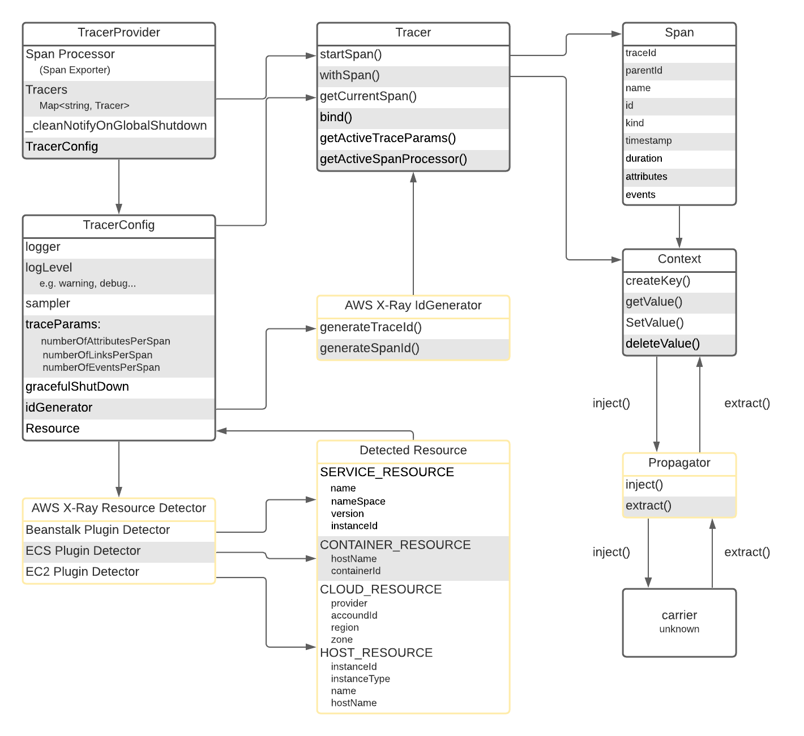
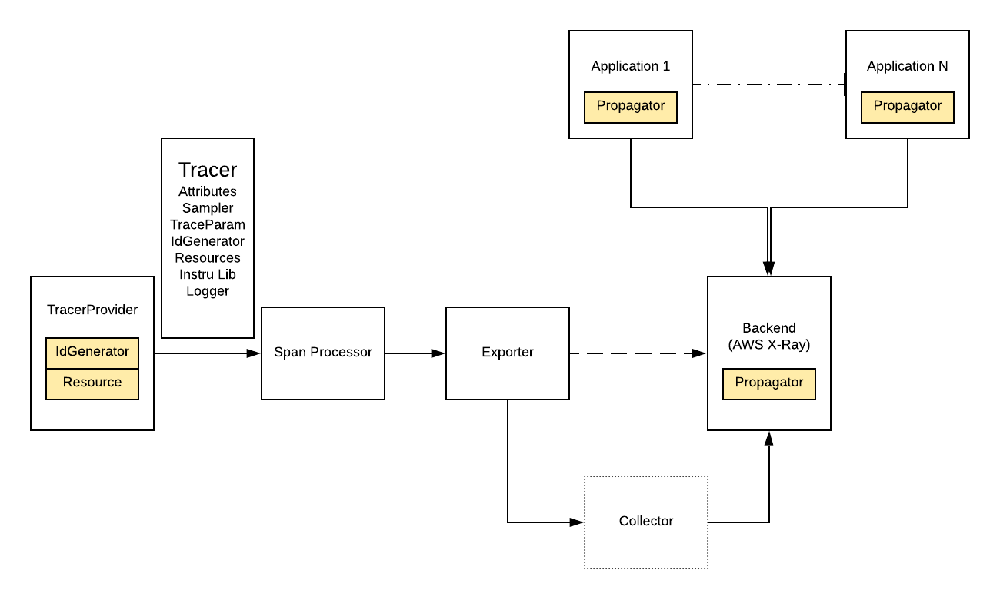
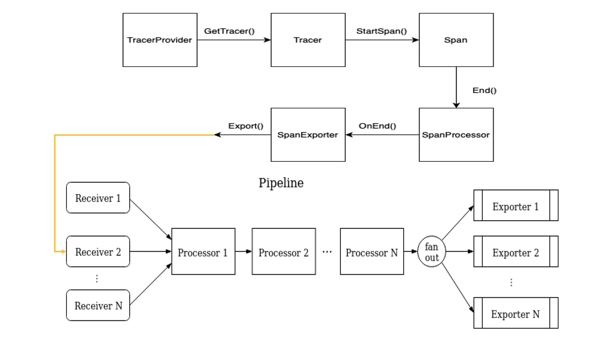
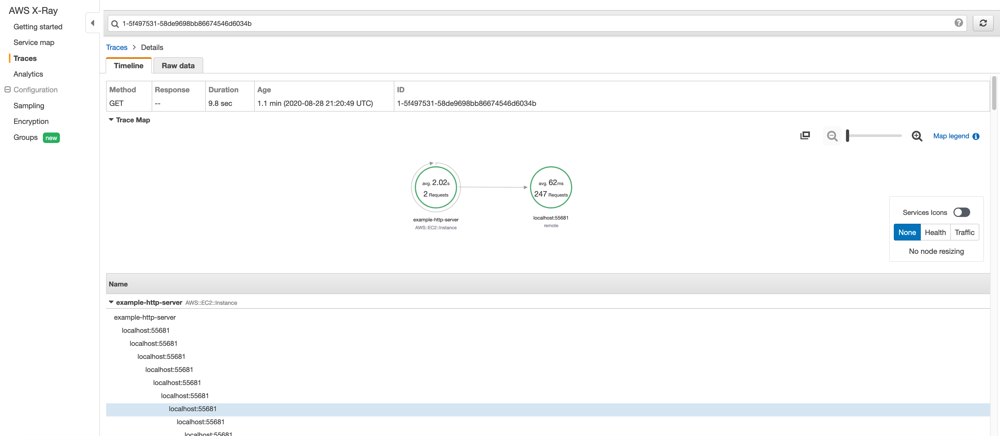
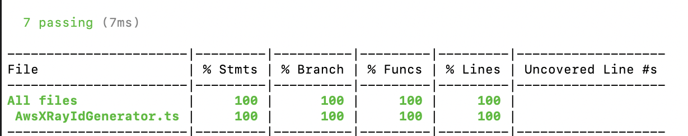
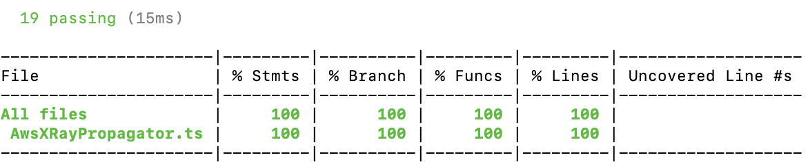
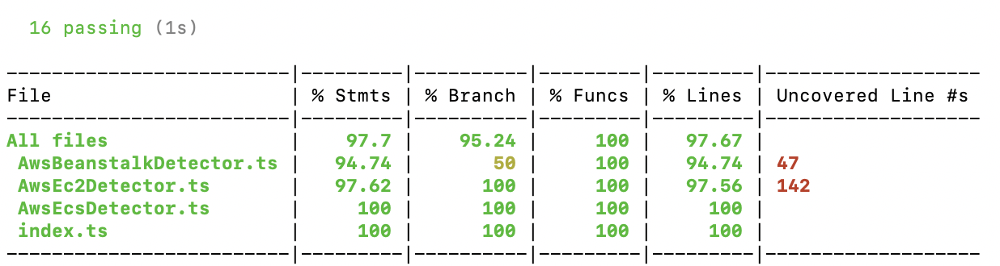

## Integrating OpenTelemetry JS SDK With AWS X-Ray

## Table of Contents

* [Architecture Overview](https://github.com/open-o11y/docs/blob/master/Integrating-OpenTelemetry-JS-SDK-with-AWS-X-Ray/README.md#architecture-overview)
   * [Note on Conmponent Details](https://github.com/open-o11y/docs/blob/master/Integrating-OpenTelemetry-JS-SDK-with-AWS-X-Ray/README.md#note-on-component-details)
* [Data Path](https://github.com/open-o11y/docs/blob/master/Integrating-OpenTelemetry-JS-SDK-with-AWS-X-Ray/README.md#data-path)
* [Usage](https://github.com/open-o11y/docs/blob/master/Integrating-OpenTelemetry-JS-SDK-with-AWS-X-Ray/README.md#usage)
* [Repository Structure](https://github.com/open-o11y/docs/blob/master/Integrating-OpenTelemetry-JS-SDK-with-AWS-X-Ray/README.md#repository-structure)
* [Testing](https://github.com/open-o11y/docs/blob/master/Integrating-OpenTelemetry-JS-SDK-with-AWS-X-Ray/README.md#testing)
* [Outstanding Tasks](https://github.com/open-o11y/docs/blob/master/Integrating-OpenTelemetry-JS-SDK-with-AWS-X-Ray/README.md#outstanding-tasks)
* [Reference Doucments](https://github.com/open-o11y/docs/blob/master/Integrating-OpenTelemetry-JS-SDK-with-AWS-X-Ray/README.md#reference-documents)


## Architecture Overview



### Note on Component Details

As shown in the diagram above, the components with yellow frames are what I built. This diagram is mainly to show how our components interact with OpenTelemetry built-in Components:

* AWS X-Ray IdGenerator

  * By default, OpenTelemetry is using `RandomIdGenerator` to generate 16-byte trace ID and 8-byte span ID randomly

  * In `AwsXRayIdGenerator`, we also generate 8-byte span ID randomly. But for trace ID, we first take the current time as the start time of trace, then transform the unit of timestamp from millisecond to second, finally encode timestamp to 4-byte hexadecimal string. We combine the encoded 4-byte timestamp string with randomly generated 12-byte string and get the generated trace ID

  * `AwsXRayIdGenerator` is **mandatory** for our pipeline, because AWS X-Ray will decode the first 4-byte string back to timestamp, and reject the trace data started over 30 days ago. If we use `RandomIdGenerator`, X-Ray will reject most of generated trace data

  * e.g.

    ```
    Current time is
    Mon Aug 31 2020 22:44:03 GMT-0500 (Central Daylight Time)
    
    Millisecond: 1598931843522
    
    Hexadecimal String: 5f4dc383
    
    Sample Trace ID:
    5f4da03670e8e0e63340343f13f40ea0
    ```

* AWS X-Ray Propagator

  * Cross-cutting concerns send state to next process using propagator, mainly read and write context data to and from messages exchanged by applications

  * `inject()` method first take `spanContext` from `Context`, then use the information such as `traceId`, `spanId` and `tracerFlags` held by `spanContext` to build a tracing header following AWS X-Ray standard and finally inject the tracing header into `carrier`

  * `extract()` method do the reverse thing. We first extract tracing header from `carrier`, then decompose the tracing and get the `traceId`, `spanId` and `tracerFlags`. Then we use information to build a new `spanContext` and push back to `Context`

  * Note that `carrier` is `unknown` type because it varies from protocol to protocol. For instance, if applications are using HTTP protocol, the `carrier` here is request header

  * Example `spanContext` and corresponding AWS X-Ray tracing header:

    ```
    // spanContext
      {
        traceId: 5759e988bd862e3fe1be46a994272793
        spanId: 53995c3f42cd8ad8
        traceFlags: 1
      }
      
    // Corresponding AWS X-Ray Tracing Header
    X-Amzn-Trace-Id: Root=1-5759e988-bd862e3fe1be46a994272793;Parent=53995c3f42cd8ad8;Sampled=1
    ```

* AWS X-Ray Plugin Resource Detectors
  * As name indicates, used to detect resource information
  * When trying to use this, user should first detect resource and then instrument `TracerProvider` with the detected resource information

### Data Path



There are six main components in our pipeline. This is a brief overview of their functions.

* TracerProvider
  * a stateful object that holds any configuration for generating `Tracer`
  * Normally, user can instrument a global `TracerProvider` using `TracerConfig`
* Tracer
  * used to generate Span data using the configuration given by `TracerProvider`
  * `Tracer` can only inherit configuration from `TracerProvider`
  * Detailed attributes:
    * Sampler: used to do sampling for tracing data, in order to reduce the transmitting pressure and refine tracing data
    * TracerParam: define the maximum number of links, attributes and events per span
    * IdGenerator: used to generate trace ID and Span ID
    * Resources: hold the detected resource information
    * InstrumentationLibrary: record the information such as name and version for named `Tracer`/`Meter`
    * Logger: log recorder
* Span Processor (Built-in)
  * Built-in span processors are responsible for batching and conversion of spans to exportable representation and passing batches to exporters.
  * Can directly used before registering `TracerProvider`
* Exporter (Protocol-Specific)
  * Simply a data encoder and transmitter following different protocol
  * As shown in the graph, the exporter has a dash line pointing directly to backend (AWS X-Ray). Because in theory, if we have a AWS X-Ray Exporter inside JS SDK, we can take use of it and transmit our tracing data directly to AWS X-Ray
  * Since currently, there is no such component in JS SDK, we need to first transmit our data to OpenTelemetry Collector through OTLP (OpenTelemetry Protocol) Exporter. Then by Collector, we finally transmit our tracing data to AWS X-Ray
* Collector
  * The OpenTelemetry collector is a set of components that can collect traces, metrics and eventually other telemetry data (e.g. logs) from processes instrumented by OpenTelementry or other monitoring/tracing libraries (Jaeger, Prometheus, etc.), do aggregation and smart sampling, and export traces and metrics to one or more monitoring/tracing backends. The collector will allow to enrich and transform collected telemetry (e.g. add additional attributes or scrub personal information).
* AWS X-Ray
  * AWS X-Ray is a popular observability tool, providing a service that collects **tracing** data about requests that an application serves, and provides tools for a user to view, filter, and gain insights that help identify issues and opportunities for optimization
  * Users can use an X-Ray client to communicate with the X-Ray service. For any traced transaction, the user can see detailed information not only about the request and response, but also about calls that their application makes to downstream AWS resources, microservices, databases and HTTP web APIs.

In detail, the data flow in the components above is shown below:



Note that the "Pipeline" here is the internal pipeline of OpenTelemetry Collector

## Usage

When integrating OpenTelemetry JS SDK with AWS X-Ray, user should do following:

* Set propagator using our `AwsXRayPropagator`
* Using Resource detectors to detect resource information and instrument `TracerConfig` with the detected resource
* Instrument `TracerConfig` with our `AwsXRayIdGenerator`
* Build a new `TracerProvider` using `TracerConfig` and  `NodeTracerProvider` class which use `AsyncHooksContextManager` automatically
* Instrument the built `TracerProvider` with Processor and OTLP Exporter
* Register this `TracerProvider`
* Return a generated `Tracer` using `getTracer()` method

E.g.

```
module.exports = (serviceName) => {
  // set global propagator
  propagation.setGlobalPropagator(new AwsXRayPropagator());

  // currently have not been merged, will do it later
  // get resource by take use of multiple detectors
  const detectorConfig = {
    detectors: [
      // awsEcsDetector,
      awsEc2Detector,
      // awsBeanstalkDetector
    ]
  };
  var resources;
  detectResources(detectorConfig)
    .then((res) => {
      resources = res;
      console.log("detected resource: " + JSON.stringify(resources));
    })
    .catch((e) => {console.log(e);});

  // create a provider for activating and tracking with AWS IdGenerator
  const tracerConfig = {
    idGenerator: new AwsXRayIdGenerator(),
    resources: resources
  };
  const tracerProvider = new NodeTracerProvider(tracerConfig);

  // add OTLP exporter
  const otlpExporter = new CollectorTraceExporter({
    serviceName: serviceName,
    protocolNode: CollectorProtocolNode.HTTP_PROTO,
  });
  tracerProvider.addSpanProcessor(new SimpleSpanProcessor(otlpExporter));
  tracerProvider.addSpanProcessor(new SimpleSpanProcessor(new ConsoleSpanExporter()));

  // Register the tracer
  tracerProvider.register();

  // Get a tracer
  return trace.getTracer("awsxray-tests");
}
```

Corresponding result in AWS X-Ray Console:



Note that this result of example usage verify the pipeline and prove the correctness of integration test.

## Repository Structure

After exhaustive discussion, OpenTelemetry-JS team decided not to host any vendor-specific `IdGenerator` and `Propagator` component, so we need to build a repository of AWS own. There are several JavaScript specific things need to be mentioned here:
 The standard file structure for each package should looks like:

opentelemetry-id-generator-aws-xray

 |

 |----------src----------XXX.ts

 |----------test----------XXX.test.ts

 |----------package.json && package-lock.json

 |----------tsconfig.json

 |----------eslintrc.js

 |----------karma.conf.js


`src&&test`
 Like in all other languages, `src` is the folder to hold source code and `test` is the folder to hold corresponding test code.

`package.json && package-lock.json`
 package.json is a file which stores important information such as package name, description, author, license, dependencies and so on. Normally it will be built automatically by running `npm init` command. In our case, since we have a lot of common dependencies and scripts to define, we borrow most of code from opentelemetry-js repository.
 And basically, package-lock.json is used to optimize the installation process by allowing npm to skip repeated metadata resolutions for previously-installed packages.

`tsconfig.json`
 The presence of a `tsconfig.json` file in a directory indicates that the directory is the root of a TypeScript project. The `tsconfig.json` file specifies the root files and the compiler options required to compile the project. In our case, the preference is shown below:

```
{
  "extends": "../../tsconfig.base",
  "compilerOptions": {
    "rootDir": ".",
    "outDir": "build"
  },
  "include": [
    "src/**/*.ts",
    "test/**/*.ts"
  ]
}
```

`eslintrc.js`
 This is another custom-defined configuration file to check our coding style.

`karma.conf.js`
 Karma is a console tool for running tests, which can track source code changes and display the percentage of code tests coverage. It is adjusted using the configuration file `karma.conf.js`, where the paths to tested files and to the files with tests should be specified.

## Testing

There are several libraries we used in our testing we need to mention here:

**mocha**

Reference: https://www.bignerdranch.com/blog/why-do-javascript-test-frameworks-use-describe-and-beforeeach/
 With RSpec-style tests, we have an explicit API of methods/functions that you use to define tests, groups, and setup blocks. 
`decribe()`
 This keyword is a nesting method, allows us to gather our tests into separate groupings within the same file.
 In JS, for unit tests it’s most common to have one test file per production class.

`beforeEach()`
 This keywork provide a place to do setup for tested functionality. For instance, if we would like to test multiple result value (like an result instance), we may use beforeEach() to first setup and obtain the result instance and use it to test the value within the instance separately.
`it()`
 tests are named with strings, not method names. This encourages using natural language for your test case names (`it('throws an exception when invalid input is provided')`), rather than an abbreviated method-name style (`function testInvalidInput`).

 The whole bunch of code will looks like:

```
describe('AwsXRaySpanId', () => {
  let spanId1: string, spanId2: string;
  beforeEach(() => {
    spanId1 = idGenerator.generateSpanId();
    spanId2 = idGenerator.generateSpanId();
  });

  it('returns 16 character hex strings', () => {
    assert.ok(spanId1.match(/[a-f0-9]{16}/));
    assert.ok(!spanId1.match(/^0+$/));
  });

  it('returns different ids on each call', () => {
    assert.notDeepStrictEqual(spanId1, spanId2);
  });
```

**nock**

For our EC2 detector, since we are fetching the information from latest AWS instance identity documentation, the content could be dynamic, so directly connecting with real AWS documentation for testing purpose can be really dumb choice.
 Here, we choose to use `nock` library: https://github.com/nock/nock. Since it can mock backend and also mock the response when communicating. As shown below

```
const scope = nock('http://myapp.iriscouch.com')
  .get('/users/1')
  .reply(404)
  .post('/users', {
    username: 'pgte',
    email: 'pedro.teixeira@gmail.com',
  })
  .reply(201, {
    ok: true,
    id: '123ABC',
    rev: '946B7D1C',
  })
  .get('/users/123ABC')
  .reply(200, {
    _id: '123ABC',
    _rev: '946B7D1C',
    username: 'pgte',
    email: 'pedro.teixeira@gmail.com',
  })
```

**sinon**

Use `sinon.sandbox` to simulate the whole environment.
 For instance we can use

```
readStub = sandbox.stub(fs, 'readFile').yields(null, data);
```

to simulate that when the `fs.readFile()` method is called, it will return `(err: null, data)`
 And in our case, we need to simulate promisified method, so we do

```
    readStub = sandbox
      .stub(cache, 'readFileAsync')
      .resolves(JSON.stringify(data));
```

to simulate asynchronous method.
 Note that each time before a test case started and after a test case finished, we need to ensure the status of sandbox:

```
  let sandbox: sinon.SinonSandbox;

  beforeEach(() => {
    sandbox = sinon.createSandbox();
  });

  afterEach(() => {
    sandbox.restore();
  });
```

Then for instance, if we would like to build a successful test case, we do:

```
  it('should successfully return resource data', async () => {
    fileStub = sandbox.stub(fs, 'access').yields(null);
    readStub = sandbox
      .stub(cache, 'readFileAsync')
      .resolves(JSON.stringify(data));
    sandbox.stub(JSON, 'parse').returns(data);

    const resource = await awsBeanstalkDetector.detect({
      logger: new NoopLogger(),
    });

    sandbox.assert.calledOnce(fileStub);
    sandbox.assert.calledOnce(readStub);
    assert.ok(resource);
    assertServiceResource(resource, {
      name: 'elastic_beanstalk',
      namespace: 'scorekeep',
      version: 'app-5a56-170119_190650-stage-170119_190650',
      instanceId: '32',
    });
  });
```

1. First stub methods need to be mocked
2. The take use of the function to be tested and get result
3. verify the result is as expected

Our final unit test coverage:







## Outstanding Tasks

We have filed several issues for enhancements to the OpenTelemetry JS SDK:

* [Support for vendor code](https://github.com/open-telemetry/opentelemetry-js/issues/1335)
* [Attribute of resource constants](https://github.com/open-telemetry/opentelemetry-js/issues/1394)
* [Proposal for vendor-guide docs](https://github.com/open-telemetry/opentelemetry-js/issues/1422)

## Pull Requests Filed and Merged
* [Tesbed README Update](https://github.com/open-telemetry/opentelemetry-collector/pull/1338)
* [Unit test for AWS X-Ray Exporter](https://github.com/open-telemetry/opentelemetry-collector-contrib/pull/390)
* [Migrating IdGenerator](https://github.com/open-telemetry/opentelemetry-js/pull/1331)
* [IdGenerator and Propagator under team repo](https://github.com/open-o11y/aws-opentelemetry-js/pull/2)
* [AWS Beanstalk resource detector](https://github.com/open-telemetry/opentelemetry-js/pull/1385)
* [AWS ECS resource detector PR(approved)](https://github.com/open-telemetry/opentelemetry-js/pull/1404)
* [AWS EC2 resource detector PR](https://github.com/open-telemetry/opentelemetry-js/pull/1408)
* [Bug Fix for AWS X-Ray Exporter](https://github.com/open-telemetry/opentelemetry-collector-contrib/pull/830)
* [Example Demo and Corresponding README](https://github.com/open-o11y/aws-opentelemetry-js/pull/3)

## Reference Documents

* Designs for all components can be found in our [public documents repository](https://github.com/open-o11y/docs/tree/master/Integrating-OpenTelemetry-JS-SDK-with-AWS-X-Ray).

* Unit testing instructions and scripts can be found in our [aws-opentelemetry-js](https://github.com/open-o11y/aws-opentelemetry-js).

* A simple usage example with explanation on the [Example Demo](https://github.com/open-o11y/aws-opentelemetry-js/examples).

* Source Code for AWS X-Ray Plugin Resource Detectors: [Resource Detectors](https://github.com/open-telemetry/opentelemetry-js/tree/master/packages/opentelemetry-resource-detector-aws)

* Source Code for AWS X-Ray IdGenerator and Propagator: [IdGenerator and Propagator(Private now)](https://github.com/open-o11y/aws-opentelemetry-js)

## Contributors
* [Cong Zou](https://github.com/EdZou)
