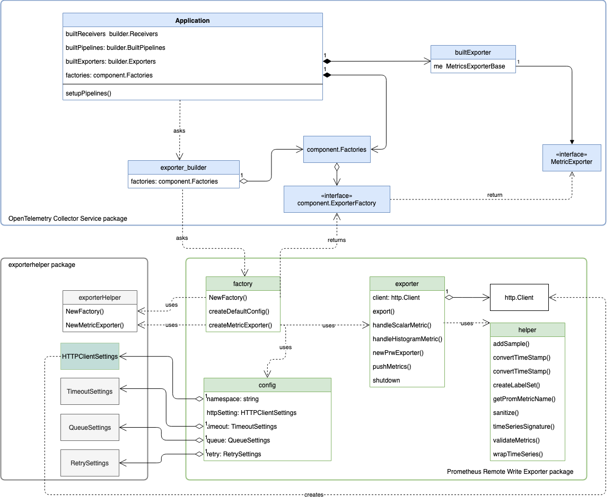
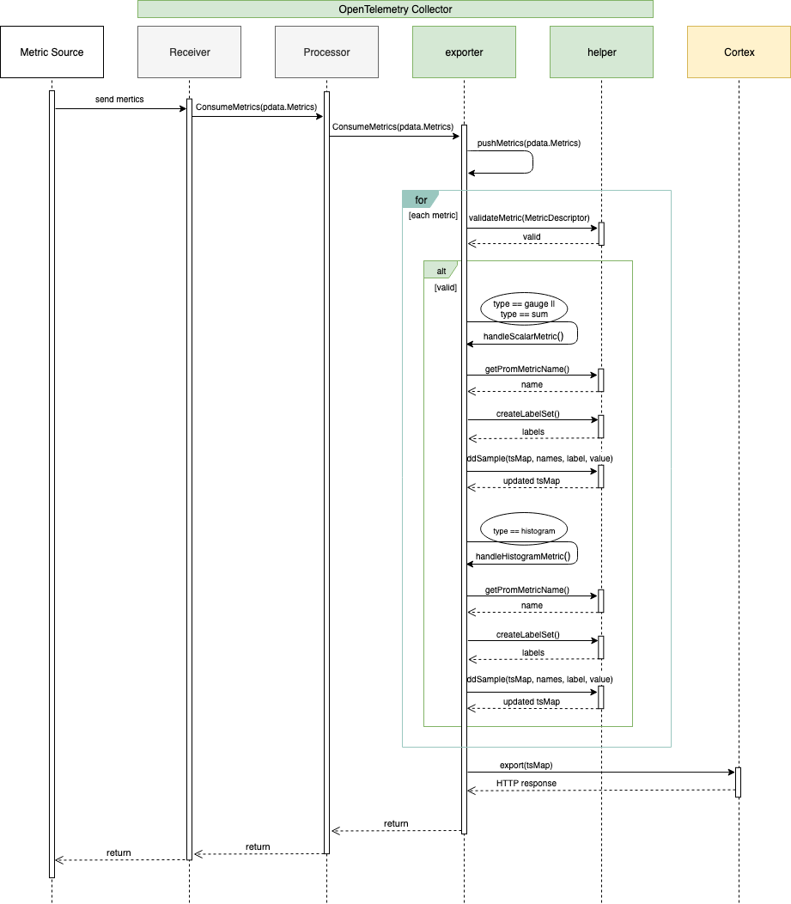

# Prometheus Remote Write Exporter

# OpenTelemetry Go SDK Prometheus Remote Write Exporter

## Table of Contents

- [Architecture Overview](#architecture-overview)
  - [Data Path](#data-path)
- [Oustanding Tasks](#oustanding-tasks)
- [Pull Requests Filed and Merged](#pull-requests-filed-and-merged)
- [Contributors](#contributors)

## Architecture Overview
The design docuement and README can be found in upstream repository. 


### Data Path

`Processor`. The CheckpointSet is then sent to the `Export` when Export() is called.

#### Exporter Data Path



The Exporter receives a pdata.Metrics from the pipeline, converts the metrics to
TimeSeries, and sends them in a snappy-compressed message via HTTP to Cortex.

## Repository Structure
See this [link](https://github.com/open-telemetry/opentelemetry-collector/tree/master/exporter/prometheusremotewriteexporter)

## Future Enhancement
### Prometheus Receiver Generates one more bucket than bound:

I am exporting from the logging exporter with the Prometheues Receiver. I noticed the received metrics have one more bucket than bound:

```
HistogramDataPoints #8
Data point labels:
     -> method: GET
     -> path: /api/pos-5
     -> status: 200
StartTime: 1598797094863000000
Timestamp: 1598797104865000000
Count: 46
Sum: 5.940146
Buckets #0, Count: 0
Buckets #1, Count: 0
Buckets #2, Count: 0
Buckets #3, Count: 0
Buckets #4, Count: 0
Buckets #5, Count: 0
Buckets #6, Count: 0
Buckets #7, Count: 0
Buckets #8, Count: 0
Buckets #9, Count: 1
Buckets #10, Count: 1
Buckets #11, Count: 0
Buckets #12, Count: 1
Buckets #13, Count: 2
Buckets #14, Count: 0
Buckets #15, Count: 3
Buckets #16, Count: 3
Buckets #17, Count: 6
Buckets #18, Count: 13
Buckets #19, Count: 10
Buckets #20, Count: 6
Buckets #21, Count: 0
Buckets #22, Count: 0
Buckets #23, Count: 0
Buckets #24, Count: 0
Buckets #25, Count: 0
ExplicitBounds #0: 0.000100
ExplicitBounds #1: 0.000150
ExplicitBounds #2: 0.000225
ExplicitBounds #3: 0.000338
ExplicitBounds #4: 0.000506
ExplicitBounds #5: 0.000759
ExplicitBounds #6: 0.001139
ExplicitBounds #7: 0.001709
ExplicitBounds #8: 0.002563
ExplicitBounds #9: 0.003844
ExplicitBounds #10: 0.005767
ExplicitBounds #11: 0.008650
ExplicitBounds #12: 0.012975
ExplicitBounds #13: 0.019462
ExplicitBounds #14: 0.029193
ExplicitBounds #15: 0.043789
ExplicitBounds #16: 0.065684
ExplicitBounds #17: 0.098526
ExplicitBounds #18: 0.147789
ExplicitBounds #19: 0.221684
ExplicitBounds #20: 0.332526
ExplicitBounds #21: 0.498789
ExplicitBounds #22: 0.748183
ExplicitBounds #23: 1.122274
**ExplicitBounds #24: 1.683411**
```

This extra bucket possibly is the “+Inf” bucket from the scraped Prometheus metrics. Is this the expected behavior? 


### Translate temporality during OC to internal metric translation

This issue is a follow up of #[1541](https://github.com/open-telemetry/opentelemetry-collector/issues/1541)

When the collector support translates OpenCensus metrics to internal metrics, it doesn’t set the Temporality of OTLP metric, so the OTLP metric gets a INVALID Temporality; The Prometheus remote write  exporter checks temporality and only processes CUMULATIVE temporality metric. I bypassed that `validateMetric` test on my local setup, and the Prometheus remote write exporter was able to export metrics. 

Temporality translation could be  added here: 
https://github.com/open-telemetry/opentelemetry-collector/blob/aeb604f4a3227415ba6e209363fcaf7d93817b70/translator/internaldata/oc_to_metrics.go#L154


### Return Consumererror.Permanent() in the Prometheus remote write exporter

The Prometheus remote write exporter right now returns vanilla Go errors. This breaks the retry mechanism in the Collector. If a batch contains a metric with invalid temporailty or it gets a 400 response code from the backend, the collector will exponentially backoff and retry, getting the same error  every time.  

If the Prometheus remote write returns error of `consumererror.permanent` type, the retry mechanism will not be triggered

### Return a consumererror.permanent from componenterror.CombineErrors() when necessary

When combining vanilla Go errors, `consumererror.partial` and `consumererror.permanant`, the resultant error of `componenterror.CombineErrors()` is always the Go error type. This breaks the retry mechanism in the collector, as explained in [this](https://quip-amazon.com/XghLAnAZbR2A/Issues-and-Future-Enhancement#fHH9CAYX3qV) issue.

`componenterror.CombineErrors()` should check for the type of each error; if any error is of type `consumererror.permanent`, the returned error should also be a permanent error.qq

## Pull Requests Filed and Merged

Collector:
[_Add Prometheus Remote Write Exporter supporting Cortex - conversion and export for scalar OTLP metrics_](https://github.com/open-telemetry/opentelemetry-collector/pull/1577)

[_Add Prometheus Remote Write Exporter supporting Cortex - conversion and export for Summary OTLP metrics_](https://github.com/open-telemetry/opentelemetry-collector/pull/1649)

[_Add Prometheus Remote Write Exporter supporting Cortex - conversion and export for Histogram OTLP metrics_](https://github.com/open-telemetry/opentelemetry-collector/pull/1643)

[_Add Prometheus Remote Write Exporter supporting Cortex - helper_](https://github.com/open-telemetry/opentelemetry-collector/pull/1555)

[_Add a ‘Headers’ field in HTTPClientSettings_](https://github.com/open-telemetry/opentelemetry-collector/pull/1552)

[_Add Prometheus Remote Write Exporter supporting Cortex - factory and config_](https://github.com/open-telemetry/opentelemetry-collector/pull/1544)

[_Add Cortex and Prometheus Remote Write exporter design_](https://github.com/open-telemetry/opentelemetry-collector/pull/1464)

[_Change some Prometheus remote write exporter functions to public and update link to design in README.md_](https://github.com/open-telemetry/opentelemetry-collector/pull/1702)

[_Refactor the Prometheus remote write exporter to use OTLP v0.5.0_](https://github.com/open-telemetry/opentelemetry-collector/pull/1708) 


O11y collector repository supporting Sig V4
[**_opentelemetry-collector-o11y_**](https://github.com/open-o11y/opentelemetry-collector-o11y)


OTEPS:
[_Proposal: OTLP Exporters Support for Configurable Export Behavior_](https://github.com/open-telemetry/oteps/pull/131)


CPP:
[_Add badges to README.md_](https://github.com/open-telemetry/opentelemetry-cpp/pull/157)


## Contributors

- [Yang Hu](https://github.com/huyan0)
