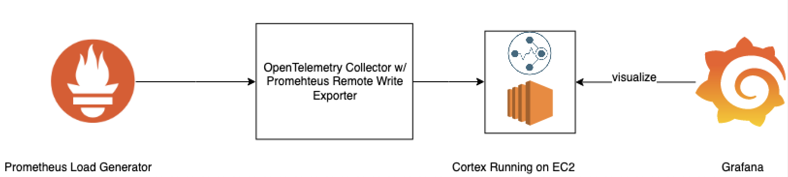

# Prometheus Remote Write Exporter

# OpenTelemetry Go SDK Prometheus Remote Write Exporter

## Table of Contents

- [Architecture Overview](#architecture-overview)
  - [Data Path](#data-path)
- [Metric Tranlation and Possible Changes](#metric-translation-and-possible-changes)
- [AWS Sig v4 Support](#aws-sig-v4-support)
- [Future Enhancement](#future-enhancement)
- [Integration Testing](#integration-testing)
- [Pull Requests Filed and Merged](#pull-requests-filed-and-merged)
- [Contributors](#contributors)

## Architecture Overview

The detailed design and README can be found in the [upstream repository](https://github.com/open-telemetry/opentelemetry-collector/tree/master/exporter/prometheusremotewriteexporter). 


#### Exporter Data Path


The Exporter receives a pdata.Metrics from the pipeline, converts the metrics to
TimeSeries, and sends them in a snappy-compressed message via HTTP to Cortex.

## Repository Structure
See this [link](https://github.com/open-telemetry/opentelemetry-collector/tree/master/exporter/prometheusremotewriteexporter)

## Metric Translation and Possible Changes
The collector supports both OpenTelemetry Protocol(OTLP) Metrics and the OpenCensus Metrics(OC) internally. When the a component in the data pipeline uses OpenCensus format, the collector
translates the OC metrics to OTLP metrics for the consumption of the remote write exporter. This translation was broken because temporality wasn't converted correctly. However, this issue has
been fixed, and the exporter works with the Prometheus receiver now. See this issue for more [detail]((https://github.com/open-telemetry/opentelemetry-collector/issues/1541))

Another uncertainty regarding metric format is that the OTLP metrics definition is still in alpha; when a change in OTLP metric happens and the data format inside the collector is updated,
the exporter code will need to be refactored. Bogdan Drutu((at)bogdandrutu) from Splunk is in charge of this process and the metric side of the
collector. See this [repository](https://github.com/open-telemetry/opentelemetry-proto) for updates on OTLP and this [PR](https://github.com/open-telemetry/opentelemetry-collector/pull/1708) for a sample code refactoring that was done for the exporter.
## AWS Sig V4 Support 

[This repository]((https://github.com/open-o11y/opentelemetry-collector-o11y)) hosts a version of the exporter that supports AWS sig v4. A executable can be built from the repository.
It has detailed design, README, and Pipeline testing instructions.  

## Integration Testing
The integration testing setup consist of a metric source, the collector executable with the exporter, a Remote write backend such as Cortex, and a visualizer/querier for validating the data.
Here is a diagram of a sample setup with a Prometheus metric source, the collector, a Cortex running in EC2, and a Grafana instance that visualizes the metrics:


To run a integration testing pipeline, first run an instance of the collector. Its executable can be found [here](https://github.com/open-telemetry/opentelemetry-collector/releases) 

Then, run the collector with a custom configuration.yaml file. A sample is provided [here](promtest/otel-collector-config.yaml).
```
./otel-collector -config=otel-collector-config.yaml
```

The metric source can be any OpenTelemetry Collector supported [sources](https://github.com/open-telemetry/opentelemetry-collector/tree/master/receiver)
One example metric source is the [prom-loadtest-metric-generator](https://github.com/alphagov/prom-loadtest-metrics-generator) that generates metrics in Prometheus text exposition format 
and expose them on a HTTP endpoint. See its README for more detail. Another metric source can be a [OTLP load generator](./test)
that sends OTLP metrics to the collector via gRPC. 

A Cortex instance can be used as a remote write backend. Instructions for setting up Cortex can be found [here](https://cortexmetrics.io/docs/getting-started/getting-started-chunks-storage/)

A Grafana instance can be used to visualize the metrics received by Cortex. To run a Grafana in docker, use the following command:
```
docker run --rm -d --name*=*grafana -p 3000:3000 grafana/grafana
```

In the Grafana UI (http://localhost:3000/) (username/password admin/admin), add a Prometheus datasource for Cortex (http://URL:9009/api/prom).

Optionally, a quierier can be used to programaticlly query metrics and write the query result to a text file. This querier 
and its intructions is provide [here](./test)


## Future Enhancement
The following are a list of upstream issues future contributor to the exporter can work on:

- [Prometheus Receiver Generates one more bucket than bound](https://github.com/open-telemetry/opentelemetry-collector/issues/1737)

- [Return a consumererror.permanent from componenterror.CombineErrors() when necessary](https://github.com/open-telemetry/opentelemetry-collector/issues/1736)

- [Return consumererror.Permanent in the Prometheus remote write exporter](https://github.com/open-telemetry/opentelemetry-collector/issues/1733)[bug](https://github.com/open-telemetry/opentelemetry-collector/issues?q=is%3Aissue+is%3Aopen+label%3Abug)

- [Prometheus Receiver translates metrics to OTLP metrics with non-cumulative temporality](https://github.com/open-telemetry/opentelemetry-collector/issues/1541)

## Pull Requests Filed and Merged

Collector:
- [_Add Prometheus Remote Write Exporter supporting Cortex - conversion and export for scalar OTLP metrics_](https://github.com/open-telemetry/opentelemetry-collector/pull/1577)

- [_Add Prometheus Remote Write Exporter supporting Cortex - conversion and export for Summary OTLP metrics_](https://github.com/open-telemetry/opentelemetry-collector/pull/1649)

- [_Add Prometheus Remote Write Exporter supporting Cortex - conversion and export for Histogram OTLP metrics_](https://github.com/open-telemetry/opentelemetry-collector/pull/1643)

- [_Add Prometheus Remote Write Exporter supporting Cortex - helper_](https://github.com/open-telemetry/opentelemetry-collector/pull/1555)

- [_Add a ‘Headers’ field in HTTPClientSettings_](https://github.com/open-telemetry/opentelemetry-collector/pull/1552)

- [_Add Prometheus Remote Write Exporter supporting Cortex - factory and config_](https://github.com/open-telemetry/opentelemetry-collector/pull/1544)

- [_Add Cortex and Prometheus Remote Write exporter design_](https://github.com/open-telemetry/opentelemetry-collector/pull/1464)

- [_Change some Prometheus remote write exporter functions to public and update link to design in README.md_](https://github.com/open-telemetry/opentelemetry-collector/pull/1702)

- [_Refactor the Prometheus remote write exporter to use OTLP v0.5.0_](https://github.com/open-telemetry/opentelemetry-collector/pull/1708) 


OTEPS:
- [_Proposal: OTLP Exporters Support for Configurable Export Behavior_](https://github.com/open-telemetry/oteps/pull/131)

## Contributors

- [Yang Hu](https://github.com/huyan0)
