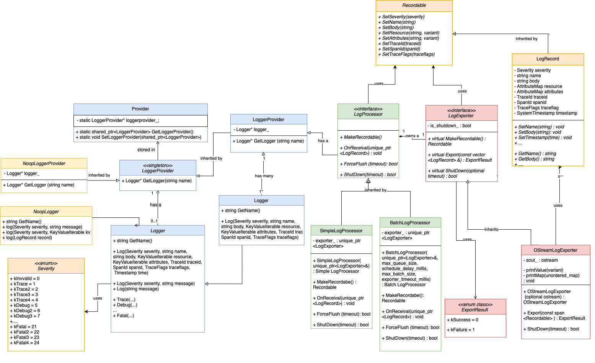
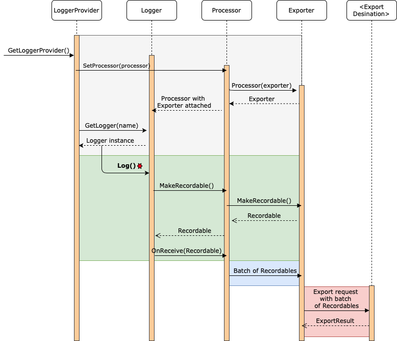

## OpenTelemetry C++ Logging API & SDK

## Table of Contents

* [Architecture Overview](https://github.com/open-o11y/docs/blob/master/cpp-logs/README.md#architecture-overview)
   * [UML Classes](https://github.com/open-o11y/docs/blob/master/cpp-logs/README.md#uml-classes)
   * [SDK Data Path](https://github.com/open-o11y/docs/blob/master/cpp-logs/README.md#sdk-data-path)
* [Usage](https://github.com/open-o11y/docs/blob/master/cpp-logs/README.md#usage)
* [Repository Structure](https://github.com/open-o11y/docs/blob/master/cpp-logs/README.md#repository-structure)
* [Testing](https://github.com/open-o11y/docs/blob/master/cpp-logs/README.md#testing)
   * [Bazel](https://github.com/open-o11y/docs/blob/master/cpp-logs/README.md#bazel)
   * [CMake](https://github.com/open-o11y/docs/blob/master/cpp-logs/README.md#cmake)
* [Outstanding Tasks](https://github.com/open-o11y/docs/blob/master/cpp-logs/README.md#outstanding-tasks)
* [Reference Documents](https://github.com/open-o11y/docs/blob/master/cpp-logs/README.md#reference-documents)

## Architecture Overview

### UML Classes


The main classes of the logging pipeline are as follows:

* Logger 
    * This is what users will call in the API to write logs with. The Logger will then in the SDK convert the logging statements into a log record, inject default values if unset.
* LoggerProvider
    * This is the entry point, that creates Loggers. Additionally, the LoggerProvider will store a Processor that the Logger instances can access when writing their logs.
* Noop*
    * These No-operation classes provide  the API works in the absence of an SDK, returning a [Null Object Pattern](https://en.wikipedia.org/wiki/Null_object_pattern) when the Logger or LoggerProvider are called. This follows the convention of the repository, similar to traces and metrics. 

* LogProcessor
    * is the class that has methods to receive the log records, and send them to an exporter. The LogProcessor class will be abstract and allow for concrete processors to be implemented, including:
    * SimpleLogProcessor, which sends single records to the exporter 
    * BatchLogProcessor, which sends batches of log record to the configured exporter

* LogExporter
    * This interface holds all the methods that all added exporters will have to provide implementations for.

Additionally, there are:

* Severity
    * An enum that will initially store the [24 built-in severity levels](https://github.com/open-telemetry/opentelemetry-specification/blob/master/specification/logs/data-model.md#displaying-severity), defined by the Log Data Model. The naming of the Severity fields follow the [Google naming convention](https://google.github.io/styleguide/cppguide.html#Enumerator_Name). The default severity if unspecified is set to `kInfo`, following the OpenTelemetry specification.
* Recordable 
    * An interface of public methods that allow the Log Data Model fields to be set, with the specific data storage to be implemented by exporters. The `LogRecord` will be the default implementation provided by the SDK, that can be used by exporters. Once an exporter creates a reordable implementation, it will pass it back to the SDK for data injection. 

### SDK Data Path

The sequence diagram below shows the calls executed in the logging pipeline. 



## Usage

The steps to initializing a Logger and writing the first logging statement is described below.

1. Initialize a LoggerProvider. We will use this to obtain Loggers in the future. 

```
auto logger_provider = std::shared_ptr<sdk::logs::LoggerProvider>(new sdklogs::LoggerProvider());
```

2. Initialize an exporter. In this example, we will use the Ostream Log Exporter, configured to print to `stdout`.

```
auto exporter = std::unique_ptr<sdk::logs::LogExporter>(new opentelemetry::exporter::logs::OStreamLogExporter);
```

3. Initialize an log processor. Here we'll use a simple processor.

```
auto processor = std::shared_ptr<sdk::logs::LogProcessor>(new sdk::logs::SimpleLogProcessor(std::move(exporter)));
```

4. Convert the SDK Logger Provider instance created to an API Logger Provider. 

```
auto api_logger_provider = nostd::shared_ptr<logs_api::LoggerProvider>(logger_provider);
```

5. Set the logger provider created as the global one.

```
auto provider = nostd::shared_ptr<logs_api::LoggerProvider>(api_logger_provider);
Provider::SetLoggerProvider(provider);
```

6. Get a Logger

```
auto logger = provider->GetLogger("logger_name");
```

7. Write a Log

```
logger->Log("Hello, World!");
```


A runnable example can be found in [/examples/logs_simple](https://github.com/open-telemetry/opentelemetry-cpp/tree/master/examples/logs_simple) folder.

## Repository Structure

The API header files will reside with the `api/include/opentelemetry/logs/` folder and the tests will be in `api/tests/logs`.

The SDK header files (`.h`) will reside in the `sdk/include/opentelemetry/sdk/` folder, and the implementation files (`.cc`)will reside in the `sdk/src/` folder. Furthermore, the tests for the SDK will be located in `sdk/tests/logs`.

The file structure is shown below:

* `api`
    * `/include/opentelemetry/logs`
        * `logger.h `
        * `logger_provider.h` 
        * `noop.h` 
        * `provider.h` 
        * `severity.h` 
    * `/tests/logs`
        * `BUILD`
        * `CMakeLists.txt`
        * `logger_provider_test.cc`
        * `logger_test.cc`
    * `BUILD`
    * `CMakeLists.txt`
* `sdk`
    * `/include/opentelemetry/logs/sdk/logs`
        * `batch_log_processor.h` 
        * `exporter.h` 
        * `log_record.h`
        * `logger.h` 
        * `logger_provider.h` 
        * `processor.h` 
        * `recordable.h`
        * `simple_log_processor.h`
    * `/src/logs`
        * `BUILD`
        * `CMakeLists.txt`
        * `batch_log_processor.cc` 
        * `logger.cc`
        * `logger_provider.cc` 
        * `simple_log_processor.cc` 
    * `tests/logs`
        * `BUILD`
        * `CMakeLists.txt`
        * `log_record_test.cc`
        * `logger_provider_sdk_test.cc`
        * `logger_sdk_test.cc`
        * `simple_log_processor_test.cc`

## Testing

### CI Tests

The CI tests can be run on a docker container locally to test whether they are all passing.

For example, the Bazel CI test can be run with the command:

```
./ci/run_docker.sh ./ci/do_ci.sh bazel.test
```

The instructions on how to run them can be found in the [README](https://github.com/open-telemetry/opentelemetry-cpp/blob/master/ci/README.md) in the `/ci` folder for the mainrepository.

CI Tests will also be run upon pushing to the master branch on the  `opentelemetry-cpp` repository on Github. The results will be seen in in the “Github Actions“ tab. 

### Unit Tests

The OpenTelemetry C++ repository supports two build systems simultaneously: Bazel and CMake. When writing unit tests, both the bazel `BUILD` files as well as the `CMakeLists.txt` files must be updated. 

Run A Specific Unit Test:

* Using [Bazel](https://bazel.build/):

```
bazel test //path/to/package:target-name
```

* or using [CMake](https://cmake.org/):

```
ctest -R <name_of_your_test>
```

## Outstanding Tasks

Issues filed and future enhancements:

* [Finding a workaround for silently dropping spans and logs](https://github.com/open-telemetry/opentelemetry-cpp/issues/441)
* [Define default timeout for all processor and exporter interfaces](https://github.com/open-telemetry/opentelemetry-cpp/issues/418) 
* [Remove duplicate enum declarations](https://github.com/open-telemetry/opentelemetry-cpp/issues/420) 
* [Define a Logger Limit](https://github.com/open-telemetry/opentelemetry-specification/issues/1259)
* [Suggest max size for the log body?](https://github.com/open-telemetry/opentelemetry-specification/issues/1251)
* [Define a specification for the OpenTelemetry Logging API and SDK](https://github.com/open-telemetry/opentelemetry-specification/issues/1258) 
* [[Issue] Logging API Data Type for “Body” Field](https://quip-amazon.com/ciElAcWTMAbP)
* [[Issue] Implement timeout functionality in processor ForceFlush/Shutdown](https://quip-amazon.com/q3QeALSlXp5q)
* [[Issue] Timeout functionality in OStream Exporter’s ShutDown()](https://quip-amazon.com/9gPnArgjjKwU)
* [[Issue] Logging API Future Enhancements](https://quip-amazon.com/VtnHAUVtdpzN)  
* [[Issue] Implement the OTLP Exporter for Logs](https://quip-amazon.com/aIHJAvxrxb6X)

## Pull Requests filed and merged

1. [API Initial Commit](https://github.com/open-telemetry/opentelemetry-cpp/pull/378#partial-pull-merging)
2. [SDK Implementation](https://github.com/open-telemetry/opentelemetry-cpp/pull/386)
3. [Simple Log Processor](https://github.com/open-telemetry/opentelemetry-cpp/pull/403)
4. [Recordable for Logs](https://github.com/open-telemetry/opentelemetry-cpp/pull/438)
5. [Ostream Exporter](https://github.com/open-telemetry/opentelemetry-cpp/pull/430)
6. [API Overloads](https://github.com/open-telemetry/opentelemetry-cpp/pull/422)
7. [Batch Log Processor](https://github.com/open-telemetry/opentelemetry-cpp/pull/434)
8. [Elasticsearch Exporter](https://github.com/open-telemetry/opentelemetry-cpp/pull/444)

## Further Documentation

* Design documents for the API, SDK,  can be found in our [public documents repository](https://github.com/open-o11y/docs/tree/master/cpp-logs)
* Design for the OStreamExporters can be found in our [public documents repository](https://github.com/open-o11y/docs).
* A simple usage example with an explanation can be found on the [OpenTelemetry C++ repository](https://github.com/open-telemetry/opentelemetry-cpp/pull/258).

## References

* [Log Data Model](https://github.com/open-telemetry/opentelemetry-specification/blob/master/specification/logs/data-model.md)
* [Library Design Guidelines](https://github.com/open-telemetry/opentelemetry-specification/blob/master/internal/img/library-design.png)

## Contributors

* [Karen Xu](https://github.com/MarkSeufert)
* [Mark Seufert](https://github.com/MarkSeufert)
