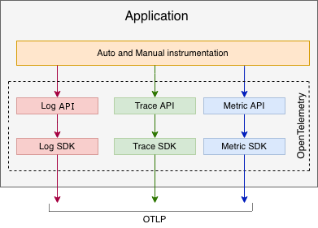
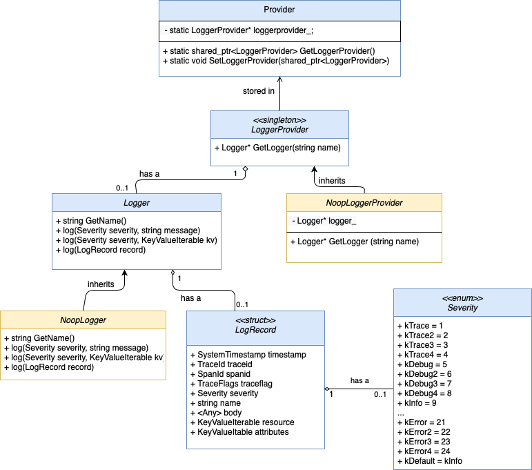

# Logging API Design for the OpenTelemetry C++ library

## Introduction

This document outlines the design of the OpenTelemetry (OTel) Logging API for C++, as part of [Issue #337](https://github.com/open-telemetry/opentelemetry-cpp/issues/337). The design was written in accordance to the [OpenTelemetry Logging Specification](https://github.com/open-telemetry/opentelemetry-specification/blob/master/specification/logs/overview.md).  It also consulted [RFC #356](https://github.com/open-telemetry/opentelemetry-cpp/issues/356) on various types of logging statements.  

The design supports a minimal blackbox API implementation, thus will function in the absence of an SDK. However, without reference to an SDK or another implementation, no log data will be collected.

## Use Cases

Logs are a first-class citizen in observability and OpenTelemetry. The goal of the Logging API specifically is to be able to capture log data from users; it will not handle any sending, processing, or configuration of log data. Furthermore, it will work as a standalone component, even in the absence of an SDK (discussed later in ‘Design Considerations’). 

## Proposed Design

The solution we propose is to define and implement a custom OpenTelemetry logging API for C++. The API, although will work as as a standalone component, will allow the user to either use the OpenTelemetry SDK or author their own SDK. The data path logs will take are API → SDK → Collector / Exporter, shown below: 



This design has the following pros and cons. 

**Pros of this design:**

* **Support all the required C++ Logging API Features** - The API features that must be supported include supporting all the fields in the [Log Data Model](https://github.com/open-telemetry/opentelemetry-specification/blob/master/specification/logs/data-model.md), performing correlation, supporting structured logs, as well as others. 
* **Implement only the Minimum-required features**- The API should only implement only the minimum required set of functionality required by OTel to reduce overhead. This will also make it be simple and intuitive to use. 

**Cons of this design:**

* **Reinvent Wheels and Add a New Learning Curve:** This requires adding a new logging library/API to the many already existing C++ logging libraries. Thus, developers will need to learn the syntax and usage of (yet another) logging library API, using extra time. 
* **No other options:** Since there are no available logging libraries, this logging API has to be extremely versatile and accomodate for all desired logging statements

However, by making the API simple and intuitive to use, we hope to reduce this learning curve. 

## API Design Tenets

The OpenTelemetry C++ Logging API will be designed in accordance with these tenets:

1. **Reliability**- Unlike metrics, logs must not be dropped (e.g. even if network error occurs), otherwise it will mislead the user into thinking log statements that were not printed were not reached in the backend. Furthermore, thread safety must also be guaranteed.
2. **Scalability**-  The initial iteration of the Logging API prototype will implement only the minimum basic functionalities required for logging. However, the API will be designed with scalability in mind for future additions to the API. 
3. **Security**- This includes the provision and requirement of an API Key as well as user authentication to be able to both identify the user making the call and to authenticate them as the person they claim to be. However, security will not be a consideration for this initial design of the API. 

## Design Considerations 

1. **Behaviour of the API in the Absence of an SDK**

An API must be self-sufficient such that if an SDK implementation isn’t provided, it will still compile without error. In order to achieve this, a minimal implementation must be included inside the API that will automatically be used unless otherwise specified by the user. This is based off [OTel’s library guidelines](https://github.com/open-telemetry/opentelemetry-specification/blob/master/specification/library-guidelines.md#api-and-minimal-implementation).This as previously mentioned is achieved by the `Noop*` classes. 

2. **ABI Policy**

The API design must meet the [ABI policy](https://github.com/open-telemetry/opentelemetry-cpp/blob/master/docs/abi-policy.md). Data types used in the virtual function signatures of abstract classes in the OpenTelemetry API must be ABI stable (concrete classes need not do this), and singletons also must use ABI stable types as well, discussed [here](https://github.com/open-telemetry/opentelemetry-cpp/issues/67). 


3. **Exceptions**

The API will not penalize the user for misuse of any sort. No implementation exceptions will stop the user from continued use of the API (but maybe a message alerting them of the error will be included).  Runtime exceptions, that are unrelated to the API, however, will be broadcasted to the user. 


4. **Concurrency**

All API calls should be safe to be called concurrently. The assumption is that `LoggerProvider` will not need to be put on the hot path of calls, thus can be performed concurrently. For the singleton `Provider`, the use of a SpinLockMutex ensures that only one thread is using it’s resources at any given time, and is therefore concurrent. `Logger` on the other hand, which will be handling the logging statement creation / writing, will need to consider thread safety as it will be performing the calls (both?) synchronously and asynchronously. 

## Architecture Overview 

The Logging API consists of the following classes: 

* `LoggerProvider`is the entry point of the API. It is a singleton class that provides access to instances of `Logger`
* `Provider` is a static class that maintains the singleton reference to `LoggerProvider`. It allows for retrieving instances of the `LoggerProvider`, as well as pushing custom implementations of `LoggerProvider` from the user
* `Logger` is the class responsible for capturing the logging information from the user 
* `NoopLogger`and `NoopLoggerProvider` ensures the API works in the absence of an SDK, returning a [Null Object Pattern](https://en.wikipedia.org/wiki/Null_object_pattern) when the Logger or LoggerProvider are called, which follows the convention of traces and metrics

Along with the following data types:

* `LogRecord` is a struct that will store the [10 fields](https://github.com/open-telemetry/opentelemetry-specification/blob/master/specification/logs/data-model.md#log-and-event-record-definition) of a log record, defined by the Log Data Model. 
* `Severity` is an enum that will initially store the [24 built-in severity levels](https://github.com/open-telemetry/opentelemetry-specification/blob/master/specification/logs/data-model.md#displaying-severity), defined by the Log Data Model. The naming of the Severity fields follow the [Google naming convention](https://google.github.io/styleguide/cppguide.html#Enumerator_Names). The default severity if unspecified is set to `kInfo`, following the convention of ILogger. 


The following UML diagram shows the relationship between the classes for the API:



**Example Usage**
The user would interact with the API as follows:

1. **Get reference to LoggerProvider:** The user can get a reference to the singleton `LoggerProvider` by calling the static `GetLoggerProvider()` method from within the `Provider` class. A default, no-operation implementation will be used instead of an SDK if the user does not call `SetLoggerProvider(LoggerProvider lp)` with the name of their SDK. 
2. **Get instance of Logger:** The logger is responsible for allowing the user to write logs. To get an instance of `Logger`, they must use the `GetLogger(name)` method from the `LoggerProvider` reference they obtained previously.
3. **Write Log Statements:** To write logs, the user will call the `log(...)` methods from within the `Logger` instance they previously retrieved. If the user skipped step 1, the `log(...)` methods will contain an empty implementation so the logs will not be written anywhere.


The following pseudocode example summarizes the steps from above:

```
// Step 1: push SDK into API
LoggerProvider implementation = new MySDK
SetLoggerProvider(implementation)

// Step 2: get reference to LoggerProvider
LoggerProvider lp = GetLoggerProvider()

// Step 3: get instance of logger
Logger myLogger = lp.GetLogger("My Logger")

// Step 4: write log statements
myLogger.log("Hello, world!")
myLogger.log("Here's some data: ", {{"Item 1", 7}, {"Item 2", 3}})
myLogger.log(Severity.ERROR, "Something bad occured")
```

## Detailed Design

### `Provider` class 

The `Provider` class provides static methods that are used to get references to a static, singleton `LoggerProvider`. Initially, it sets the static LoggerProvider to use a minimal implementation, but new implementations from the SDK can be pushed into it through the `SetLoggerProvider()` method. To retrieve a reference to the LoggerProvider, the Provider class has the method `GetLoggerProvider()`. 

```
// This class is static so it doesn't need to be instantiated
static class Provider
private: 
    // This field is private because user will never call this variable directly
    // This variable stores reference to the singleton LoggerProvider
    static variable: LoggerProvider _loggerprovider
    
public:
    // Returns a reference to the singleton LoggerProvider`
    static method: LoggerProvider GetLoggerProvider()
        return _loggerprovider
            
    // Sets the implementation of the singleton LoggerProvider
    static method: void SetLoggerProvider(LoggerProvider lp)
        _loggerprovider = lp
```


### `LoggerProvider` class

The LoggerProvider class is a singleton that is used to create instances of the Logger class. Pointers to this LoggerProvider can be obtained through the static function `GetLoggerProvider()`, defined in the Provider Class. The LoggerProvider will be responsible for returning instances of `Logger` from its `GetLogger(nostd::string_view name, ...)` method.

```
// This class is abstract so it needs a definition to be instantiated
abstract class LoggerProvider
    // Each of these methods need to be overloaded
    // These methods return a Logger
    virtual method: Logger GetLogger(“Name”)
```


### `Logger` class

The Logger class is used to provide the user with logging statements. An instance of a Logger can be obtained by calling the aforementioned `GetLogger()` method from the LoggerProvider. This class will define multiple overloaded virtual definitions of the `log(...)` function, each of which will fall under one of the following categories:

* **Unstructured logging statements:** This includes allowing strings, non-string primitive data types (int, float, double, char, binary, hex, etc.),  or fmtlib (or std::format) supported formats to be embedded in logging statements.
* **Structured logging statements**: This includes logging of common objects, such as maps, or a `LogRecord` (defined later) which stores all [10 expected fields](https://github.com/open-telemetry/opentelemetry-specification/blob/master/specification/logs/data-model.md#log-and-event-record-definition) of the Log Data Model. 
* **Generic/Templated Objects Logging**: Logging of a generic template type may be added for higher expressiveness. The template could be a user defined class, or an external library such as [nlohmann/json](https://github.com/nlohmann/json), which was something that users commented they would like to be able to do on [RFC #356](https://github.com/open-telemetry/opentelemetry-cpp/issues/356). It is important to note that even if the logger should supported nested objects, the input taken in through logging statements should be in flattened 2D Data formats only. This is because 2D formats are what many databases require and store. (The object can later be unflattened either in the Exporter or Collector, as per [this comment](https://github.com/open-telemetry/opentelemetry-cpp/issues/356#issuecomment-705937393)).

```
abstract class Logger
    // Returns the name of the logger`
    virtual method: String **GetName**()
    
    // Different logging statements that will be overloaded in the SDK/No-op
    virtual method: void log(message)
    virtual method: void log(message, map<string, string>)
    virtual method: void log(LogRecord)
```

### `LogRecord` class 

The [Log Data Model](https://github.com/open-telemetry/opentelemetry-specification/blob/master/specification/logs/data-model.md) specifies a list of [all 10 fields](https://github.com/open-telemetry/opentelemetry-specification/blob/master/specification/logs/data-model.md#log-and-event-record-definition) that must be supported by the C++ Logging API. The `LogRecord` class will define all 10 of the fields. Note all the field kinds are optional to include in a Log Record. However some will be set to a default value within the SDK if the user does not specify a value. 

```
class LogRecord
    // The 10 fields from the log data model
    SystemTimestamp timestamp   
    TraceId trace_id                  
    SpanId span_id                      
    TraceFlags trace_flag             
    Severity severity
    string name                  
    string body                     
    KeyValueIterable resource          
    KeyValueIterable attributes  
```

Resources and attributes will be implemented as a KeyValueIterable, which is a nostd class acting as map from nostd::string_view to nostd::variant, but is ABI stable. 

### `Noop*` classes

**Motivation**
No-operation (noop) classes will be defined for all the classes with pure virtual methods. Virtual methods do not compile unless they are overwritten by an implementation. Therefore, the noop classes will provide a minimal implementation of these virtual methods such that the Logging API will work without an SDK. There are two classes that will have a noop implementation: `Logger` and `LoggerProvider` classes.

**Pseudocode**

```
class NoopLogger: inherits Logger
    // The concrete definitions of Logger's virtual methods`
    method: String GetName() {"Noop logger"}
    method: void log(message) {}
    method: void log(message, map<string, string>) {}
    method: void log(LogRecord) {}
      
 class NoopLoggerProvider: inherits LoggerProvider
    variable: _logger
    // The concrete definitions of LoggerProvider's virtual methods
    method: Logger GetLogger(“Name”) {return NoopLogger}
```

## Alternatives Considered

**Auto-instrumenting Existing Libraries**
This design option to instrument existing C++ logging libraries (see example extension written for [Log4j2 Java](https://github.com/open-telemetry/opentelemetry-java/pull/1344/files)) does not duplicate work of creating a separate Logging API. Notably, a difference is that in C++, there is no most commonly used logging library (such as Log4J for Java); instead there exist a plethora of smaller C++ logging libraries. 

Even so, while this solution would leverage existing C++ logging libraries would have been preferred, there were no suitable logging libraries available. Some dealbreakers included: 

* Having large dependencies (such as Boost), which would add an increased overhead to OpenTelemetry. 
* Not originating form a reputable, large-scale reliable vendors. 
* Lacking ways of logging structured objects (e.g. maps, json, etc.)
* Not being simple and intuitive enough to use. 

Thus this alternative was ruled out as a viable design option.

## Test Strategy/Plan

Unit tests will be written for this design. Following the OTEL C++ Testing conventions, we will be using [GoogleTest](https://github.com/google/googletest).  The goal is to pass 100% of all unit tests. The unit test strategy will be integrated with [codecov.io](http://codecov.io/) which is also used by OTEL C++. The initial goal is to maintain the same code coverage (currently around 90-95%) both before and after the API submission. 


## Related Issues and PRs
[Issue #356: \[RFC\] C++ Example Logging Statements](https://github.com/open-telemetry/opentelemetry-cpp/issues/356)

[PR #378: Initial commit of API ](https://github.com/open-telemetry/opentelemetry-cpp/pull/378) 

[Issue #337: Logging Prototype](https://github.com/open-telemetry/opentelemetry-cpp/issues/337)

## References

[Logs terminology](https://github.com/open-telemetry/opentelemetry-specification/blob/master/specification/glossary.md#logs)

[Log Data Model](https://github.com/open-telemetry/opentelemetry-specification/blob/master/specification/logs/data-model.md)

[Log Specification](https://github.com/open-telemetry/opentelemetry-specification/blob/master/specification/logs/overview.md)
