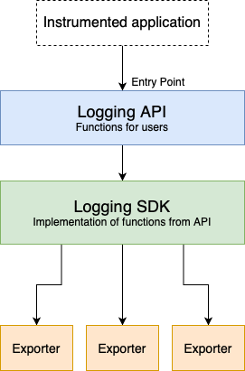
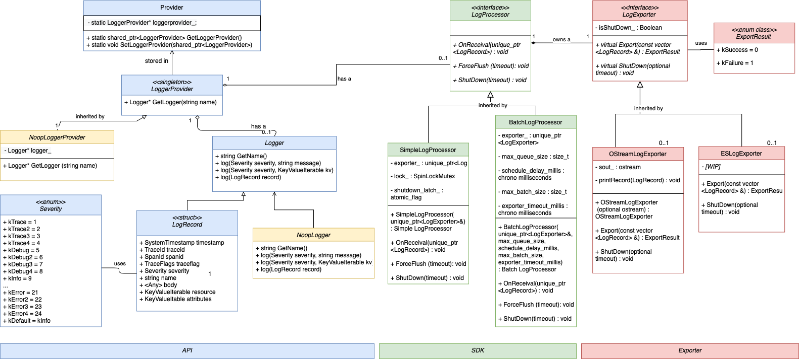
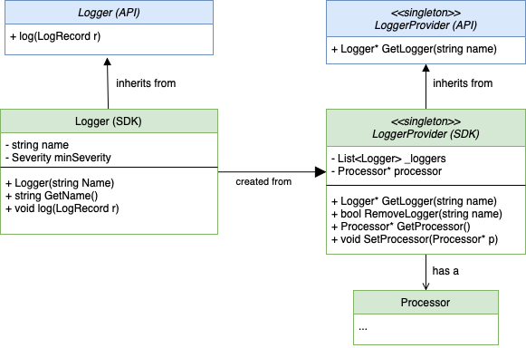
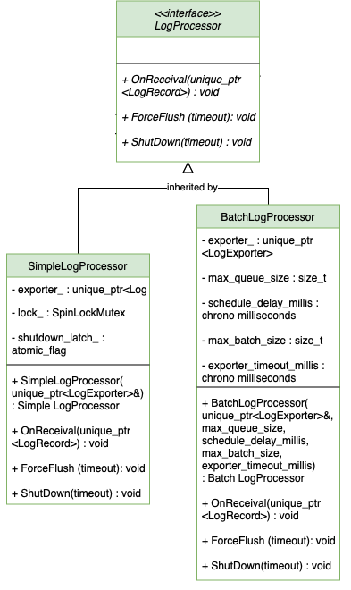
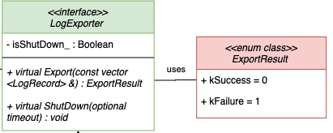
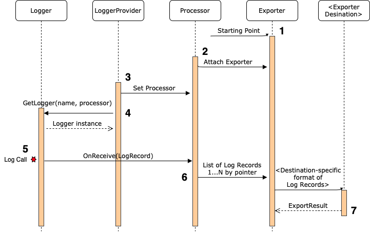

# Logging API and SDK Design for the OpenTelemetry C++ Library

## **Introduction**

This document outlines a proposed design of the C++ OpenTelemetry Logging SDK. The SDK is responsible for providing a concrete implementation of the methods defined in the API, as well as sending logs to various exporters. 

In order to have a complete logging pipeline in C++, three components must exist: a Logging API, Logging SDK, and one or multiple Exporters. The API’s [design](https://github.com/open-o11y/docs/blob/master/cpp-logs/api-design.md) and [initial PR](https://github.com/open-telemetry/opentelemetry-cpp/pull/378#partial-pull-merging) has been completed, and the design of the exporters will be released in the future. The diagram below shows the basic class structure of the three components:



## Logging Architecture Overview

The complete UML diagram for the full Logging pipeline is below:

There are three main class components of the Logging SDK (in green above): 
 
**1. Concrete implementations of the API classes:**

* `LoggerProvider` is a singleton class that defines how a Logger instance is obtained by the user. Additionally, the LoggerProvider will store a Processor that the Logger instances can access when writing their logs.
* `Logger` is the class responsible for converting the logging statements from the user into an internal log record, and then sending that log record to the Processor.

**2. Processor interface and implementation**

* `LogProcessor` is the class responsible for collecting the log records, and piping them to an exporter. The LogProcessor class will be abstract and allow for concrete processors to be created, such as:
    * `SimpleLogProcessor` class 
    * `BatchLogProcessor` class

**3. Exporter interface**

* `LogExporter` is the class that users can extend from to implement their own exporter, for example to OStream (Console) or Elasticsearch, both of which we will outline as part of a future design document. 

## API Class Implementations

The API defines two abstract classes that are guaranteed to have an implementation inside of the SDK: the Logger and the LoggerProvider. The SDK implementation of these classes will connect with the other components of the SDK, such as the processor, and create the complete logging pipeline.

**UML Diagram**



### `LoggerProvider` class

The SDK’s LoggerProvider class implementation is extended from the API’s LoggerProvider.h abstract class. This class will have two main functionalities:

1. **Getting and Removing Logger Instances**. As defined in the API, there is a `GetLogger(“Name”)` method that creates a new Logger instance with the given name. If a logger with that name already exists, return that existing logger instead of creating a new one. This logic can be achieved by maintaining a list of Loggers as a private variable. Whenever a `GetLogger()` call is done, the Logger list will be iterated through to check if that name exists within one of them.
2. **Maintaining a common processor**. All the Logger instances that are returned by the `GetLogger(“Name”)` method need to have a processor to write their logs. The LoggerProvider will maintain a common processor, stored as a private variable, that can be retrieved by the `GetProcessor()` method and set via the `SetProcessor(Processor p)` method. 

Once the SDK LoggerProvider class is implemented, it will need to be pushed into the API. This is done by using the API’s static method `SetLoggerProvider(LoggerProvider)`. From that point on, the API’s static `GetLoggerProvider()` method will return the new SDK LoggerProvider.

**Pseudocode:**

```
class LoggerProvider : api::LoggerProvider
    private list(Logger) _loggers // List of Loggers
    private Processor _processor  // This provider's processor
    
    // Return a Logger with a given name
    public GetLogger(name):
        if name exists already in _loggers:
            return that logger
        else:
            return a new logger
            add it to _loggers
    
    // Remove a Logger with a given name
    public RemoveLogger(name):
        if name exists already in _loggers:
            set that logger to a Noop Logger
            return true
        else:
            do nothing
            return false
    
    // Get the Processor
    public GetProcessor():
        return _processor
    
    // Set the Processor
    public SetProcessor(Processor p):
        _processor = p
        
        // Add this processor to all the children
        for all loggers in _loggers:
            loggers.SetProcessor(p)
```

### `Logger` class

The SDK’s Logger class implementation is extended from the API’s Logger.h abstract class. This class is responsible for receiving the log statements from the API, converting it to a Log Data Model compliant format, then sending it to processors for exporting. Specific fields that the user does not include in their log will be automatically injected before being sent to the processor. 

The logger will also be responsible for filtering out logs that have a severity less than a threshold value. Two helper functions exist to help with this: `SetMinLogLevel(LogLevel)` to set the minimum log level to be sent to the processor; and `IsEnabled(LogLevel)` to return whether a LogLevel is enabled or not.

**Pseudocode:**

```
class Logger : api::Logger
   private string _name     // Name of this logger 
   private LogLevel _min    // Minimum log level
   private Processor _proc  // Processor of this logger
    
    // Return the name of this logger
    public GetName():
        return _name
    
    // Write a log to the processor
    public log(LogRecord record):
        if all fields of record are **NOT** populated:
            give default values to those LogRecord fields
    
        // Get an instance of the LoggerProvider
        // Then, call the GetProcessors() to get its processors
        // Then, write the record to each of the processors
        for all p in GetLoggerProvider().GetProcessors()
        p.Write(record)
    
    public SetMinLogLevel(LogLevel level):
        _min = level
    
    public IsEnabled(LogLevel level):
        if level is less than _min
            return false
        else 
            return true
    
    // Get this logger's processor   
    public GetProcessor():
        return _proc
        
    // Set this logger's processor
    public SetProcessor(Processor p):
        _proc = p
```

## Processor

The processor is responsible for sending the `LogRecord`s it receives for exporting from the SDK. There are two ways to group logs before sending to the exporter:

1. Exporting a LogRecord as soon as it is created in the SDK (simple processor)
2. Holding a batch of Log Records in a queue, and sending batches of them to the exporter (batch processor). This is the expected processor for users to use. 

**UML Diagram**
Each processor should be associated with a single, unique exporter instance (i.e. a 1:1 relationship).  An exporter must be passed to the Processor constructor during initialization of a processor. The exporter is then kept as a unique pointer in a private field of the Processor instance.



### `LogProcessor` class (interface) 

* This base processor class holds the methods that every processor should implement: 
    * `OnReceive` should take in a LogRecord created from the SDK then create the batch then send processed LogRecord(s) to the exporter. It should also be thread safe, and should not block or take long time, since they will be called on critical code path.
    * `OnForceFlush` is used to force the processor to send whatever current batch of logs it has received to the exporter (no matter the batch size, time limit, etc. This will usually be called by the next function OnShutDown() to empty all the logs before shutting down
    * `OnShutdown` Shut down the processor and do any cleanup required (including shutting down the exporter attached to the processor because exporters and processors have a 1:1 relationship so there is no point of having an exporter unattached to any processor.). Processed logs are exported before shutdown. After the call to Shutdown, subsequent calls to OnReceive, ForceFlush or Shutdown will return immediately without doing anything. 

**Pseudocode**

```
class LogProcessor
    /** 
    * Each of these methods in the interface 
    * should be inerhited by each concrete processor implementation, 
    * which include simple and batch log processors in this design document. 
    */ 
    public void OnRecieve(LogRecord)
    public void *ForceFlush*(timeout = 0)    // the default timeout of 0 means that no timeout is applied
    public void *Shutdown*(timeout = 0)      // the default timeout of 0 means that no timeout is applied
    
```

### `SimpleLogProcessor` class

* The constructor should take in a (unique) exporter 
* Implementations required for the 3 methods inherited from LogProcessor:
    * `OnReceive` should simply convert the LogRecord received into a vector with one element, and send it to the exporter. Logs cannot call the exporter’s `Export()` concurrently, and should use mutex to enforce this. - confirm 
    * `OnForceFlush` does nothing in the simple processor, since there is no buffer to be flushed 
    * `OnShutdown` should shut down the exporter attached to the processor. This is because exporters and processors have a 1:1 relationship and there is no point of having an exporter unattached to any processor.

**Pseudocode**

```
class SimpleLogProcessor : public LogProcessor
   /**
    * Initialize a simple log processor.
    * @param exporter the exporter used by the log processor
    */
    public SimepleProcessor(LogExporter exporter) : exporter_(exporter) {}
    
    /** 
    * Take in a LogRecord and send it to the exporter. 
    * Then get the Export code returned from the exporter,
    * and implement the proper error handling mechanism if the 
    * export failed 
    */ 
    public OnReceive(LogRecord record)
        if (exporter_->Export(batch) == ExportResult::kFailure)
            /* throw exception */
  
    /**
    * This overloaded method does nothing in simple processor,
    * since there is no buffer to be flushed 
    */ 
    public ForceFlush (timeout_milliseconds){}
    
    
    /** 
    * Calls the exporter's shutdown function.
    * An atomic flag is  be used to ensure 
    * the processor is not being shut down in two different places, 
    * since the exporter's shutdown() function should only be called one. 
    */    
    public ShutDown(timeout_milliseconds)
        if(shutdown_latch is held by this method)
            exporter_->ShutDown(timeout)
    
    /** ================================================ **/
    /** Private variables of this class **/    
    
    private exporter_        // the unique exporter tied to this processor 
    private atomic_flag shutdown_latch; // atomic bool to track whether the processor has been shut down or not 
    
};
```

### `BatchLogProcessor` class

* The batch log processor’s ForceFlush() and ShutDown() methods will be highly similar to the [batch span processor](https://github.com/open-telemetry/opentelemetry-cpp/blob/master/sdk/src/trace/batch_span_processor.cc) for traces. Thus there is no need to reinvent the wheel. Here we will only discuss the logging-specific aspects of the batch log processor. 
* **Configuration options:** The batch processor has a set of parameters that indicates when it is time to send a “batch” of LogRecords (stored in a circular buffer) to the Exporter. When the processor is initially constructed, its constructor takes in a (unique) exporter, and the following config options (which will take on default values if unspecified): 

    * `maxQueueSize` =  the maximum number of `LogRecord`s that are kept in the queue before possibly dropping some (default = 2048)
    * `scheduleDelayMillis` = the delay interval between two consecutive exports (default = 5000)
    * `maxExportBatchSize` = the maximum size of the batch of log records sent to the exporter (default = 512) 

* **Circular Buffer for storing batches of logs:** The log records will be added to a circular buffer, an OpenTelemetry defined class that is similar to a queue. This lock-free queue supports multiple concurrent producers and a single consumer. The methods used for this data structure to push and pop are  `Add() `and `Consume()` respectively.

* **Error handling:** Optionally should keep track of number of successfully passed, waiting, and dropped logs 
* Pseudocode for ForceFlush() and ShutDown() methods will use same logic and implementation for traces, so will not be repeated here. A brief description can be seen in Appendix A. 

**Pseudocode**
```
class BatchLogProcessor : public LogProcessor 
    
        /**
        * Creates a batch log processor by configuring the specified exporter and other parameters
        * as per the official, language-agnostic opentelemetry specs.
        *
        * @param exporter - The backend exporter to pass the ended logs to
        * @param max_queue_size -  The maximum buffer/queue size. After the size is reached, logs are
        * dropped.
        * @param schedule_delay_millis - The time interval between two consecutive exports.
        * @param max_export_batch_size - The maximum batch size of every export. It must be smaller or
        * equal to max_queue_size
        */
        public BatchLogProcessor(
            LogExporter exporter,
            const size_t max_queue_size = 2048,
            const milliseconds schedule_delay_millis = milliseconds(5000),
            const size_t max_export_batch_size = 512,
            const milliseconds schedule_delay_millis = milliseconds(30000)); 
        
        /**
        * Called when the Logger's log method is called.
        * @param record - The log that just got written
        */  
        public void OnReceive(LogRecord record) 
        
        /**
        * Export all acknowledged log records remaining in the buffer that have not been exported yet
        * Note: Timeout functionality not supported yet (future enhnacement)
        */
        public ForceFlush(timeout) 
            // highly similar to traces' batch_processor.h ForceFlush() method 
        
        /**
        * Shuts down the processor and does any cleanup required. Completely drains the buffer/queue of
        * all its logs and passes them to the exporter. Any subsequent calls to OnStart, OnEnd,
        * ForceFlush or Shutdown will return immediately without doing anything.
        * Note: Timeout functionality not supported yet.
        */
        public ShutDown(timeout)
            // highly similar to traces' batch_processor.h ShutDown() method
        
        /** ================================================ **/
        /** Private variables of this class **/ 
        
        // The exporter that this processor sends to
        private LogExporter exporter_
        
        // The processor options (constants that will not be changed after initialization)
        // The values of all these options should be greater than 0. 
        private const uint max_queue_size  // the maximum number of LogRecords that are kept in the queue before possibly dropping some (default = 2048)
        private const int64 schedule_delay_millis  // the delay interval between two consecutive exports (default = 5000)
        private const uint max_export_batch_size        // the maximum size of the batch of log records sent to the exporter (default = 512) 
        
        // A buffer (that acts like a queue) that stores LogRecords received from the SDK 
        private CircularBuffer<LogRecord> buffer_
        
        // a list of records to pass to Exporter
        private vector<LogRecord> batch;  // how to ensure only one thread is writing to this at once? also accessing its size should be atomic
        
        // atomic bools 
        private atomic<bool> is_shutdown_{false}; // whether the processor is shut down
        private atomic<bool> is_force_flush_{false}; // whether the processor is in the middle of force flushing the remaining LogRecords received
        private atomic<bool> is_force_flush_notified_{false}; // whether the processor is in the middle of being notified of a flush
        
        // background worker thread and the functions it calls to export logs in the background 
        private thread worker_thread_
        private void DoBackgroundWork() // called by the BatchLogProcessor's constructor 
        private void Export(const bool was_force_flush_called)  // called by DoBackgroundWork()
        private void DrainQueue()    // called by ForceFlush()
        
        // optional: helpful here to include for more detailed error messages
        private atomic<long long> numFailedExports = 0;  
        private enum reasonFailed {DroppedLogRecord, ExporterFailure, QueueFull, ExporterTimeout));
    }
```
## Exporter 

**UML Diagram**



### **`LogExporter`** class (interface)

* `Exporter` interface should be implemented based on [this generic specification](https://github.com/open-telemetry/opentelemetry-specification/blob/master/specification/trace/sdk.md#span-exporter) (according to [OpenTelemetry Library Guidelines )](https://github.com/open-telemetry/opentelemetry-specification/blob/master/specification/library-guidelines.md)
* This [generic specification](https://github.com/open-telemetry/opentelemetry-specification/blob/master/specification/trace/sdk.md#span-exporter) states exporters should implement two functions: `Export` and `Shutdown`.
    * `Export` method exports a list of (shared) log records, that will also returns a success/failure result (0 or 1) - stored in an enum. The method must not** **must not block indefinitely. 
    * `ShutDown` method that user can call when they are done exporting or want to kill exporter.
* The exporters should not modify the Log Records that are passed to them in any way so the list (vector) of `LogRecords` are passed in as a const and passed by reference. 

The LogExporter interface should look as follows.
**Pseudocode: **

```
class LogExporter {
  /*
   * Export(...)
   * 
   * For each LogRecord in the list of records stored in a vector, 
   * format the LogRecord as a (possibly flattened/unflattened) LogRecord, then 
   * send the LogRecord to the exporter destination. Returns an ExportResult enum error code.
   * The default timeout is set to 0 if unspecified. 
   */ 
   ExportResult Export(vector<LogRecord> records) 
    
   /* Shutdown(...)
    * 
    * Marks the exporter as ShutDown and cleans up any resources as required.
    * The default timeout is set to 0 if unspecified.
    * This overloaded method should only be called ONCE in this exporter. 
    * This should be guaranteed by the processor's ShutDown() method, 
    * which uses a synchronization primitive and if statement to ensure the processor
    * is not already shut down. A unit test will be written to test this. 
    */ 
   void Shutdown(timeout = 0) 
};
```

**`ExportResult` enum**

* This supporting enum stores the returning status of the `Export(...)` function. An enum is serialized and stored as an int. There are only two possible outcomes: a success or a failure. In the case of a success, it the log was successfully exported. However, if the export failed, the caller can’t retry exporting the same log. The log will have to be dropped.

**Pseudocode:**

```
enum ExportResult {
  kSuccess = 0,
  kFailure // can take on any non-zero to indicate failure 
}
```

## **Overall SDK Component Interaction Diagram**

The following diagram shows the control path our implementation of the logging SDK will follow. The five main classes present in the diagram have previously been described in detail.



The descriptions for each of the numbered called in the diagram are labelled below: 

1. User creates an `Exporter` instance that corresponds to a specific export destination
2. User creates a `Processor` instance and attaches the previously created `Exporter` to it.
3. User gets a `LoggerProvider` instance, and then pushes the previous `Processor` into the `LoggerProvider` using the `SetProcessor(p)` method.
4. User gets a `Logger` instance from the `LoggerProvider` using the `GetLogger(name)` method defined in the API.
5. The user calls a `log()` method from the `Logger`. To push the data into the *Processor*, the log method directly calls the processor’s `OnReceive(LogRecord)` method.
6. `Processor` calls the exporter’s `Export(list<LogRecord>)` method
7. `Exporter` returns an `ExportResult` based on whether the logs were written successfully. The processor can decide what to do with this result (e.g. simply keeping count of successful vs. dropped logs). 

## **Test Strategy**

Following the OpenTelemetry project conventions, we will be using [GoogleTest](https://github.com/google/googletest) and [codecov.io](http://codecov.io/) to do the testing for the API. The goal is to pass 100% of all unit tests written in [GoogleTest](https://github.com/google/googletest), and to maintain the same [codecov.io](http://codecov.io/) code coverage range as the current code base before submission (currently ranging from 90-95%).

## Related Issues/PRs

[[1] Logging API Initial commit (#378)](https://github.com/open-telemetry/opentelemetry-cpp/pull/378)

[[2] RFC Logging Statements (#356)](https://github.com/open-telemetry/opentelemetry-cpp/issues/356)
