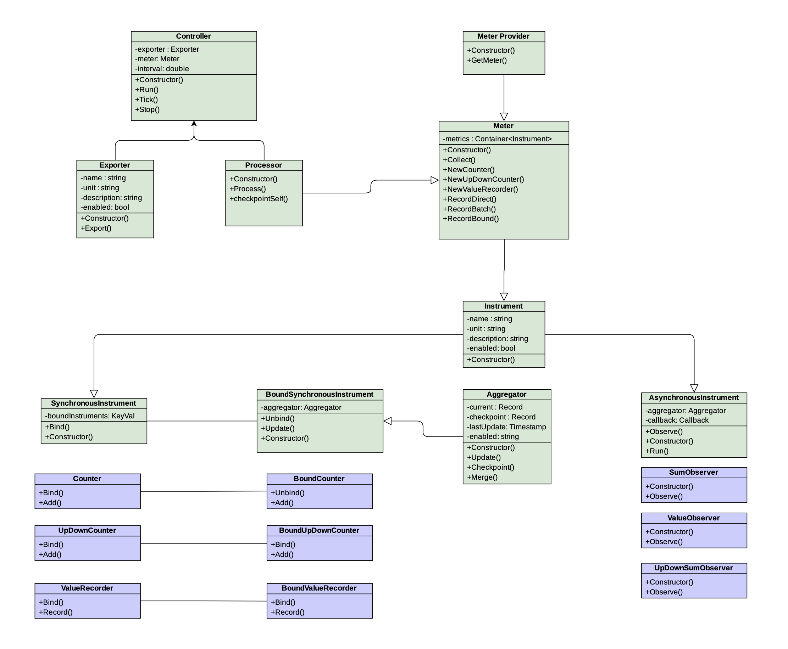
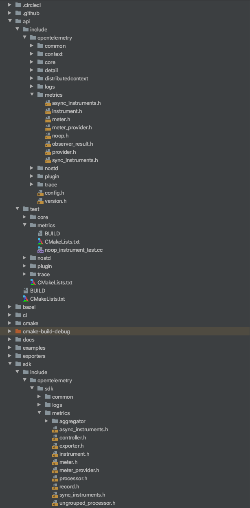
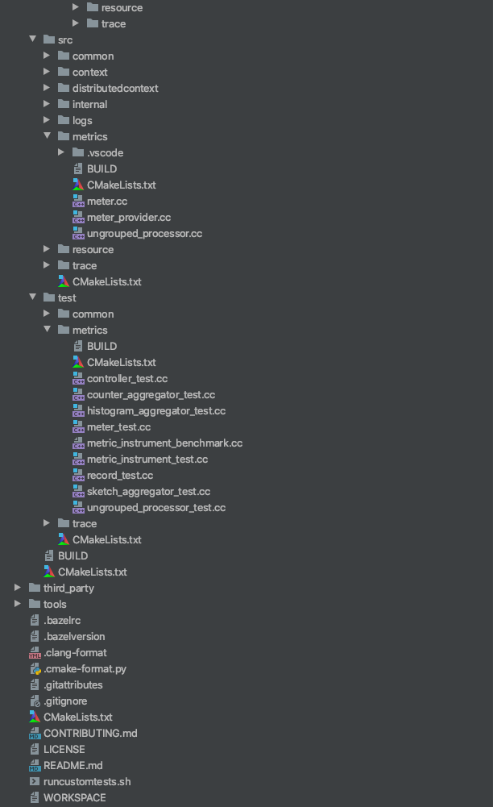
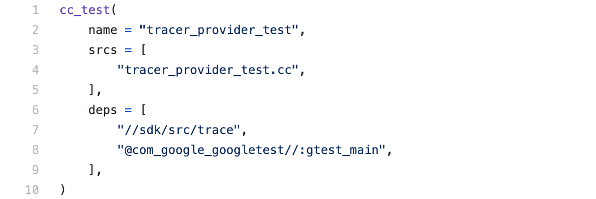
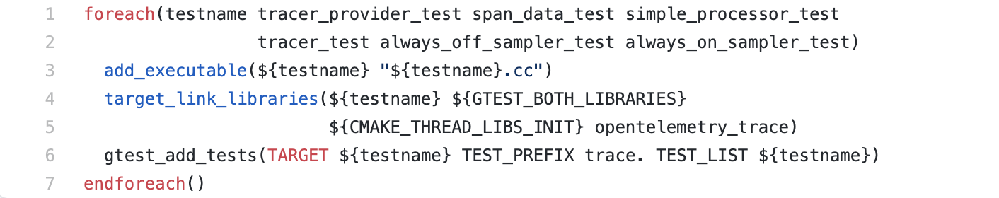

## OpenTelemetry C++ Metrics API & SDK

## Table of Contents

* [Architecture Overview](https://github.com/open-o11y/docs/blob/master/cpp-metrics/README.md#architecture-overview)
   * [Note on Inheritance Hierarchy](https://github.com/open-o11y/docs/blob/master/cpp-metrics/README.md#note-on-inheritance-hierarchy)
* [SDK Data Path](https://github.com/open-o11y/docs/blob/master/cpp-metrics/README.md#sdk-data-path)
* [Usage](https://github.com/open-o11y/docs/blob/master/cpp-metrics/README.md#usage)
* [Repository Structure](https://github.com/open-o11y/docs/blob/master/cpp-metrics/README.md#repository-structure)
* [Testing](https://github.com/open-o11y/docs/blob/master/cpp-metrics/README.md#testing)
   * [Bazel](https://github.com/open-o11y/docs/blob/master/cpp-metrics/README.md#bazel)
   * [CMake](https://github.com/open-o11y/docs/blob/master/cpp-metrics/README.md#cmake)
* [Outstanding Tasks](https://github.com/open-o11y/docs/blob/master/cpp-metrics/README.md#outstanding-tasks)
* [Reference Doucments](https://github.com/open-o11y/docs/blob/master/cpp-metrics/README.md#reference-documents)


## Architecture Overview



### Note on Inheritance Hierarchy

Every components inherits from its API counterpart (if there is one). This is particularly confusing in one instance: Each metric instrument class in the SDK inherits from a base SDK::SynchronousInstrument (or a base SDK::AsynchronousInstrument) AND from their API counter-part. This is done so that the SDK can access functions that are defined only in the SDK versions of instruments even when they are provided a pointer to an API instrument.

### SDK Data Path


There are five main components in the SDK. This is a brief overview of their functions.

* Controller
    * This component is responsible for overseeing and managing the other components. At regular intervals (specified by the user in the Controller constructor) the controller will call Collect() on the meter, sends those records to the Processor’s Process() function, then send the returned records to the exporter’s Export() function.
* Accumulator
    * Otherwise known as the Meter SDK class.
    * This component is used to create and store metric instruments. The user can call functions in the Meter to create a new metric instrument that they can use to record values with. When the Controller calls Collect(), the accumulator loops through all instruments in its internal registry and compiles records from each of them then returns those records to the controller.
* Aggregators
    * Counter, Gauge, MinMaxSumCount, Exact, Histogram, and Sketch
    * These components are responsible for maintaining and updating the actual values that are being recorded. Each aggregator updates these values in a unique way. The aggregators have two vectors: values_ and checkpoints_. The values_ vector is updated each time a new value is recorded to the aggregators. When Collect() is called, the aggregators will be “checkpointed.” This means that their checkpoint_ vector will be set equal to values_ and values_ will be cleared. This checkpoint_ vector is what should be used for export.
* Processor
    * Two modes: Stateless and stateful.
    * This component has two primary functions. The first is to decide which aggregation type to apply to a metric instrument. The other is to merge records which have the same name and instrument together. If the processor is stateful, these values will be stored in an internal map. This can be used to export cumulative metrics.
* Exporter
    * The exporter should receive a batch of aggregated and filtered records that are ready for export. The exact purpose of an exporter depends on which service we are exporting to but generally the exporter must translate OpenTelemetry data to a target data type supported by the backend service, then send that translated data to the service.

## Usage

Before collecting data, the metrics pipeline must be configured:


1. Initialize a MeterProvider. We will use this to obtain Meter objects in the future.  

`auto provider = shared_ptr<MeterProvider>(new MeterProvider);`

2. Set the MeterProvider as the default instance for the library. This ensures that we will have access to the same MeterProvider across our application.

`Provider::SetMeterProvider(provider);`

3. Obtain a meter from this meter provider. Every Meter pointer returned by the MeterProvider points to the same Meter. This means that the Meter will be able to combine metrics captured from different functions without having to constantly pass the Meter around the library.

`shared_ptr<Meter> meter = provider→GetMeter("Test");`

4. Initialize an exporter and processor. In this case, we initialize an OStream Exporter which will print to stdout by default. The Processor is an UngroupedProcessor which doesn’t filter or group captured metrics in any way. The false parameter indicates that this processor will send metric deltas rather than metric cumulatives.

```
unique_ptr<MetricsExporter> exporter = unique_ptr<MetricsExporter>(new OStreamMetricsExporter);  
shared_ptr<MetricsProcessor> processor = shared_ptr<MetricsProcessor>(new UngroupedMetricsProcessor(false));
```

5. Pass the meter, exporter, and processor into the controller. Since this is a push controller, a collection interval parameter (in seconds) is also taken. At each collection interval, the controller will request data from all of the instruments in the code and export them. Start the controller to begin the metrics pipeline.

`metrics_sdk::PushController controller(meter, std::move(exporter), processor, 5);`
`controller.start();`

6. Instrument code with synchronous and asynchronous instrument. These instruments can be placed in areas of interest to collect metrics and are created by the meter. Synchronous instruments are updated whenever the user desires with a value and label set. Calling add on a counter instrument for example will increase its value.  Asynchronous instruments can be updated the same way, but are intended to recieve updates from a callback function. The callback below observes a value of 1. The user never has to call this function as it is automatically called by the controller. 

```

// Observer callback function
void SumObserverCallback(metrics_api::ObserverResult<int> result){
    std::map<std::string, std::string> labels = {{"key", "value"}};
    auto labelkv = trace::KeyValueIterableView<decltype(labels)>{labels};
    result.observe(1,labelkv);
}

// Create new instruments
auto ctr= meter->NewIntCounter("Counter","none", "none", true);
auto obs= meter->NewIntSumObserver("Counter","none", "none", true, &SumObserverCallback);

// Create a label set which annotates metric values
std::map<std::string, std::string> labels = {{"key", "value"}};
auto labelkv = trace::KeyValueIterableView<decltype(labels)>{labels};

// Capture data from instruments.  Note that the asynchronous instrument is updates 
// automatically though its callback at the collection interval.  Additional measurments
// can be made through calls to its observe function.
ctr->add(5, labelkv);

```

7. Stop the controller once the program finished. This ensures that any metrics inside the pipeline are properly exported. Otherwise, some metrics may be destroyed in cleanup.

`controller.stop();`

A more complete usage example can be found [here](https://github.com/open-telemetry/opentelemetry-cpp/pull/258).

## Repository Structure

**API**

* All API header files are located in the folder api/include/opentelemetry/metrics. 
* There are no source files in the API. 
* The tests are located in api/test/metrics.

**SDK**

* All SDK header files are located in the folder sdk/include/opentelemetry/metrics.
  * Aggregator header files are located in the further subdirectory sdk/include/opentelemetry/metrics/aggregator.
* The SDK source files can be found in sdk/src/metrics.
* The tests are located in sdk/test/metrics.

In order to better convey the repository structure there is an embedded image of the directory below. This does not include all metrics files but does show
where the header, source, and test files are located.

Screenshot of directory structure (**NOTE: This does NOT include all Metrics API & SDK files):**




## Testing

The OpenTelemetry C++ repository supports two build systems simultaneously, CMake and Bazel. These two frameworks are applied around the repo and make it easy to run tests.

### **Bazel**

**To Run Tests:**

* In the terminal, navigate to the directory the `WORKSPACE` file resides in, and execute two commands:
    * `bazel build //path/to/package:target-name` builds the unit test with the given target name;
    * `bazel-bin/path/to/package/target-name` runs the unit test.
    * For example, these commands will build and execute the the test named tracer_provider_test in the sdk/test/trace directory
        * `bazel build //sdk/test/trace:tracer_provider_test`
        * `bazel-bin/sdk/test/trace/tracer_provider_test`
* On a similar note, the command: 
    * `bazel test //path/to/package:target-name `
    * does these above two commands at once, though you may get a message stating "There were tests whose specified size is too big" and they may not run without modifying some options.
* Additionally, all Bazel tests can be ran in a Docker container by navigating to the root of the directory and executing the command:
    * `./ci/run_docker.sh ./ci/do_ci.sh bazel.test`


**To Add Tests:**
Bazel makes use of a `BUILD` file, which gives instructions to bazel on how to build the project. The file contains targets that point to a set of source files and dependencies. Along with a `BUILD` file, a `WORKSPACE` file exists that identifies the directory it resides in as a Bazel workspace. In the OpenTelemetry C++ repository, the SDK unit tests using the Google Test framework to ensure code functionality. In the [BUILD](https://github.com/open-telemetry/opentelemetry-cpp/tree/master/sdk/test/trace) file for trace tests, there are six different targets, each corresponding to a different unit test. An example target taken from this file is shown below.



Integrating Google Tests with bazel is as simple as creating a target with:

* ***name***: The target name, aka the name of the binary to build
* ***srcs***: The source file containing the tests
* ***deps***: The dependencies of the build; 
    * here, `//sdk/src/trace` refers to the directory of the source code being tested, and `@com_google_googletest//:gtest_main` is the Google Test dependency. 

### CMake

**To Run Tests:**

* In the terminal, navigate to the build directory (should be root/build after running the command `cmake`) and execute the following command:
    * `ctest -R <name_of_your_test>`
    * For example, this command will build and execute the test named TEST(Meter, CollectSyncInstruments) in the metrics library:
        * `ctest -R metrics.Meter.CollectSyncInstruments`
* Additionally, all CMake tests can be ran in a Docker container by navigating to the root of the directory and executing the command:
    * `./ci/run_docker.sh ./ci/do_ci.sh cmake.test`


**To Add Tests:**
CMake makes use of a `CMakeLists.txt` file that provides instructions for a project’s source files and targets. There is a main `CMakeLists.txt` file in the root of the project directory, and a `CMakeLists.txt` for each subdirectory. In the main `CMakeLists.txt` file, the `cmake_minimum_required`  and `CMAKE_CXX_STANDARD` are set, the project name is set with `project()`, directories are included and subdirectories added, and much more. However, more importantly, in the context of Google Test within the OTel CPP repo, the `CMakeLists.txt` to look at is the one located in the directory your tests are being written in; for this example, it’s `opentelemetry-cpp/sdk/test/trace`. This[CMakeLists.txt](https://github.com/open-telemetry/opentelemetry-cpp/blob/master/sdk/test/trace/CMakeLists.txt) file, shown below, describes the names of the tests to be added as executables.



This is how a `CMakeLists.txt` file will be written with the purpose of unit testing. After writing a unit test, navigate to the `CMakeLists.txt` file for that subdirectory and add the test name to the list of test names in `foreach()`.

## Outstanding Tasks

We have filed several issues for enhancements to the metrics library:

* [Allow users to specify aggregators](https://github.com/open-telemetry/opentelemetry-cpp/issues/253)
* [Change key for ungrouped processor to a struct/class](https://github.com/open-telemetry/opentelemetry-cpp/issues/254)
* [Bug: Aggregators with no updates are still exported](https://github.com/open-telemetry/opentelemetry-cpp/issues/255)
* [Add support for multiple meters](https://github.com/open-telemetry/opentelemetry-cpp/issues/256)
* [Aggregators shouldn't store values in vectors](https://github.com/open-telemetry/opentelemetry-cpp/issues/257)
* [Allow users to specify a Metrics Controller thread](https://github.com/open-telemetry/opentelemetry-cpp/issues/260)
* [Add customization to Exact/Sketch Aggregators](https://github.com/open-telemetry/opentelemetry-cpp/issues/259)
* [Allow users to specify Controller's thread](https://github.com/open-telemetry/opentelemetry-cpp/issues/260)

## Pull Requests Filed and Merged
* [OStream Span Exporter](https://github.com/open-telemetry/opentelemetry-cpp/pull/183)
* [OStream Metrics Exporter](https://github.com/open-telemetry/opentelemetry-cpp/pull/218)
* [MeterProvider API](https://github.com/open-telemetry/opentelemetry-cpp/pull/165)
* [MeterProvider SDK](https://github.com/open-telemetry/opentelemetry-cpp/pull/182)
* [MMSC and Gauge aggregators](https://github.com/open-telemetry/opentelemetry-cpp/pull/182)
* [Counter and Histogram aggregators](https://github.com/open-telemetry/opentelemetry-cpp/pull/178)
* [Exact aggregator](https://github.com/open-telemetry/opentelemetry-cpp/pull/198)
* [Sketch aggregator](https://github.com/open-telemetry/opentelemetry-cpp/pull/213)
* [Instruments API](https://github.com/open-telemetry/opentelemetry-cpp/pull/161)
* [Synchronous Instruments SDK](https://github.com/open-telemetry/opentelemetry-cpp/pull/179)
* [Asynchronous Instruments SDK](https://github.com/open-telemetry/opentelemetry-cpp/pull/191)
* [Meter API](https://github.com/open-telemetry/opentelemetry-cpp/pull/162)
* [Meter SDK](https://github.com/open-telemetry/opentelemetry-cpp/pull/212)
* [Processor](https://github.com/open-telemetry/opentelemetry-cpp/pull/229)
* [Controller](https://github.com/open-telemetry/opentelemetry-cpp/pull/231)

## Reference Documents

Designs for the API and SDK can be found in our [public documents repository](https://github.com/open-o11y/docs/tree/master/cpp-metrics).

Design for the OStreamExporters can be found in our [public documents repository](https://github.com/open-o11y/docs).

Pipeline testing instructions and scripts can be found in our [public C++ repository](https://github.com/open-o11y/opentelemetry-cpp/tree/master/sdk/test/metrics).

A simple usage example with explanation on the [OpenTelemetry C++ repository](https://github.com/open-telemetry/opentelemetry-cpp/pull/258).

## Contributors
* [Ankit Bhargava](https://github.com/ankit-bhargava)
* [Brandon Kimberly](https://github.com/Brandon-Kimberly)
* [Hudson Humphries](https://github.com/HudsonHumphries)
