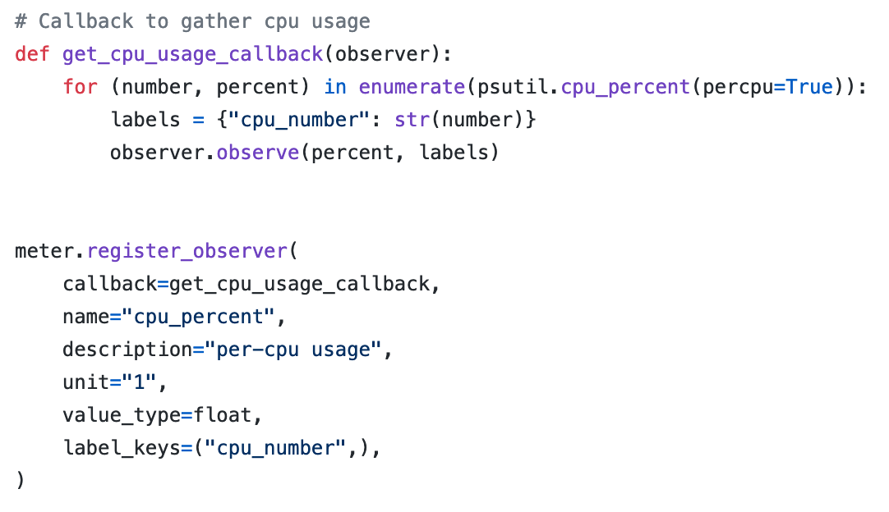
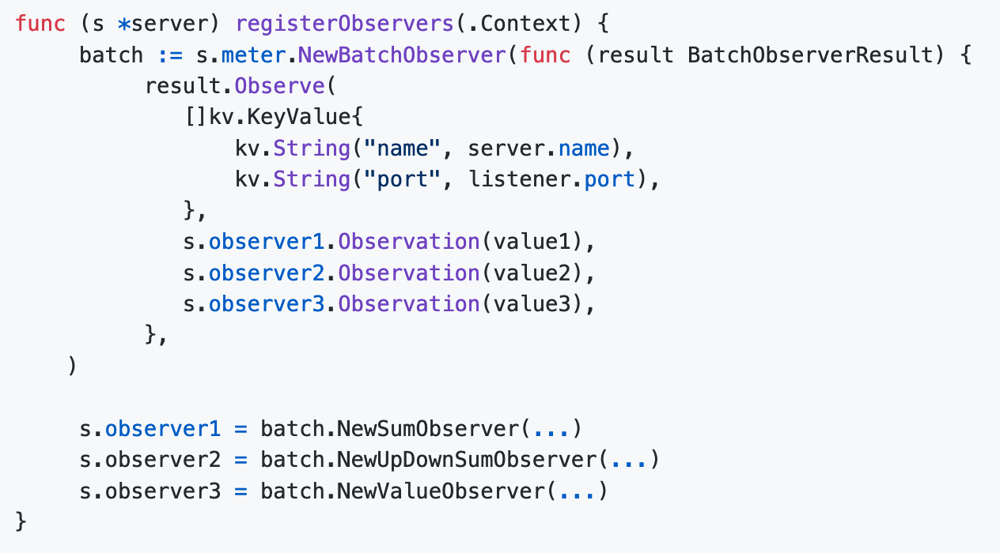

# Metrics API Requirements

Sources

* [Metrics API Specification](https://github.com/open-telemetry/opentelemetry-specification/blob/master/specification/metrics/api.md)
* [Metrics SDK Specification (WIP)](https://github.com/jmacd/opentelemetry-specification/blob/jmacd/draft_metric_sdk_spec/specification/sdk-metric.md)

Overview Diagram
[Image: image.png]
## **Meter Interface (`MeterProvider` Class)**

This interface consists of a set of instrument constructors, and a facility for capturing batches of measurements in a semantically atomic way.  It is also responsible for Aggregation, the transformation of multiple metric updates into a meaningful metric measurement.  

The Meter interface MUST provide a `MeterProvider` class.

**Obtaining a Meter**

* New Meter instances are created via a `MeterProvider` and its `GetMeter(name,version)` method
* API SHOULD provide a single global default `MeterProvider` and allow an SDK `MeterProvider` to be installed in its place

**`GetMeter(name, version)` Method**

* Expects 2 string arguments:
    * name (required): identifies the instrumentation library.  If a null or empty string is specified, a working Meter instance is still returned as opposed to a null return or an exception.  A no-op meter is also an acceptable return if the SDK implementation suppresses metrics from the library identified by the name.
    * version (optional): specifies the version of the instrumenting library

**Global Meter Provider**

API SHOULD support a global `MeterProvider`.  When a global instance is supported, the API MUST ensure that `Meter` instances derived from the global `MeterProvider` are initialized AFTER the global SDK implementation is first initialized.

The singleton global `MeterProvider` can be used to obtain a global Meter by calling `global.GetMeter(name,version)` which calls `GetMeter() `on the initialized global `MeterProvider`

[Image: image.png]

A `MeterProvider` MUST support a  `global.SetMeterProvider(MeterProvider)` function which installs the SDK implementation of the `MeterProvider` into the API

## **Metric Instruments (`Meter` Class)**

Defined as devices used to capturing raw measurements in the API.  Metric instruments are created through instances of the `Meter` class.  Each instrument can be described with the following properties:

* Synchronicity:  A synchronous instrument is called by the user in a distributed [Context](https://github.com/open-telemetry/opentelemetry-specification/blob/master/specification/context/context.md) (i.e., Span context, Correlation context) and is updated once per request. An asynchronous instrument is called by the SDK once per collection interval and only one value from the interval is kept.
* Additivity:  An additive instrument is one that records additive measurements, meaning the final sum of updates is the only useful value.  Non-additive instruments should be used when the intent is to capture information about the distribution of values.
* Monotonicity: A monotonic instrument is an additive instrument, where the progression of each sum is non-decreasing. Monotonic instruments are useful for monitoring rate information

**Metric Events**

Metric Instruments capture Metric Events which MUST include the following information

* timestamp (implicit)
* instrument definition (name, kind, description, unit of measure)
* label set (key value pairs)
* value (signed int or float)
* resources associated with the SDK at startup

Metric instruments are primarily defined by their name.  Names MUST conform to the following syntax:

* Non-empty string
* case-insensitive
* first character non-numeric, non-space, non-punctuation
* subsequent characters alphanumeric, ‘_’, ‘.’ , and ‘-’

`Meter` instances MUST return an error when multiple instruments with the same name are registered

Each distinctly named Meter (i.e. Meters derived from different instrumentation libraries) MUST create a new namespace for metric instruments descending from them.  Thus, the same instrument name can be used in an application provided they come from different Meter instances. 

**Synchronous & Asynchronous Instruments**

Synchronous instruments occur inside a request, so they have an associated Context (Span context, Correlation Context, etc.)  Therefore, multiple metric events may occur within a collection interval. 

Asynchronous events are reported by a callback only once per collection interval, so they can only report one value per period.  Multiple values for the same label set are ignored and only the last is kept.

Each instrument MUST support a single function which adheres to its semantic meaning.

* Synchronous additive: Add()
* Synchronous non-additive: Record()
* Asynchronous: Observe()

**Instrument Types (Numerous Instrument Classes):**

The following instrument types MUST be supported
[Image: image.png]Generally, Observer variants are used when capturing the value of interest is computationally expensive (polling the CPU load, counting cache missed, etc.) 

**Obtaining Instruments**

Meter interface MUST support the creation of new metric instruments through constructors for each type.   Instrument constructors are named by adding a `New-` prefix to the kind of instrument it constructs, with a builder pattern, or some other idiomatic approach in the language.

**Label Set**

A key:value mapping of some kind MUST be supported as annotation each metric event.
Labels MUST be represented the same way throughout the API (i.e. using the same idiomatic data structure)
Duplicates are dealt with by taking the last value mapping
Languages MAY support ordered key labeling (e.g. OrderedLabels(“a”,“b”,“c”) → “a”:1,“a”:2,“a”:3,

**Synchronous Instrument Details**

MUST support bound instrument calling (where labels remain the same on each call)
`instrument.Bind(labels)`
`instrument.Add(4)`
All subsequent calls will include the labels implicitly in their recording

MUST support direct calling (where labels are explicitly included in each call)
`instrument.Add(4, labels)`

MUST support `RecordBatch` calling (where a single set of labels is applied to several metric instruments)
`meter.RecordBatch(labels, counter.measurement(1), updowncounter.measurement(10))`

Future: add support using Correlation Context as labels automatically

**Asynchronous Instrument Details**

MUST support measurement capture through single-instrument or multi-instrument callback

Single instrument callback:

Multi-instrument callback:

# Metrics SDK Requirements ([WIP](https://github.com/jmacd/opentelemetry-specification/blob/jmacd/draft_metric_sdk_spec/specification/sdk-metric.md))

Note: these requirements come from a specification currently under development.  Changes and feedback are in [PR #347](https://github.com/open-telemetry/opentelemetry-specification/pull/347) and the current document is linked [here.](https://github.com/jmacd/opentelemetry-specification/blob/jmacd/draft_metric_sdk_spec/specification/sdk-metric.md)

## **Accumulator**

The Accumulator creates and tracks instruments. It MUST maintain aggregators for each active instrument.

`Collect()` sweeps through metric instruments with un-exported updates, checkpoints their aggregators, and submits them to the processor.

`RecordBatch(instruments, values, labels)` This functions applies labels to and updates the values of multiple instruments in one call.

Accumulator MUST maintain aggregators for each active instrument with distinct a `labelSet`.

Look at [Reccomended Implementation](https://github.com/jmacd/opentelemetry-specification/blob/jmacd/draft_metric_sdk_spec/specification/sdk-metric.md#recommended-implementation)

## Aggregator

Aggregators MUST support `Update()`, `Checkpoint()`, and `Merge()` operations. `Update()` is called directly from the Meter in response to a metric event, and may be called concurrently. The `Checkpoint()` operation is called to atomically save a snapshot of the Aggregator. The `Merge()` operation supports dimensionality reduction by combining state from multiple aggregators into a single Aggregator state.

SDK MUST include the Counter aggregator which maintains a sum and the gauge aggregator which maintains last value and timestamp. Should be atomic in languages that support atomic operations

SDK SHOULD include MinMaxSumCount, Sketch, Histogram, and Exact aggregators

## **Processor**

The Processor SHOULD act as the primary source of configuration for exporting metrics from the SDK. The two kinds of configuration are:

1. Given a metric instrument, choose which concrete aggregator type to apply for in-process aggregation.
2. Given a metric instrument, choose which dimensions to export by (i.e., the "grouping" function).

## **Controller**

A controller is needed to coordinate the decision to begin collection. Controllers generally are responsible for binding the Accumulator, the Processor, and the Exporter.

Once the export interval has been reached, the controller MUST call `Collect()` on the Accumulator, then read the checkpoint from the Processor, then invoke the Exporter.

## **Exporter**

The exporter SHOULD be called with a checkpoint of finished export records. Most configuration decisions have been made before the exporter is invoked, including which instruments are enabled, which concrete aggregator types to use, and which dimensions to aggregate by.

# View API

https://docs.google.com/document/d/1ZyPNOqByj4GFxLhXeB8bENR4uWmR3NPYiaS46yrlWTQ/edit
