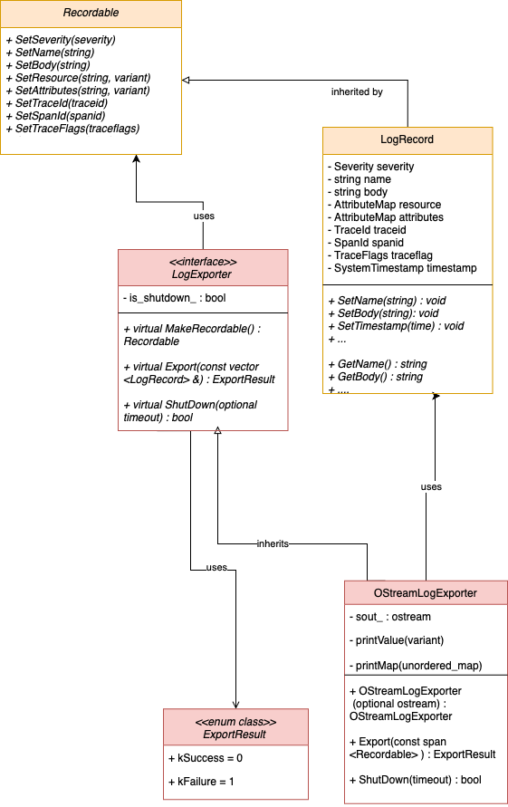

# OpenTelemetry C++ Logging OStream Exporter

## Architecture Overview




* `OstreamLogExporter` class:
    * Prints out each field of the log’s records, that inherits the `LogExporter` interface. Helper functions are defined to print out map structures, and versatile data types (such as variants). 
* `LogRecord` class:
    * The default storage of log records, that implements the public methods of the `Recordable` interface. 

## Repository Structure

SDK interfaces 

* The `LogExporter` interface is defined in `sdk/include/opentelemetry/sdk/logs`.
* The `Recordable` interface and `LogRecord` default implementation are both defined in `sdk/include/opentelemetry/sdk/logs`.

OStream Exporter 

* All header files are located in the folder `exporters/elasticsearch/include/opentelemetry/exporters/ostream`
* All implementation files can be found in `exporters/ostream/src`.
* The unit tests are located in `exporters/ostream/test`

Examples
A full logging example is in `examples/logs_simple`.

## Usage

The OStream Log exporter can be used to test the full logging data pipeline. An example of this is shown in the `/examples` folder. 

## Testing

### CI Tests 

The CI tests can be run on a docker container to test whether they are all passing before submitting a PR upstream.

For example, the Bazel CI test can be run with the command:

```
./ci/run_docker.sh ./ci/do_ci.sh bazel.test
```

The instructions on how to run them can be found in the [README](https://github.com/open-telemetry/opentelemetry-cpp/blob/master/ci/README.md) in the `/ci` folder for the mainrepository.

CI Tests will also be run upon pushing to the master branch on the  `opentelemetry-cpp` repository on Github. The results will be seen in in the “Github Actions“ tab. 

### Unit Tests

The OpenTelemetry C++ repository supports two build systems simultaneously: Bazel and CMake. When writing unit tests, both the bazel `BUILD` files as well as the `CMakeLists.txt` files must be updated. 

Run A Specific Unit Test: 

* Using [Bazel](https://bazel.build/):

```
bazel test //path/to/package:target-name
```

* or using [CMake](https://cmake.org/):

```
ctest -R <name_of_your_test>
```

## Pull Requests

[Add OStream Log Exporter and tests](https://github.com/open-telemetry/opentelemetry-cpp/pull/430)

## Reference Documents

* The OStream Exporter design doc can be found in the o11y team `/docs` repository 

## Contributors

* [Karen Xu](https://github.com/MarkSeufert)
* [Mark Seufert](https://github.com/MarkSeufert)
