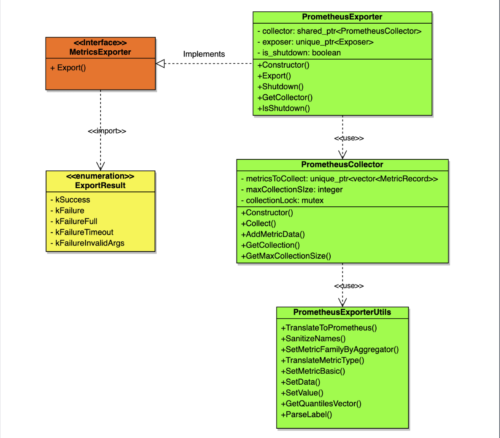
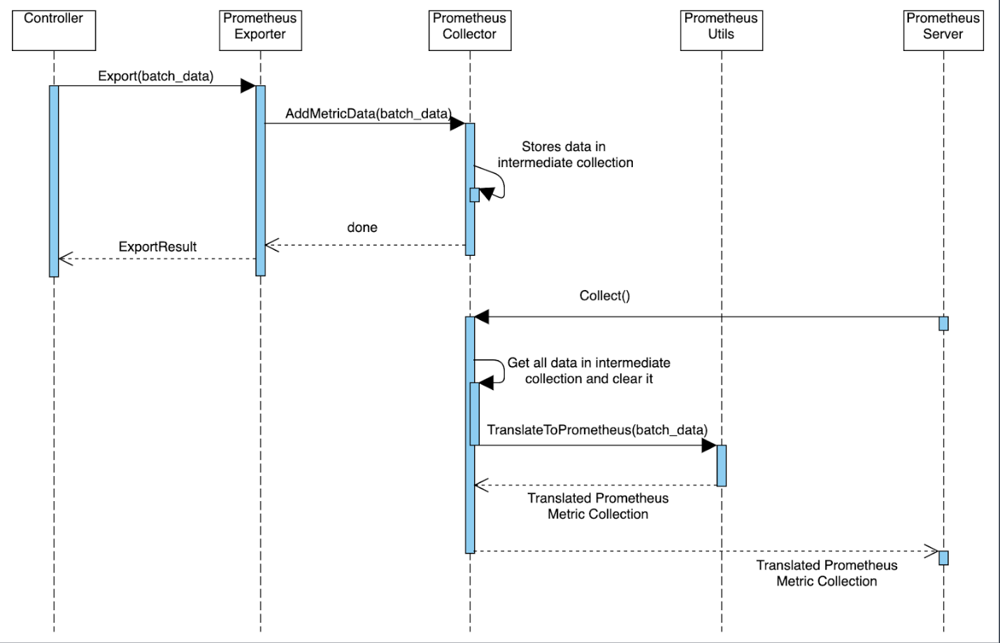
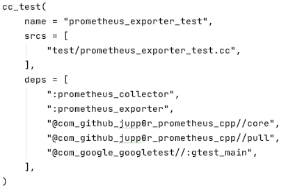

## OpenTelemetry C++ Prometheus Exporter

## Table of Contents    
* [Architecture Overview](#architecture-overview)
    * [Prometheus Exporter Architecture](#prometheus-exporter-architecture)
    * [Prometheus Exporter Data Path](#prometheus-exporter-data-path)
* [Usage](#usage)
* [Repository Structure](#repository-structure)
* [Testing](#testing)
   * [Bazel](#bazel)
   * [CMake](#cmake)
* [Outstanding Tasks](#outstanding-tasks)
    * [Future Enhancements](#future-enhancements)
* [Pull Requests](#pull-requests)
* [Reference Documents](#reference-documents)
* [Contributors](#contributors)


## Architecture Overview


### Prometheus Exporter Architecture
- `MetricsExporter` Interface
    - This component defines the basic behaviors of a metric exporter implemented by all metrics exporters.
- `ExportResult` Class
    - This component enumerates all export status codes.
- `PrometheusExporter` Class
    - This component provides an implementation of `MetricsExporter` interface for exporting data to Prometheus.
- `PrometheusCollector` Class
    - This component interacts with Prometheus backend. It temporarily holds metrics data collected by Metrics SDK, 
    and serves data for Prometheus pull requests.
- `PrometheusExporterUtils` Class
    - This component contains all helper and util functions needed in the exporter.


### Prometheus Exporter Data Path
#### Exporter
The position the exporter lies in the metric SDK and the data pipeline before the exporter is shown 
[here](../../cpp-metrics/README.md#sdk-data-path). The exporter should receive a batch of aggregated and filtered records that are ready for export. 
The exact purpose of an exporter depends on which service we are exporting to but generally the exporter 
must translate OpenTelemetry data to a target data type supported by the backend service, then send that 
translated data to the service.

#### Inside the Prometheus Exporter


The entire Prometheus Exporter data pipeline can be split into a producer side and a consumer side. The producer side starts from the 
[`Controller`](https://github.com/open-telemetry/opentelemetry-cpp/blob/master/sdk/include/opentelemetry/sdk/metrics/controller.h) 
in the metrics SDK. Metrics SDK collects and pre-processes metric data and calls the `Export()` function in the `PrometheusExporter` class 
to send data to exporters. Then, the `PrometheusExporter` passes the same batch of data 
to `PrometheusCollector` by calling the `AddMetricsData()` function. `PrometheusCollector` receives the batch, and temporarily stores data 
in an in-memory collection. `PrometheusExporter` also exposes an HTTP endpoint and waits for Prometheus pull requests to scrape data from the collection. Note that there are six instruments and six aggregators in the C++ Metrics SDK, but there is not a one to one mapping of instruments to aggregators. That means only two aggregators are mapped to from these six instrument types used to collect metric data. As a result, current usage of the C++ Metrics SDK does not allow for all six aggregators to be used, and subsequently affects the diversity of data that can be exported.

The consumer side starts with a Prometheus pull request. Prometheus server first sends a pull request to the HTTP endpoint we exposed. 
The HTTP server defines a [`Collectable`](https://github.com/jupp0r/prometheus-cpp/blob/master/core/include/prometheus/collectable.h) 
interface, and it has a registry inside. Every class that implements the `Collectable` interface can register itself to the HTTP server, 
and then the HTTP server will scan all registered components to scrapes data from them. Our `PrometheusCollector` is such a class, so the Prometheus 
server will find our collector in the registry and call the `Collect()` function. `PrometheusCollector` will fetch all data from the 
intermediate collection, call helper functions in `PrometheusExporterUtils` class to parse the data to the structure that is acceptable 
by Prometheus, and serve the parsed result.


## Usage
### Use in the metric data pipeline
In order to use Prometheus Exporter in the metric data pipeline, follow the setup steps [here](../../cpp-metrics/README.md#usage),
but initialize a `PrometheusExporter` instead of an `OStreamExporter`:
```C++
unique_ptr<MetricsExporter> exporter = unique_ptr<MetricsExporter>(new PrometheusExporter);  
```

### Use for a test program
In order to run an example program to test the Prometheus Exporter, you can setup and run in the following steps.
1. Configure an HTTP endpoint address to expose for Prometheus to scrape data.
    ```C++
    string address = "localhost:8080";
    ```
2. Initialize a PrometheusExporter instance with the address.
    ```
    PrometheusExporter exporter{address};
    ```
3. Keep generating metrics data in a while loop, so that the sample program will keep running until shutdown manually.
    ```C++
    int counter = 0;
    
    for (;;)
    {
       // configure the aggregator
       auto aggregator = std::shared_ptr<metric_sdk::Aggregator<double>>(
           new metric_sdk::CounterAggregator<double>(metric_api::InstrumentKind::Counter));
       
       // build a metric record with aggregator...
       auto record = ...
   
       // add record to collection and export the collection
       collection.emplace_back(record);
       exporter.Export(collection);
    
       // increase the counter and sleep for one second
       counter++;
       std::this_thread::sleep_for(std::chrono::seconds(1));
    }
    ```
4. A more complete usage example can be found [here](https://github.com/open-o11y/opentelemetry-cpp/tree/cpp-prometheus-exporter-07122020/examples/prometheus_exporter).

## Repository Structure
**Interface**
- `MetricExporter` interface is defined in `sdk/include/opentelemetry/sdk/metrics`.
- Metric `Record` that is exported is defined in `sdk/include/opentelemetry/sdk/metrics`.

**Prometheus Exporter Implementation**
- All header files are located in the folder `exporters/prometheus/include/opentelemetry/exporters/prometheus`.
- All implementation files can be found in `exporters/prometheus/src`.
- The unit tests are located in `exporters/prometheus/test`.

**Example Program**
- Example program is in `examples/prometheus_exporter`

In order to better convey the repository structure there is an embedded image of the directory below. This does not 
include all metrics files but does show where the header, source, and test files are located.

Screenshot of directory structure:


## Testing
The OpenTelemetry C++ repository supports two build systems simultaneously, CMake and Bazel. 
These two frameworks are applied around the repo and make it easy to run tests.

### Bazel
**To Run Tests:**

- In the terminal, navigate to the directory the `WORKSPACE` file resides in, and execute two commands:
    - `bazel build //path/to/package:target-name` builds the unit test with the given target name;
    - `bazel-bin/path/to/package/target-name` runs the unit test.
    - For example, these commands will build and execute the the test named `prometheus_collector_test` in the `exporters/prometheus/test` directory
        - `bazel build //exporters/prometheus:prometheus_collector_test`
        - `bazel-bin/exporters/prometheus/test/prometheus_collector_test`
- Additionally, all Bazel tests can be ran in a Docker container by navigating to the root of the directory and executing the command:
    - `./ci/run_docker.sh ./ci/do_ci.sh bazel.test`

**To Add Tests:**

Bazel makes use of a `BUILD` file, which gives instructions to Bazel on how to build the project. The file contains targets that point to 
a set of source files and dependencies. Along with a `BUILD` file, a `WORKSPACE` file exists that identifies the directory it resides in as a 
Bazel workspace. In the OpenTelemetry C++ repository, the Prometheus Exporter unit tests using the Google Test framework to ensure code functionality. 
An example target taken from this file is shown below.



Integrating Google Tests with Bazel is as simple as creating a target with:
- ***name***: The target name, namely the name of the binary to build
- ***srcs***: The source file containing the tests
- ***deps***: The dependencies of the build; 
    - `:prometheus_collector` and `:prometheus_exporter` refer to the collector and exporter target.
    - `@com_github_jupp@r_prometheus_cpp//*` refers to the Prometheus C++ client dependency.
    - `@com_google_googletest//:gtest_main` is the Google Test dependency. 

### CMake
**To Run Tests:**

* In the terminal, navigate to the build directory (should be root/build after running the command `cmake`) and execute the following command:
    * `ctest -R <name_of_your_test>`
    * For example, this command will build and execute the test named `TEST(PrometheusExporter, InitializeConstructorIsNotShutdown)`:
        * `ctest -R exporter.PrometheusExporter.InitializeConstructorIsNotShutdown`
* Additionally, all CMake tests can be ran in a Docker container by navigating to the root of the directory and executing the command:
    * `./ci/run_docker.sh ./ci/do_ci.sh cmake.test`

**To Add Tests:**

CMake makes use of a `CMakeLists.txt` file that provides instructions for a project’s source files and targets. There is a main `CMakeLists.txt` 
file in the root of the project directory, and a `CMakeLists.txt` for each subdirectory. In the main `CMakeLists.txt` file, the `cmake_minimum_required` 
and `CMAKE_CXX_STANDARD` are set, the project name is set with `project()`, directories are included and subdirectories added, and much more. However, 
more importantly, in the context of Google Test within the OTel CPP repo, the `CMakeLists.txt` to look at is the one located in the directory your 
tests are being written in; for this example, it’s `opentelemetry-cpp/exporters/prometheus`. This 
[CMakeLists.txt](https://github.com/open-telemetry/opentelemetry-cpp/blob/master/exporters/prometheus/test/CMakeLists.txt) file describes the names of the tests to be added as executables.


This is how a `CMakeLists.txt` file will be written with the purpose of unit testing. After writing a unit test, navigate to the `CMakeLists.txt` file 
for that subdirectory and add the test name to the list of test names in `foreach()`.

## Outstanding Tasks
We have filed several issues to the metrics library for enhancements and problems discussion:

- [C++ SDK creates invalid metrics label name records for Prometheus](https://github.com/open-telemetry/opentelemetry-cpp/issues/297)
- [How-to install Prometheus Client in the C++ SDK CI Environment](https://github.com/open-telemetry/opentelemetry-cpp/issues/291)
- [Recommendation on the number of quantile samples](https://github.com/open-telemetry/opentelemetry-cpp/issues/237)
- [Mapping OpenTelemetry MinMaxSumCount aggregator to Prometheus Gauge metric](https://github.com/open-telemetry/opentelemetry-cpp/issues/228)
- [Adding a Google Test Demo Document](https://github.com/open-telemetry/opentelemetry-cpp/issues/170)
- [Design Discussion on the Intermediate Storage of Prometheus Exporter](https://github.com/open-telemetry/opentelemetry-cpp/issues/159)
- [Data structure usage for intermediate storage in Prometheus Exporter](https://github.com/open-telemetry/opentelemetry-cpp/issues/158)
- [Prometheus Exporter HTTP Server Support](https://github.com/open-telemetry/opentelemetry-cpp/issues/138)

### Future Enhancements
- [Make Exporting Quantiles Configurable](https://github.com/open-telemetry/opentelemetry-cpp/issues/259) (filed previously)
- [Authentication and Authorization for Exposed HTTP Endpoint](https://github.com/open-telemetry/opentelemetry-cpp/issues/307)

## Pull Requests
- [MetricsExporter Interface](https://github.com/open-telemetry/opentelemetry-cpp/pull/240)
- [Add PrometheusUtils and project building files](https://github.com/open-telemetry/opentelemetry-cpp/pull/280)
- [Add PrometheusCollector](https://github.com/open-telemetry/opentelemetry-cpp/pull/282)
- [Add PrometheusExporter](https://github.com/open-telemetry/opentelemetry-cpp/pull/263)
- [Modify KvToString() Method in Instrument.h to Allow Valid Label Names in Records For Prometheus](https://github.com/open-telemetry/opentelemetry-cpp/pull/298)
- [Add Prometheus Exporter Example Program](https://github.com/open-telemetry/opentelemetry-cpp/pull/310)

## Reference Documents
- Designs for the Prometheus Exporter can be found in our [public documents repository](./prometheus-exporter-design.md).
- Pipeline testing instructions and scripts can be found in our [team public C++ repository](https://github.com/open-o11y/opentelemetry-cpp/tree/cpp-prometheus-exporter-07122020/exporters/prometheus/test).
- A simple usage example with explanation on the [OpenTelemetry C++ repository](https://github.com/open-o11y/opentelemetry-cpp/tree/cpp-prometheus-exporter-07122020/examples/prometheus_exporter).
- Learn more about Prometheus with official document [here](https://prometheus.io/docs/introduction/overview/).

## Contributors
- [Cunjun Wang](https://github.com/CunjunWang)
- [Eric Hsueh](https://github.com/erichsueh3)
