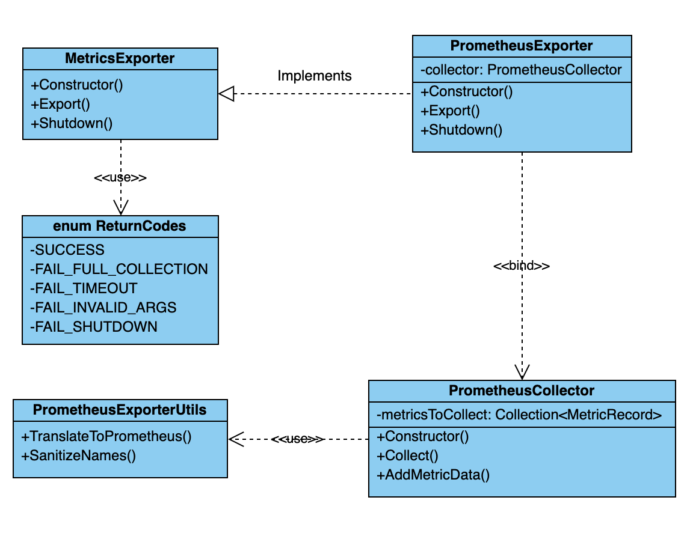
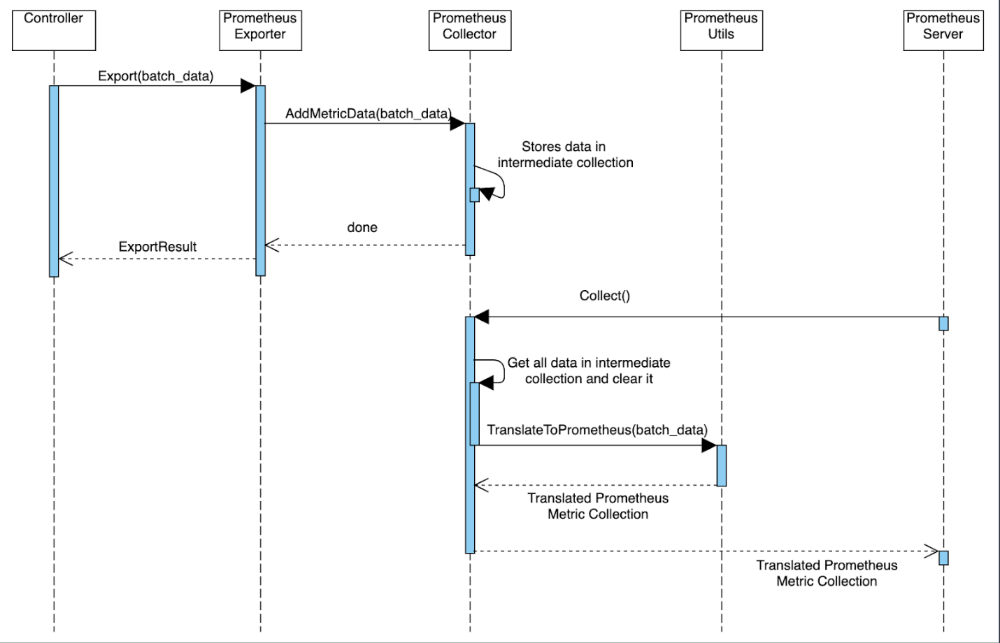
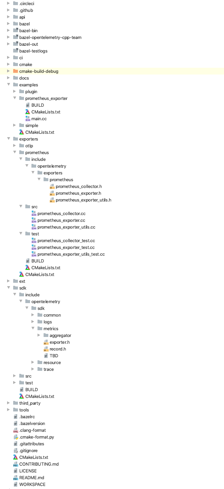
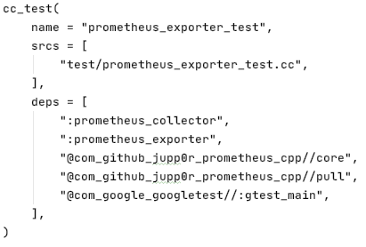
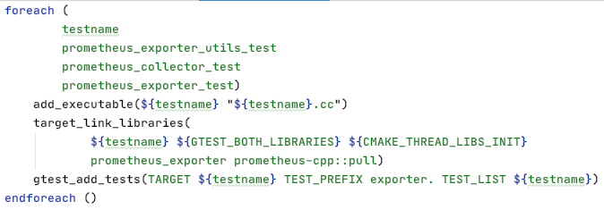

## OpenTelemetry C++ Prometheus Exporter

## Table of Contents    
* [Architecture Overview](#architecture-overview)
    * [Prometheus Exporter Architecture](#prometheus-exporter-architecture)
    * [Prometheus Exporter Data Path](#prometheus-exporter-data-path)
* [Usage](#usage)
* [Repository Structure](#repository-structure)
* [Testing](#testing)
   * [Bazel](#bazel)
   * [CMake](#cmake)
* [Outstanding Tasks](#outstanding-tasks)
* [Reference Doucments](#reference-documents)
* [Contributors](#contributors)


## Architecture Overview


### Prometheus Exporter Architecture
- `MetricsExporter` Interface
    - This component defines the basic behaviors of a metric exporter.
- `PrometheusExporter` Class
    - This component provides an implementation of `MetricsExporter` for exporting data to Prometheus.
- `PrometheusCollector` Class
    - This component interacts with Prometheus backend. It collects and serves data for Prometheus pull requests.
- `PrometheusExporterUtils` Class
    - This component contains all helper and utils functions needed in the exporter.
- `ReturnCode` Class
    - This component defines export status code.

### Prometheus Exporter Data Path
#### Exporter
- The position the exporter lies in the metric SDK and the data pipeline before the exporter is shown 
[here](../../cpp-metrics/README.md#sdk-data-path).
- The exporter should receive a batch of aggregated and filtered records that are ready for export. 
The exact purpose of an exporter depends on which service we are exporting to but generally the exporter 
must translate OpenTelemetry data to a target data type supported by the backend service, then send that 
translated data to the service.

#### Inside Prometheus Exporter



## Usage
### Use in the metric data pipeline
In order to use Prometheus Exporter in the metric data pipeline, follow the setup steps [here](../../cpp-metrics/README.md#usage),
but initialize a `PrometheusExporter` instead of an `OStreamExporter`:
```C++
unique_ptr<MetricsExporter> exporter = unique_ptr<MetricsExporter>(new PrometheusExporter);  
```

### Use for a test program
In order to run an example program to test the Prometheus Exporter, you can setup and run in the following steps.
1. Configure an HTTP endpoint address to expose for Prometheus to scrape data.
    ```C++
    string address = "localhost:8080";
    ```
2. Initialize a PrometheusExporter instance with the address.
    ```
    PrometheusExporter exporter{address}
    ```
3. Keep generating metrics data in a while loop, so that the sample program will keep running until shutdown manually.
    ```C++
    int counter = 0;
    
    for (;;)
    {
       // configure the aggregator
       auto aggregator = std::shared_ptr<metric_sdk::Aggregator<double>>(
           new metric_sdk::CounterAggregator<double>(metric_api::InstrumentKind::Counter));
       
       // build a metric record with aggregator...
       auto record = ...
   
       // add record to collection and export the collection
       collection.emplace_back(record);
       exporter.Export(collection);
    
       // increase the counter and sleep for one second
       counter++;
       std::this_thread::sleep_for(std::chrono::seconds(1));
    }
    ```
4. A more complete usage example can be found [here] (add link later).

## Repository Structure
**Interface**
- Metric Exporter interface is defined in `sdk/include/opentelemetry/sdk/metrics`.
- Metric Record that is exported is defined in `sdk/include/opentelemetry/sdk/metrics`.

**Prometheus Exporter Implementation**
- All header files are located in the folder `exporters/prometheus/include/opentelemetry/exporters/prometheus`.
- All implementation files can be found in `exporters/prometheus/src`.
- The unit tests are located in `exporters/prometheus/test`.

**Example Program**
- Example program is in `examples/prometheus_exporter`

In order to better convey the repository structure there is an embedded image of the directory below. This does not 
include all metrics files but does show where the header, source, and test files are located.

Screenshot of directory structure:




## Testing
The OpenTelemetry C++ repository supports two build systems simultaneously, CMake and Bazel. 
These two frameworks are applied around the repo and make it easy to run tests.

### Bazel
**To Run Tests:**

- In the terminal, navigate to the directory the `WORKSPACE` file resides in, and execute two commands:
    - `bazel build //path/to/package:target-name` builds the unit test with the given target name;
    - `bazel-bin/path/to/package/target-name` runs the unit test.
    - For example, these commands will build and execute the the test named `prometheus_collector_test` in the `exporters/prometheus/test` directory
        - `bazel build //exporters/prometheus:prometheus_collector_test`
        - `bazel-bin/exporters/prometheus/test/prometheus_collector_test`
* Additionally, all Bazel tests can be ran in a Docker container by navigating to the root of the directory and executing the command:
    * `./ci/run_docker.sh ./ci/do_ci.sh bazel.test`

**To Add Tests:**

Bazel makes use of a `BUILD` file, which gives instructions to Bazel on how to build the project. The file contains targets that point to 
a set of source files and dependencies. Along with a `BUILD` file, a `WORKSPACE` file exists that identifies the directory it resides in as a 
Bazel workspace. In the OpenTelemetry C++ repository, the Prometheus Exporter unit tests using the Google Test framework to ensure code functionality. 
An example target taken from this file is shown below.



Integrating Google Tests with bazel is as simple as creating a target with:
- ***name***: The target name, namely the name of the binary to build
- ***srcs***: The source file containing the tests
- ***deps***: The dependencies of the build; 
    - `:prometheus_collector` and `:prometheus_exporter` refer to the collector and exporter target.
    - `@com_github_jupp@r_prometheus_cpp//*` refers to the Prometheus C++ client dependency.
    - `@com_google_googletest//:gtest_main` is the Google Test dependency. 

### CMake
**To Run Tests:**

* In the terminal, navigate to the build directory (should be root/build after running the command `cmake`) and execute the following command:
    * `ctest -R <name_of_your_test>`
    * For example, this command will build and execute the test named `TEST(PrometheusExporter, InitializeConstructorIsNotShutdown)`:
        * `ctest -R exporter.PrometheusExporter.InitializeConstructorIsNotShutdown`
* Additionally, all CMake tests can be ran in a Docker container by navigating to the root of the directory and executing the command:
    * `./ci/run_docker.sh ./ci/do_ci.sh cmake.test`

**To Add Tests:**

CMake makes use of a `CMakeLists.txt` file that provides instructions for a project’s source files and targets. There is a main `CMakeLists.txt` 
file in the root of the project directory, and a `CMakeLists.txt` for each subdirectory. In the main `CMakeLists.txt` file, the `cmake_minimum_required` 
and `CMAKE_CXX_STANDARD` are set, the project name is set with `project()`, directories are included and subdirectories added, and much more. However, 
more importantly, in the context of Google Test within the OTel CPP repo, the `CMakeLists.txt` to look at is the one located in the directory your 
tests are being written in; for this example, it’s `opentelemetry-cpp/exporters/prometheus`. This 
[CMakeLists.txt] (add link later when PR is merged) file describes the names of the tests to be added as executables.



This is how a `CMakeLists.txt` file will be written with the purpose of unit testing. After writing a unit test, navigate to the `CMakeLists.txt` file 
for that subdirectory and add the test name to the list of test names in `foreach()`.

## Outstanding Tasks

We have filed several issues for enhancements to the metrics library:

- [Recommendation on the number of quantile samples](https://github.com/open-telemetry/opentelemetry-cpp/issues/237)
- [Mapping OpenTelemetry MinMaxSumCount aggregator to Prometheus Gauge metric](https://github.com/open-telemetry/opentelemetry-cpp/issues/228)
- [Adding a Google Test Demo Document](https://github.com/open-telemetry/opentelemetry-cpp/issues/170)
- [Prometheus Exporter HTTP Server Support](https://github.com/open-telemetry/opentelemetry-cpp/issues/138)

## Pull Requests Filed (and to be merged)
- [MetricsExporter Interface](https://github.com/open-telemetry/opentelemetry-cpp/pull/240)
- [Prometheus utils header and build config for bazel and CMake](https://github.com/open-telemetry/opentelemetry-cpp/pull/245)
- [Prometheus utils function implementation](https://github.com/open-telemetry/opentelemetry-cpp/pull/250)
- [Prometheus utils unit tests](https://github.com/open-telemetry/opentelemetry-cpp/pull/251)
- [PrometheusCollector header and source files](https://github.com/open-telemetry/opentelemetry-cpp/pull/261)
- [PrometheusCollector unit tests](https://github.com/open-telemetry/opentelemetry-cpp/pull/262)
- [PrometheusExporter header, source, and tests](https://github.com/open-telemetry/opentelemetry-cpp/pull/263)

## Reference Documents
- Designs for the API and SDK can be found in our [public documents repository](https://github.com/open-o11y/docs/tree/master/exporter/cpp-prometheus).
- Design for the OStreamExporters can be found in our [public documents repository](https://github.com/open-o11y/docs).
- Pipeline testing instructions and scripts can be found in our [public C++ repository] (add link here later).
- A simple usage example with explanation on the [OpenTelemetry C++ repository] (add link here later).

## Contributors
- [Cunjun Wang](https://github.com/CunjunWang)
- [Eric Hsueh](https://github.com/erichsueh3)
