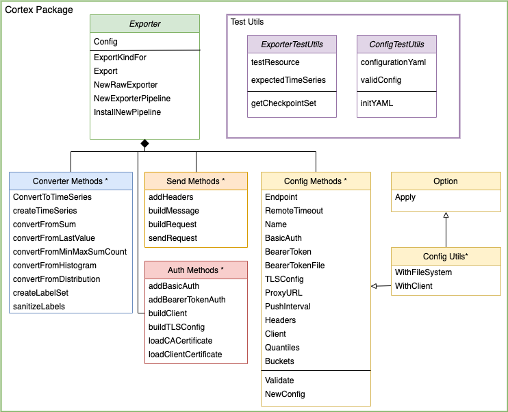
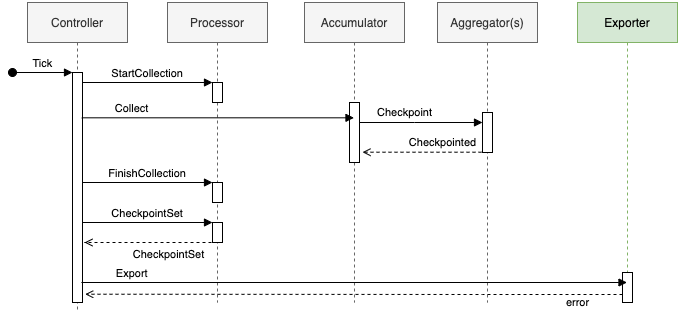
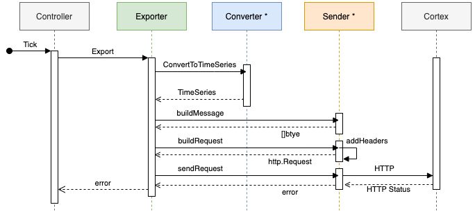

# OpenTelemetry Go SDK Prometheus Remote Write Exporter

## Table of Contents

- [Architecture Overview](#architecture-overview)
  - [Data Path](#data-path)
- [Usage](#usage)
- [Repository Structure](#repository-structure)
- [Testing](#testing)
- [Oustanding Tasks](#oustanding-tasks)
- [Pull Requests Filed and Merged](#pull-requests-filed-and-merged)
- [Reference Documents](#reference-documents)
- [Contributors](#contributors)

## Architecture Overview

> Note: Entities with an \* after their name are not actual classes, but instead logical groupings
> of functions within the Cortex package.



### Data Path

#### OpenTelemetry SDK Data Path



The diagram above outlines the SDK data path. This `Exporter` uses a `Push Controller`, so on a set
interval, Tick will be called starting the data collection. The `Accumulator` will collect all
metrics from the `Aggreators`. The collected metrics are saved in a CheckpointSet in the
`Processor`. The CheckpointSet is then sent to the `Export` when Export() is called.

#### Exporter Data Path



The Exporter receives a CheckpointSet from the Push Controller, converts the CheckpointSet to
TimeSeries, and sends them in a snappy-compressed message via HTTP to Cortex.

## Usage

### 1. Configure the Exporter

> TODO: Explain configuration

```go
type Config struct {
	Endpoint            string            `mapstructure:"url"`
	RemoteTimeout       time.Duration     `mapstructure:"remote_timeout"`
	Name                string            `mapstructure:"name"`
	BasicAuth           map[string]string `mapstructure:"basic_auth"`
	BearerToken         string            `mapstructure:"bearer_token"`
	BearerTokenFile     string            `mapstructure:"bearer_token_file"`
	TLSConfig           map[string]string `mapstructure:"tls_config"`
	ProxyURL            string            `mapstructure:"proxy_url"`
	PushInterval        time.Duration     `mapstructure:"push_interval"`
	Quantiles           []float64         `mapstructure:"quantiles"`
	HistogramBoundaries []float64         `mapstructure:"histogram_boundaries"`
	Headers             map[string]string `mapstructure:"headers"`
	Client              *http.Client
}
```

```go
// Create Config struct using utils module.
config, err := utils.NewConfig("config.yml")
if err != nil {
    return err
}

// Setup the exporter.
pusher, err := cortex.InstallNewPipeline(config)
if err != nil {
    return err
}

// Add instruments and start collecting data.
```

### 2. Setting up an Exporter

Users can setup the Exporter with the `InstallNewPipeline` function. It requires the `Config` struct
created in the first step and returns a push Controller that will periodically collect and push
data.

Example:

```go
pusher, err := cortex.InstallNewPipeline(config)
if err != nil {
    return err
}

// Make instruments and record data
```

### 3. Set up backend

Set up your desired backend, like Cortex, and start receiving data from the Exporter.

## Repository Structure

- `cortex/`
  - `cortex.go`
  - `cortex_test.go`
  - `testutil_test.go`
  - `config.go`
  - `config_test.go`
  - `config_data_test.go`
  - `sanitize.go`
  - `sanitize_test.go`
  - `go.mod`
  - `go.sum`
  - `README.md`
  - `utils/`
    - `config_utils.go`
    - `config_utils_test.go`
    - `config_utils_data_test.go`
    - `go.mod`
    - `go.sum`
  - `example/`
    - `main.go`
    - `go.mod`
    - `go.sum`
    - `config.yml`
    - `cortexConfig.yml`
    - `docker-compose.yml`
    - `README.md`
  - `pipeline/`
    - Will include info on E2E testing
  - TODO: Include authentication info

## Testing

- How to run tests

## Outstanding Tasks

We have filed several issues for enhancements to the Exporter:

- List issues
- here

## Pull Requests Filed and Merged

- [Cortex Exporter Project setup #202](https://github.com/open-telemetry/opentelemetry-go-contrib/pull/202)
- [Cortex Exporter Setup Pipeline and Configuration #205](https://github.com/open-telemetry/opentelemetry-go-contrib/pull/205)
- [Cortex Exporter Send Pipeline #210](https://github.com/open-telemetry/opentelemetry-go-contrib/pull/210)
- [Add convertToTimeseries for Sum, LastValue, and MinMaxSumCount #211](https://github.com/open-telemetry/opentelemetry-go-contrib/pull/211)
- [Add distribution and histogram #237](https://github.com/open-telemetry/opentelemetry-go-contrib/pull/237)
- [Cortex example project #238](https://github.com/open-telemetry/opentelemetry-go-contrib/pull/238)
- [Authentication Implementation and Timestamp fix #246](https://github.com/open-telemetry/opentelemetry-go-contrib/pull/246)

## Reference Documents

Designs for the Exporter can be found in our
[public documents repository](https://github.com/open-o11y/docs/blob/master/exporter/go-prometheus-remote-write/design-doc.md).

A simple usage example with explanation can be found on the
[OpenTelemetry Go SDK Contribution repository](https://github.com/open-telemetry/opentelemetry-go-contrib/tree/master/exporters/metric/cortex/example)

## Contributors

- [Connor Lindsey](https://github.com/connorlindsey)

- [Eric Lee](https://github.com/ercl)
