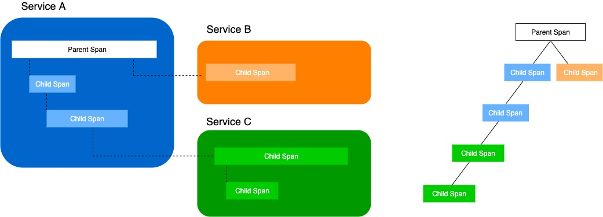
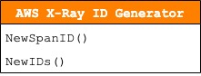
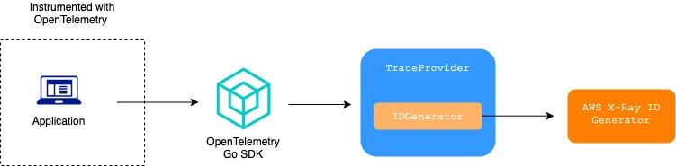
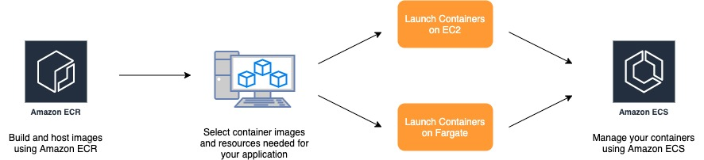
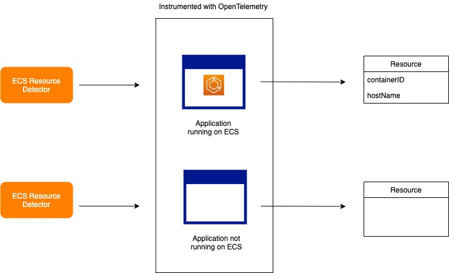
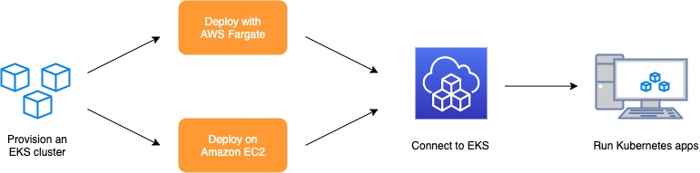
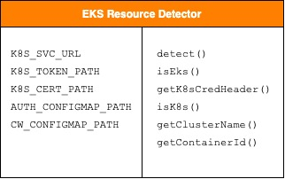
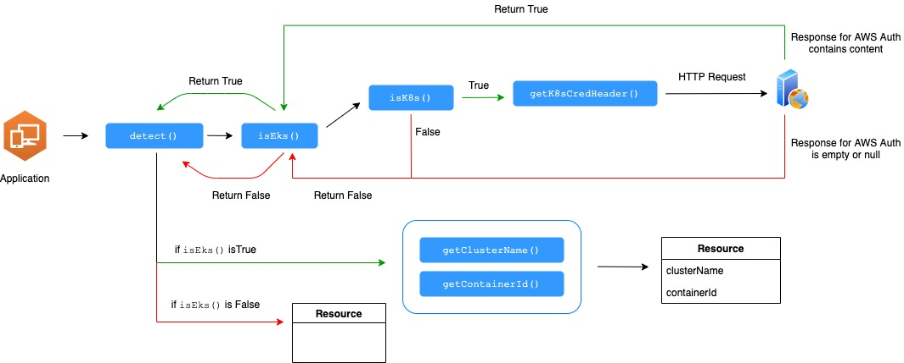

# OpenTelemetry Go SDK Components for AWS X-Ray Design

## Table of Contents
- [AWS X-Ray ID Generator](#aws-x-ray-id-generator)
- [AWS X-Ray Propagator](#aws-x-ray-propagator)
- [ECS Resource Detector](#ecs-resource-detector)
- [EKS Resource Detector](#eks-resource-detector)

## AWS X-Ray ID Generator

### Summary

Tracing refers to the practice used by engineers and developers to analyze application code. Traditionally, this was done through using various different debugging tools and programming techniques. As applications evolved and adopted the microservices architecture, tracing now refers to distributed tracing. This term refers to tracing a path that a request takes as it goes through different services and processes in a multi-service architecture design. To define a trace more precisely in OpenTelemetry terms, it is essentially a group of linked spans, which represent a unit of work in a request. The spans can have information attached such as a name and other data describing the timed operation. Every trace consists of at least a root span and can have zero or more child spans. The root span describes the end-to-end latency of the entire trace, while child spans representing sub-operations.



Each `span` contains the following information:

* name of the operation it represents
* start and end timestamps 
* events and attributes that occurred during the span
* links to other spans
* status of the operation

A `TraceID` is used to uniquely identify a trace. This is useful since it can be used to group together all spans for a specific trace across all processes. The `TraceID` is a 32-hex-character lower case string that is generated when a root span is created. For a spans that have a parent, the `TraceID` is the same as the parent span’s traceId since they both belong to the same trace. 

*Example of a trace with one span:*

```
{"component_kind": "exporter", "component_type": "awsxray", "component_name": "awsxray"}
Resource labels:
    -> service.name: STRING(example-server)
    -> telemetry.sdk.language: STRING(nodejs)
    -> telemetry.sdk.name: STRING(opentelemetry)
    -> telemetry.sdk.version: STRING(0.11.0)
InstrumentationLibrarySpans #0
InstrumentationLibrary awsxray-tests *
Span #0
    Trace ID       : e5f69e7bbf5eedee3c7f8d74d1df1a75cf7c6bd69df5b6f8
    Parent ID      : e3d73de1c6deddf735db4e1e
    ID             : e77e5fd3579ef5ce3d77871d
    Name           : handleRequest
    Kind           : SPAN_KIND_SERVER
    Start time     : 2020-11-13 20:07:58.403258368 +0000 UTC
    End time       : 2020-11-13 20:08:00.40723712 +0000 UTC
    Status code    : STATUS_CODE_OK
    Status message : 
Attributes:
     -> key: STRING(value)
Events:
SpanEvent #0
     -> Name: invoking handleRequest
     -> Timestamp: 1605298078403282944
     -> DroppedAttributesCount: 0
```

The objective of the ID Generator is to be able to support sending traces to AWS X-Ray from OpenTelemetry. This will be done by creating an AWS X-Ray specific ID Generator for generating the `traceID` that conforms to the `traceID` format that AWS X-Ray accepts.

*Example of an AWS X-Ray TraceID Format*


### Design Tenets

1. **Security** - The AWS X-Ray ID Generator will go through a security review to identify any potential vulnerabilities 
2. **Test Driven Development** - We will follow TDD practices established by the team and ensure proper test coverage.
3. **Reliability** - The AWS X-Ray ID Generator will be reliable by gracefully handling errors. The ID Generator must return a `traceID` that is in the format that AWS X-Ray accepts. 
4. **Go Best Practices** - The AWS X-Ray ID Generator will conform to best practices for Go as described in [Effective Go](https://golang.org/doc/effective_go.html).

### Struct Definition and Functions



In the AWS X-Ray ID Generator struct, there are 2 functions which are defined below: 

1. `NewSpanID()`

    This function is responsible for generating a new `spanID` when a new span is created. The `spanID` will be a non-zero randomly chosen sequence. 

2. `NewIDs()`

    This function is responsible for generating a pair of IDs. The first ID will be a `traceID` which is in the format that AWS X-Ray recieves. The second ID will the a `spanID` which uses the same implementation as `NewSpanID()` from above. 

### Architecture

OpenTelemetry requires a `Tracerprovider` to be initialized in order to generate traces. A `Tracerprovider` contains configuration options such as which ID Generator to use, what is the maximum attributes per span, what is the maximum events per span etc.



Whenever a `TracerProvider` instance is initialized to start sending traces, the user will change the default implementation for `IDGenerator` by pointing to the AWS X-Ray ID Generator rather than using the random ID Generator provided by OpenTelemetry. 

### Test Strategy

We will follow TDD practices while completing this project. We’ll write unit tests before implementing production code. Tests will cover normal and abnormal inputs and test for edge cases. The standard [Go testing library](https://golang.org/pkg/testing/) will be used for writing and running the unit tests.


## AWS X-Ray Propagator

### Summary


The ability to correlate events across service boundaries is one of the principle concepts behind distributed tracing. To find these correlations, components in a distributed system need to be able to collect, store, and transfer metadata referred to as context. Propagators are configured inside Tracer objects in order to support transferring of context across process boundaries. A context will often have information identifying the current span and trace, and can contain arbitrary correlations as key-value pairs. Propagation is when context is bundled and transferred across services, often via HTTP headers. This is done by first injecting context into a request and then this is extracted by a receiving service which can then make additional requests, and inject context to be sent to other services and so on. Together, context and propagation represent the engine behind distributed tracing. 

### Objective

The objective of the AWS X-Ray propagator is to provide HTTP header propagation for systems that are using [AWS X-Ray HTTP header format](https://docs.aws.amazon.com/xray/latest/devguide/xray-concepts.html#xray-concepts-tracingheader). Without the proper HTTP headers, AWS X-Ray will not be able to pick up any traces and it’s metadata sent from the collector. The AWS X-Ray propagator translates the OpenTelemetry SpanContext into the equivalent AWS X-Ray header format, for use with the OpenTelemetry Go SDK. By default, OpenTelemetry uses the [W3C Trace Context format](https://www.w3.org/TR/trace-context/)for propagating spans which is different than what AWS X-Ray takes in:

The following is an example of W3 trace header with root traceID.

traceparent: 5759e988bd862e3fe1be46a994272793 tracestate:optional

The following is an example of AWS X-Ray trace header with root trace ID and sample decision.

```
X-Amzn-Trace-Id: Root=1-5759e988-bd862e3fe1be46a994272793;Sampled=1
```


### Design Tenets

1. **Security** - Data will not be modified during the injection and extraction of the headers, it will only inject and extract from the headers of an HTTP request. The Propagator will also go through a security review to identify any potential vulnerabilities. 
2. **Test Driven Development** - We will follow TDD practices established by the team and ensure proper test coverage.
3. **Reliability** - The propagator should be reliable by gracefully handling errors such as invalid traceID, empty context, etc, and empty headers. As per the [specifications](https://github.com/open-telemetry/opentelemetry-specification/blob/master/specification/context/api-propagators.md), if a value cannot be parsed from a carrier it will not throw an exception and not store a new value in Context, in order to preserve any previously existing valid value.
4. **Go Best Practices** - The propagator will conform to best practices for Go as described in [Effective Go](https://golang.org/doc/effective_go.html).

### Design Details

By default, OpenTelemetry uses the [W3C Trace Context format](https://www.w3.org/TR/trace-context/) for propagating spans, and out-of-the-box supports B3 and Jaeger propagation. The TextMap interface allows other propagators to be implemented, so we implement a propagator that conforms with the [X-Ray trace header format](https://docs.aws.amazon.com/xray/latest/devguide/xray-concepts.html#xray-concepts-tracingheader).

As described in [specification](https://github.com/open-telemetry/opentelemetry-specification/blob/master/specification/context/api-propagators.md), a standard propagator should have the following functions:

* `inject()`
* `extract()`
* `fields()`

The propagator containing the mentioned methods should be held in a struct as shown below:

```go
type AWSXRay struct {
    /**
    struct used to instantiate AWS X-Ray propagator  
    */
}
```

### Fields

Fields refer to the predefined propagation fields. If the carrier is reused, the fields should be deleted before calling [inject](https://github.com/open-telemetry/opentelemetry-specification/blob/b338f9f63dbf02ff8ebd100e8a847e7bf43e2682/specification/context/api-propagators.md#inject).
For example, if the carrier is a single-use or immutable request object, we don't need to clear fields as they couldn't have been set before. If it is a mutable, returnable object, successive calls should clear these fields first. This will return a list of fields that will be used by the TextMapPropagator.

```go
func (awsXRay AWSXRay) Fields() []string {
  /**
  returns a list of fields that will be used by the TextMapPropagator.
  */
}
```

### Inject

The inject method injects the AWS X-Ray values into the header. The implementation should accept 2 parameters, the context format for propagating spans and textMapCarrier interface allowing our propagator to be implemented.

```go
Inject(ctx context.Context, carrier otel.TextMapCarrier) {
   /**
   * Injects values from a given `Context` into a carrier
    * as AWS X-Ray headers.
   *
   * OpenTelemetry defines a common set of format values (TextMapPropagator),
   * and each has an expected `carrier` type.
   *
   * @param context the Context from which to inect values to transmit
   *     
   * @param carrier the carrier of propagation fields, such as http request
   *     headers.
   */
}
```

### Extract

Extract is required in a propagator to extract the value from an incoming request. For example, the values from the headers of an HTTP request are extracted. Given a context and a carrier, extract(), extracts context values from a carrier and return a new context, created from the old context, with the extracted values. The Go SDK extract method should accept 2 parameters, the context and textMapCarrier interface.

```go
Extract(ctx context.Context, carrier otel.TextMapCarrier) context.Context
/**
   * Given a `Context` and a carrier, extract context values from a
   * carrier and return a new context, created from the old context, with the
   * extracted values if the carrier contains AWS X-Ray headers. 
   *
   * @param context the Context from which to extract values to transmit over
   *     the wire.
   * @param carrier the carrier of propagation fields, such as http request
   *     headers.
   */
```


### Test Strategy

We will follow TDD practices while completing this project. We’ll write unit tests before implementing production code. Tests will cover normal and abnormal inputs and test for edge cases. The standard [Go testing library](https://golang.org/pkg/testing/) will be used for writing and running the unit tests. [Go cmp](https://github.com/google/go-cmp) will be used to handle comparison of the headers.

## ECS Resource Detector

### Introduction

This document outlines a proposed design for the AWS ECS Plugin Detector component in the OpenTelemetry Go SDK.

#### What is a Container?
A container is a standard unit of software that packages up code and all its dependencies so the application runs quickly and reliably from one computing environment to another.
 
#### What is AWS ECS?
Amazon Elastic Compute Service [(ECS)](https://docs.aws.amazon.com/AmazonECS/latest/developerguide/Welcome.html) is a fully managed container orchestration service that makes it easy to run, stop, and manager containers on a cluster. A container defined in a task definition can be used to run individual tasks or tasks within a service. 



As defined by OpenTelemetry specifications, a [Resource](https://github.com/open-telemetry/opentelemetry-specification/blob/b338f9f63dbf02ff8ebd100e8a847e7bf43e2682/specification/overview.md#resources) is an immutable representation of the entity producing telemetry. 
For example, a process running in a container on Kubernetes has a cluster name, pod name, and various other metadata describing the environment the process is running on. All of these attributes can be included in the Resource. The primary purpose of a resource as a concept in the SDK is to separate the discovery of resource information from exporters. This allows for independent development and easy customization for users that need to integrate with closed source environments. The SDK must allow for creation of Resources and for associating them with telemetry.

### Objective

The objective of an ECS resource detector is to provide information about the container of a process running on an ECS environment. The ECS resource detector will first detect whether an application instrumented with OpenTelemetry Go SDK is running on ECS or not.

If the ECS resource detector successfully detects that a process is running on an ECS environment, it will populate the resource with metadata about the container the process is in. This will include the containerId(the docker Id of the container) and hostName(host name of the container).

The ECS resource detector will return either an empty Resource or a Resource which is filled with metadata depending on if the application instrumented is running on ECS or not.




### Design Tenets

1. **Security** - When the ECS resource detector is used with distributed tracing, the returned object is associated with the `TracerProvider` and the association cannot be changed. The ECS resource detector will also go through a security review to identify any potential vulnerabilities.
2. **Scalability** - The ECS resource detector will be designed such that is extendable to capture other data and fields if additional requirements arise in the future.
3. **Test Driven Development** - We will follow TDD practices established by the team and ensure proper test coverage.
4. **Reliability** - The ECS resource detector should be reliable by gracefully handling errors such as not running on an ECS environment, failure to read files, and failure to detect host name. As per the specifications, failure to detect a resource should not throw an error.
5. **Go Best Practices** - The ECS resource detector will conform to best practices for Go as described in [Effective Go](https://golang.org/doc/effective_go.html).

### Design

Resource is used to define attributes of the application itself, for example the cloud environment it is running on. This corresponds with the plugins in AWS X-Ray. We implement a  Resource detector that returns the container id and host name we expect for AWS users.

#### Environment Variables

In each AWS ECS environment, the container agent injects environment variables into each container in a task. When queried, the metadata about the process and container are available. We simply need to check whether the following environment variable exists to determine whether or not the process is running on ECS:

- `ECS_CONTAINER_METADATA_URI`

### Functions

The resource detector will be held in a struct and contain the following methods:

1. `Detect()`

```go
func (ecs *ECS) Detect(ctx context.Context) (*resource.Resource) {
   /**
   This method is responsible for returning the resource with it's hostName and 
   containerId. In the event that the application is not running on ECS it will
   return an empty resource.
   */
}
```

1. `getContainerID()`

```go
func getContainerId() string {
    /**
    This method is responsible for returning the docker ID of the container found
    in its CGroup file. 
    */
}
```

1. `getHostName()`

```go
func getHostName() string {
   /**
   This method will return the host name of the container the process is in.
   */
}
```

## EKS Resource Detector

### Summary

Amazon Elastic Kubernetes Service (also known as EKS) is a fully managed Kubernetes service that allows you to run and deploy Kubernetes on AWS. Kubernetes is an open-source system that allows organizations to deploy and manage containerized applications like platforms as a service (PaaS), batch processing workers, and microservices in the cloud at scale. Through Amazon EKS, organizations using AWS can get the full functions of Kubernetes without having to install or manage Kubernetes itself. 



### Objective 

What the EKS resource detector will do, is detect whether or not the application that’s generating telemetry data is running on EKS and then populate EKS specific attributes inside the `resource`. These attributes include the `containerID` and `clusterName`. This comes in handy when trying to troubleshooting a failed request by pinpointing exactly which container was the root case.


### Design Tenets

1. **Security** - When the EKS resource detector is used with distributed tracing, the resource object can be associated with the [TracerProvider](https://github.com/open-telemetry/opentelemetry-specification/blob/master/specification/trace/api.md#tracerprovider) when the `TracerProvider` is created. That association cannot be changed later. When associated with a `TracerProvider`, all Spans produced by any Tracer from the `TraceProvider` must be associated with this Resource. The EKS resource detector will also go through a security review to identify potential vulnerabilities.
2. **Scalability** - The EKS resource detector must be designed to be scalable in terms of being able to easily extend other features. For example it should be able to capture other data and fields if the requirements arise in the future. 
3. **Test Driven Development** - We will follow TDD practices established by the team and ensure proper test coverage.
4. **Reliability** - The EKS resource detector should be reliable by gracefully errors such as when the environment is not running on a Kubernetes process, EKS process, or failed HTTP call. The resource detector must return a resource object with the correct data inside when detecting the application is running on EKS and when it detects an application is not running on EKS.
5. **Go Best Practices** - The EKS resource detector will conform to best practices for Go as described in [Effective Go](https://golang.org/doc/effective_go.html).


### Struct Definition

The high-level design for the EKS Resource Detector includes a struct with Kubernetes and authentication specific member variables along with methods to help detect and create the `resource` for supporting EKS detection with OpenTelemetry. 

*The diagram below shows the variables on the left and the methods on the right for the EKS Resource Detector struct.*



### Struct Variables

The following variables are used as the recommended way (according to the official [Kubernetes documentation](https://kubernetes.io/docs/tasks/access-application-cluster/access-cluster/)) for locating the API server within a pod, credentials for a service account, and verifying the credentials: 
* `K8S_SVC_URL`
* `K8S_TOKEN_PATH`
* `K8S_CERT_PATH`


The following variables are used to manage users or IAM roles for a cluster and grab cluster info from Amazon CloudWatch Logs Group.
* `AUTH_CONFIGMAP_PATH`
* `CW_CONFIGMAP_PATH`

### Struct Functions

In the EKS Resource Detector struct, there are 6 methods which are defined below: 

1. `Detect()`

    This method is responsible for returning the `resource` with the correct attributes inside. It uses helper methods to determine if it is running on EKS or not. In the event that the application is running on EKS, this method will return a `resource` with attributes for `clusterName` and `containerID`. Otherwise, in the event that the application is not running on EKS, then this method will return an empty `resource`.

2. `isEks()`

    This method determines whether or not the application is running on Elastic Kubernetes Service(EKS). It returns `true` if the application is running on EKS, and returns `false `otherwise. 

3. `getK8sCredHeader()`

    This method is used to get the Kubernetes credential header using the value stored in `K8S_TOKEN_PATH`.  Then the credential header is used in any HTTP requests made to the Kubernetes service to retrieve information. 

4. `isK8s()`

    This method determines whether or not the application is a Kubernetes instance. It returns `true` if the application is a Kubernetes instance and returns `false` otherwise. 

5. `getClusterName()`

    This method retrieves the `clusterName` attribute that will be included in the `resouce` if the EKS Resource Detector detects that the application is running on EKS.

6. `getContainerID()`

    This method retrieves the `containerID` attribute that will be included in the resouce object if the EKS Resource Detector detects that the application is running on EKS.

### Architecture



The diagram above shows the flow of function executions for the EKS Resource Detector. The application first invokes the `detect()` method which first checks whether or not the application is running on EKS or not. This is done by calling the `isEks()` method which uses helper methods including `isK8s()` and `getK8sCredHeader()`. Once the helper methods return, if `isEks()` is true (meaning the application is running on EKS) then it will call `getClusterName()` and `getContainerID()` to retrieve the attributes for the `resource`. If `isEks()` returns `false` (meaning the application is not running EKS) then an empty `resource` will be returned. 