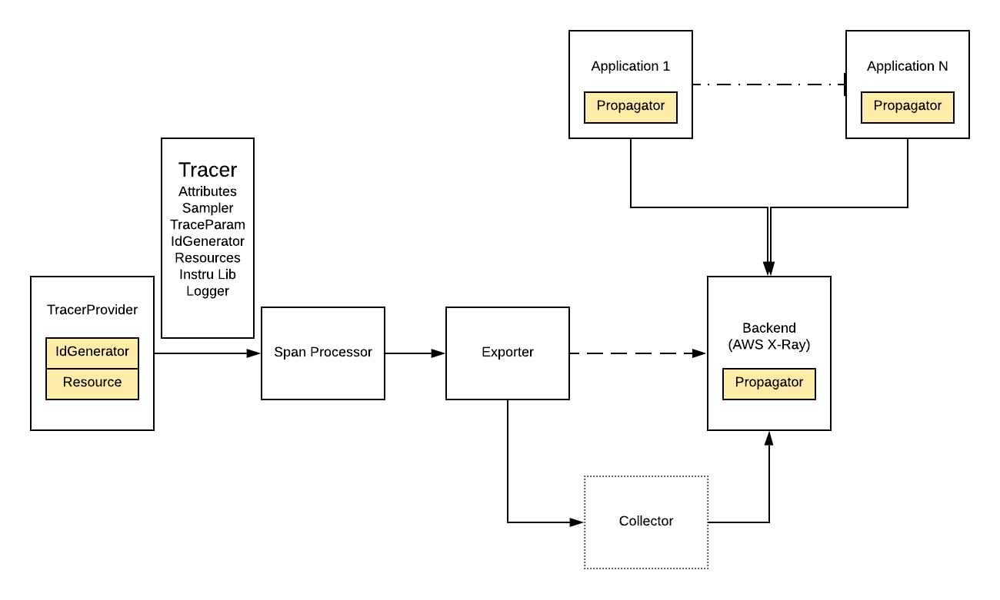

# Design Doc for AWS Beanstalk Plugin Resource Detector

## Objective

Design and implement AWS Beanstalk resource detector component in OpenTelemetry.

## Summary

A [Resource](https://github.com/open-telemetry/opentelemetry-specification/blob/b338f9f63dbf02ff8ebd100e8a847e7bf43e2682/specification/overview.md#resources) is an immutable representation of the entity producing telemetry. For example, a process producing telemetry that is running in a container on Kubernetes has a Pod name, it is in a namespace and possibly is part of a Deployment which also has a name. All three of these attributes can be included in the `Resource`.
The primary purpose of resources as a first-class concept in the SDK is decoupling of discovery of resource information from exporters. This allows for independent development and easy customization for users that need to integrate with closed source environments. The SDK MUST allow for creation of `Resources` and for associating them with telemetry.
When used with distributed tracing, a resource can be associated with the [TracerProvider](https://github.com/open-telemetry/opentelemetry-specification/blob/b338f9f63dbf02ff8ebd100e8a847e7bf43e2682/specification/trace/sdk.md#tracer-sdk) when it is created. That association cannot be changed later. When associated with a `TracerProvider`, all `Span`s produced by any `Tracer` from the provider MUST be associated with this `Resource`.

## Goal

* Design the functionality and code structure to be implemented for AWS Beanstalk resource detector.

## Design

`Resource` is used to define attributes of the application itself, for example the cloud environment it is running on. This corresponds with the plugins in the X-Ray SDKs. We implement `Resource`s that populate attributes we expect for AWS users. We can implement a `Resource` for each of our plugins and merge them together.
In opentelemetry-js repository, different from the content in [specification doc](https://github.com/open-telemetry/opentelemetry-specification/blob/b338f9f63dbf02ff8ebd100e8a847e7bf43e2682/specification/resource/sdk.md), Javascript repository does not explicitly provide `create()` and `merge()` method.

### create()

The interface MUST provide a way to create a new resource, from a collection of attributes. Examples include a factory method or a constructor for a resource object. A factory method is recommended to enable support for cached objects.
In JavaScript SDK, this part of functionality has been supported:

```
  static createTelemetrySDKResource(): Resource {
    return new Resource({
      [TELEMETRY_SDK_RESOURCE.LANGUAGE]: SDK_INFO.LANGUAGE,
      [TELEMETRY_SDK_RESOURCE.NAME]: SDK_INFO.NAME,
      [TELEMETRY_SDK_RESOURCE.VERSION]: SDK_INFO.VERSION,
    });
  }
```

### merge

In the specification document, it says the interface MUST provide a way for a primary resource and a secondary resource to be merged into a new resource.
The resulting resource MUST have all attributes that are on any of the two input resources. Conflicts (i.e. a key for which attributes exist on both the primary and secondary resource) MUST be handled as follows:

* If the value on the primary resource is an empty string, the result has the value of the secondary resource.
* Otherwise, the value of the primary resource is used.

This part of functionality is also supported by current JavaScript SDK:

```
  merge(other: Resource | null): Resource {
    if (!other || !Object.keys(other.labels).length) return this;

    // Labels from resource overwrite labels from other resource.
    const mergedLabels = Object.assign({}, other.labels, this.labels);
    return new Resource(mergedLabels);
  }
```

### Detector

The concept and standard of resource detector is not mentioned in specification file. It seems to be JavaScript SDK specific component. And here is the interface standard defined for resource detector:

```
/**
 * Interface for a Resource Detector. In order to detect resources in parallel
 * a detector returns a Promise containing a Resource.
 */
export interface Detector {
  detect(config: ResourceDetectionConfigWithLogger): Promise<Resource>;
}
```

Also, this part of functionality is the main task our Beanstalk to realize. For Beanstalk detector, the only thing to do is to read resource information from `environment.conf` file. By referring to https://docs.amazonaws.cn/en_us/xray/latest/devguide/xray-guide.pdf, we know the content of `environment.conf` file should look like:

```
`"aws": { 
    "elastic_beanstalk": { 
        "version_label": "app-5a56-170119_190650-stage-170119_190650",
        "deployment_id": 32, "environment_name": "scorekeep" },
        "ec2": { 
            "availability_zone": "us-west-2c", 
            "instance_id": "i-075ad396f12bc325a" 
            }, 
        "xray": { "sdk": "2.4.0 for Java" }
}`
```

And we should read corresponding token value as shown below,

```
String DEVELOPMENT_ID = "deployment_id";
String VERSION_LABEL = "version_label";
String ENVIRONMENT_NAME = "environment_name";
```

Since applications may run in different OS, the config file path can be different, according to https://github.com/aws/aws-xray-sdk-dotnet/blob/8053d17f191d40cbabb18b4cb20b6d6ff6cfb44f/sdk/src/Core/Plugins/ElasticBeanstalkPlugin.cs#L32 and https://docs.amazonaws.cn/en_us/xray/latest/devguide/xray-guide.pdf, we know:

```
  readonly DEFAULT_BEANSTALK_CONF_PATH =
    '/var/elasticbeanstalk/xray/environment.conf';
  readonly WIN_OS_BEANSTALK_CONF_PATH =
    'C:\\Program Files\\Amazon\\XRay\\environment.conf';
```