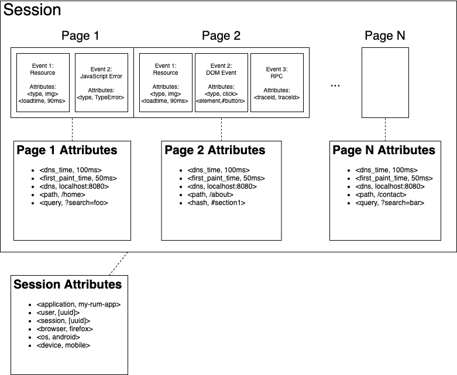
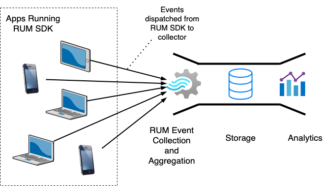

# Real User Monitoring in OpenTelemetry Data Model

This is a proposal to add real user monitoring (RUM) as an independent observability tool, or ‘signal’, to the Open Telemetry specification. Specifically, we propose a data model and semantics which support the collection and export of RUM telemetry.

## Motivation

Our goal is to make it easy for application owners to move their real user monitoring (RUM) telemetry across services. We aim to accomplish this by providing application owners with a standardized, platform agnostic tool set for recording RUM telemetry. Such a tool set would include (1) a common API and (2) SDKs that implement the API and support multiple platforms including web applications and native mobile applications.

To achieve this goal, we propose a modification of the Open Telemetry specification to support collecting and exporting RUM telemetry. Specifically, Open Telemetry currently supports three signals: tracing, metrics and logs. We propose adding a fourth signal, RUM events, which will be used to record telemetry for interactions between end-users and the application being monitored. See the Alternatives section for a discussion of why we propose a new signal over using an existing signal.

## Background

### What is RUM?

RUM allows customers to monitor user interactions within their applications in real time. For example, RUM can provide application owners with insights into how users navigate their application, how quickly the application loads for users or how many new users tried the application. RUM provides application owners with a way to rapidly address issues and improve the user experience.

Examples of RUM use cases include:
- Counting the number of new users versus number of returning users
- Visualizing how users navigate the application's UI
- Identifying pages that generate a high number of errors
- Identifying pages with high load latency
- Counting conversions from home page to purchase
- Linking traces (e.g., RPCs and HTTP requests) to user interactions

To enable application monitoring, RUM collects telemetry (e.g., button clicks, load times, errors) from applications with user interfaces (e.g., JavaScript in browsers, or native Android or IOS applications) and dispatches this telemetry to a collection service.

### RUM Model

RUM is analogous to, but semantically different from tracing. While tracing records a compute operation, RUM records data relating to the experience of a user performing a task. We refer to the interaction between a user and an application to perform a task as a session. The diagram below shows the structure of a RUM session.



A session represents the interactions that occur between a user and an application while the user works to accomplish a task. Because an application is UI driven, RUM records telemetry based on which page (or UI) the user is viewing. This (1) allows engineers to correlate events with the UI that generated them, and (2) allows designers to view how users navigate the application. Pages have a set of attributes (an attribute is a key/value pair) and a list of events (an event is a named and timestamped set of attributes).

Because RUM aims to aggregate data from multiple sessions into metrics, it is unnecessary and impractical to export entire sessions from a client to a collector. Instead, we export events as they occur and aggregate events from multiple sessions in the collector, or later on using batch processing. The diagram below visualizes this relationship.



## Internal Details

The Open Telemetry specification currently defines three signals: tracing, metrics and logs. We propose adding a fourth signal, RUM events, which would provide observability into real user interactions with an application.

### RUM Event Context Definition

RUM records and dispatch telemetry, such as button clicks and errors, in near real-time. To support aggregating this data across dimensions, context must be propagated with each event. The context for an event includes session and page attributes. Session and page attributes represent the dimensions by which events will be aggregated.

For example, consider a JavaScript (JS) error event. Context such as (1) page ID and (2) browser type must be propagated with the event to efficiently aggregate metrics such as (1) number of JS errors by page and (2) number of JS errors by browser type.

Events are grouped by (1) session and then (2) page. Session fields include:

| Field Name | Type | Description |
| ---------- | ---- | ----------- |
| Resource   | [Resource](https://github.com/open-telemetry/opentelemetry-specification/blob/main/specification/overview.md#resources) | Uniquely identifies an application. |
| User ID    | string | Identifies the user of an application. This can be either a random ID for unauthenticated users, or the ID of an authenticated user. |
| Session ID | string | Identifies a series of interactions between a user and an application. |
| Attributes | map | Session attributes are extensible. For example, they may include data such as browser, operating system or device. |

Pages represent discrete UIs, or views, within an application. For web applications, pages can be represented by a URL, or more commonly, a subset of the URL such as the path or hash fragment. Native mobile applications will have a different type of ID for their pages. Page fields include:

| Field Name | Type | Description |
| ---------- | ---- | ----------- |
| Page/View ID | string | Uniquely identifies a discreet user interface within an application. For example, a web application may identify pages by the URL's path or hash fragment. |
| Attributes | map | Page attributes are extensible. For example, they may include data such as the URL of the web page. |

### RUM Event Definition

Pages generate zero or more events. Events store and transmit information about an interaction between a user and the application being monitored. Event fields include:

| Field Name | Type | Description |
| ---------- | ---- | ----------- |
| Timestamp | uint64 | An epoch timestamp in milliseconds, measured on the client system when the event occurred. |
| Event type | string | Uniquely identifies an event schema. The event type contains an event name prefix (e.g., `com.amazon.aws`) followed by an event name (e.g., `dom_event`). When the event is sent to a collection service, the event schema instructs the collection service how to validate and deserialize the event details. |
| Details | object | Each event has a unique schema. Event schemas are not fixed -- they may be created, modified and removed, and are therefore outside of the scope of this data model. This field contains a JSON object. This object adheres to a schema which is unique to the event type. |

### RUM Event Types

Because there is no fixed set of RUM events (RUM event types may be created, modified or removed), specific events are not part of the RUM data model. Examples of RUM event types may include, but are not limited to:

- Session start
- Page view
- Page load timing
- Resource load timing
- DOM interaction
- JavaScript error
- HTTP request with trace

### Example of a RUM event record

We display this example as a JSON object, as JSON is natively supported by JavaScript and web protocols. Alternatively the SDK may transmit the record as a protobuff.
```
{
  resource: {
   application_id: '2ecec2d5-431a-41d5-a28c-1448c6284d44'
  }
  user_id: '93c71068-9cd9-11eb-a8b3-0242ac130003',
  session_id: 'a8cc5ef0-9cd9-11eb-a8b3-0242ac130003',
  session_attributes: {
      browser: 'Chrome',
      operating_system: 'Android',
      device_type: 'Mobile'
  },
  page_id: '/console/home',
  page_attributes: {
      host: 'console.amazon.aws.com',
      path: '/console/home',
      hash: '#about'
  },
  event: {
       timestamp: 1591898400000,
      type: com.amazon.aws.dom_event,
      details: {
           event: 'click',
          element_id: 'submitButton'
      }
  }
}
```

### What does this data look like on the wire?

Events are human generated and are therefore sparse. We estimate about 1 - 60 events per minute, per user, depending on the application. The number of events for a single session is small, however because of the volume of users, the cost of network calls and storage may be high compared to the value of the data, and therefore the number of events may be capped or events may be sampled. For example, events for a session may be capped at a few hundre

## Alternatives / Discussion

### Why create a RUM event signal instead of using the log signal?

Benefits of transmitting RUM telemetry using the log signal include: (1) less work would be required to modify and implement the Open Telemetry specification, and (2) the complexity of the Open Telemetry specification would not increase substantially.

We proposed creating a new data model over using the existing logs signal. Using logs would require soft contracts between (1) the application and the SDK and (2) the SDK and the collector. Such soft contracts, without having a standardized and strongly typed API, could fracture SDK implementations. This would affect maintainability and the portability of RUM telemetry.

Some aspects of the RUM signal may also be cross cutting concerns, which is not supported by the log signal. For example, it may be valuable to propagate RUM context (e.g., session ID, page ID, UI events) across API boundaries, so that downstream executions can be associated with the user interactions that triggered them.

------

### By creating a new signal, we get stronger typing at the expense of adding complexity. For example, we would not create new signal types for databases, pub sub, etc.

We view Databases and PubSub as specific technologies that need to be monitored, while tracing, metrics and logging are monitoring technologies. Our proposition is that (1) real user monitoring, like tracing, metrics and logging, is a monitoring technology and that (2) there are advantages to treating real user monitoring as a first class monitoring technology within Otel.

------

### Could we use semantic conventions instead of a new signal by packaging RUM data as traces?

The `opentelemetry-js` and `opentelemetry-js-contrib` SDKs already capture certain browser activity associated with RUM (i.e., http requests, document load behavior and DOM events) as traces. Conceptually, we view tracing as the process of recording the execution of a program. This fits very well for specific web application execution activities like HTTP requests, load timing and executions that are initiated by DOM events.

However, we view RUM as the process of recording the experience of a person interacting with a program, which something that traces cannot effectively model. Because RUM is driven by human interactions with the application, we need a system which can capture events over a long period of time and link the events together into a timeline of the user’s experience.

RUM events can model many different types of telemetry, such as: traces, errors, sequences of DOM interactions, web vitals measurements, etc. These events must be associated with a RUM session and a view of the application (i.e., the page the user is viewing). The Splunk SDK (i.e., opentelemetry-js + splunk-sdk-javascript) makes this association by attaching the session ID and page URL to spans as attributes.

The long-term problem with using traces for recording RUM sessions  is that (1) there is no guarantee that each implementation behaves the same, reducing data portability, (2) many events are not traces, which violates object oriented design principles and reduces the maintainability of the SDK, and (3) it makes it more difficult to define and validate events.

Regarding (1), we would like the ability to change RUM providers with minimal changes to an application’s monitoring instrumentation.

Regarding (2), we would like the ability to define session attributes (e.g., browser, device, platform), page attributes (e.g., page ID, page URL, page interaction level) and event attributes.

Regarding (2), we would also like the ability to install plugins in the SDK which record RUM events. I don’t think using traces or logs prevents this, however I think it reduces maintainability.

Regarding (3), we would like the ability to define schemas for events so that (a) we can type-check events when implementing RUM SDKs, (b) we can verify that incoming event payloads are valid during collection, and (c) we can query the event data after it is stored. 

------

### Could we use semantic conventions instead of a new signal by packaging RUM data as logs?

Logs stores unstructured data and also suffers from (1) and (3) above. In addition, it might be beneficial to separate the log and RUM event traffic so that the collection service doesn’t need to do so.

------

### Could we achieve stronger type saftey on top of existing log or trace signals, for example, by adding a projection layer on top of these signals?

Potentially -- would a projection layer improve understandability and maintainability compared to adding a new signal?
