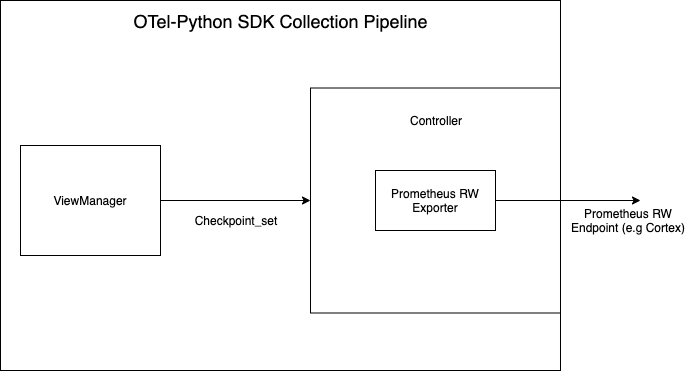
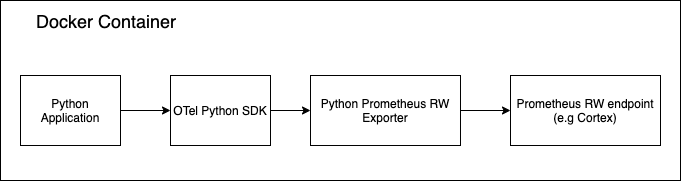
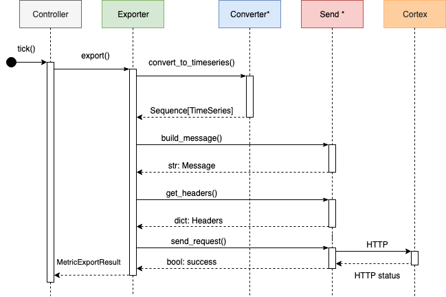
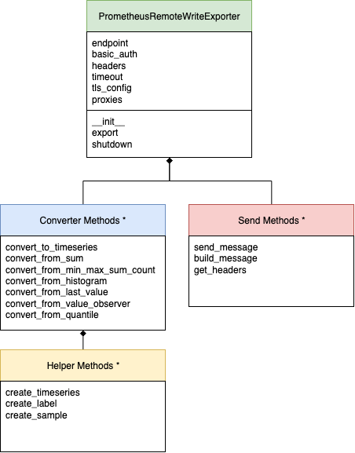
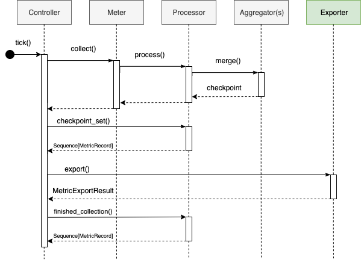
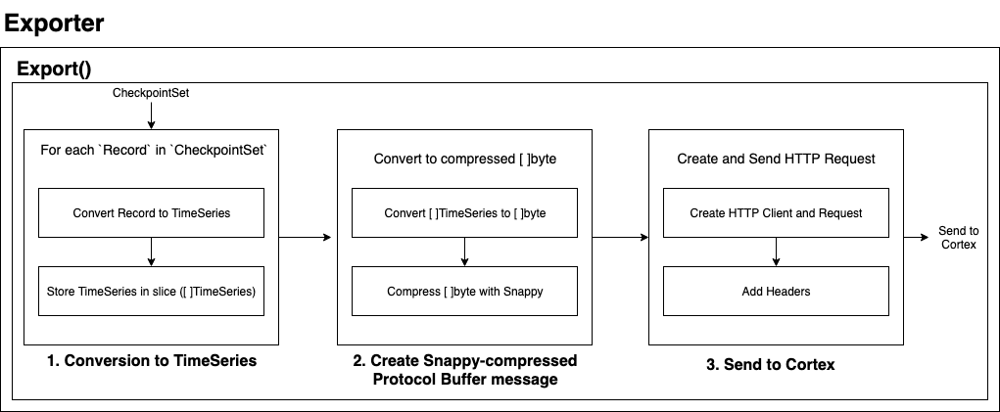

# Design: Prometheus Remote Write Exporter for OpenTelemetry Python SDK

## Introduction

This document outlines our proposed design for the OpenTelemetry Python SDK Cortex Exporter. Our design will follow the current version of the [OpenTelemetry Metrics SDK Specification](https://github.com/open-telemetry/opentelemetry-specification/blob/master/specification/metrics/sdk.md), and be largely inspired by the source code available for the [Go Remote Write Exporter](https://github.com/open-telemetry/opentelemetry-go-contrib/tree/master/exporters/metric/cortex) as well as the [Python Prometheus Exporter](https://github.com/open-telemetry/opentelemetry-python/tree/master/exporter/opentelemetry-exporter-prometheus).

## **Use Cases**


Metrics are raw measurements of resource usage and behaviour of a software system. Metrics provide insight into the behaviour and health of systems. Example metrics include average server latency and total bytes served. By monitoring metrics data, backend monitoring systems like Prometheus and Cortex can help engineers understand their system, respond to and prevent service disruptions, and alert end users when necessary.

Our project focuses on delivering an exporter to export metrics data directly from the OpenTelemetry-Python SDK to a Prometheus remote write endpoint. This is the simplest and most direct way to export metrics to Cortex from a Python application. Currently, users have to run an instance of Prometheus or the Collector to perform this export. Our project will eliminate the need to run an entire Prometheus server by exporting directly to Cortex, as well as eliminate the need to run the Collector. The reduced complexity will improve developer efficiency, reduce operational cost by not having to run Prometheus or the Collector, and reduce the chances of introducing bugs.

## Design Tenets

1. **Security** - The Exporter will properly handle authentication by including credentials or signing HTTP requests sent to the remote write endpoint.
2. **Test Driven Development** - We will follow TDD practices established by the team and ensure proper test coverage (at least 90%).
3. **Scalability** - The Exporter must operate on sizeable systems with predictable overhead growth. It cannot consume unbounded memory resources.
4. **Reliability** - The Exporter should be reliable by gracefully handling errors. Data will either all be successfully exported or, in the case of failure, be dropped. Data cannot be modified during the export process.
5. **Python Best Practices - **The Exporter will conform to best practices for Python as described in [Writing Great Python](https://docs.python-guide.org/#writing-great-python-code).

## **Out of Scope**

1. **Multiple exporter support** - The[OpenTelemetry Metrics SDK Specification](https://github.com/open-telemetry/opentelemetry-specification/blob/master/specification/metrics/sdk.md)  explains that running multiple Processors and Exporters in parallel would be costly. It states that the SDK is not required to provide multiplexing implementations of the Processor or Exporter.
2. **Concurrency** - Because concurrency is handled by the controller in the metrics data pipeline, export will never be called concurrently for the same exporter instance according the the Exporter specification. Based on this assumption, we will not have to handle concurrency.

3. **Streaming data to Cortex **- [Cortex currently](https://cortexmetrics.io/docs/api/#remote-write) only supports batched data, but streamed data may be supported in the future with HTTP/2 support.

## Test Strategy

### Unit Tests

We will follow TDD practices while completing this project. We will first write unit tests that encapsulate the expected behaviour for each function before implementing production code. Tests will cover normal and abnormal inputs and test for edge cases. We will use the standard [Python unit test library](https://docs.python.org/3/library/unittest.html) to create tests and mock various data formats. These tests will follow the Python SDK convention and live inside the exporter subdirectory as shown [here](https://github.com/open-telemetry/opentelemetry-python/tree/master/exporter/opentelemetry-exporter-prometheus). In this case, it will be `/opentelemetry-python/exporter/opentelemetry-exporter-prometheus-remote-write/tests/`

Using the [Python unit test library](https://docs.python.org/3/library/unittest.html), a unit test for methods in a given class is created as described below.

```
class TestPrometheusRemoteWriteExporter(unittest.TestCase):
    def test_[descriptive_test_name](self):
        # define data for test case
        # mock calls/requests
        # create instance of PrometheusRemoteWriteExporter
        # make call to targetted method and store result
        # assert result is as expected or assert call throws an exception
```

### Integration Tests

For further testing, we will provide an example setup that collects metrics from a Python application instrumented by the OpenTelemetry SDK and exports to Cortex, similar to what is done in the [Prometheus Exporter documentation](https://opentelemetry-python.readthedocs.io/en/latest/exporter/prometheus/prometheus.html). We will use Docker to let users quickly run the demo application as well as Cortex. We will write integration tests that will run this demo application which will ensure the Python SDK, Cortex Exporter, and Cortex Gateway integrate properly. This test will reside in the /`opentelemetry-python/tests/open-telemetry-docker-tests/cortex` directory following the pattern shown [here](https://github.com/open-telemetry/opentelemetry-python/tree/master/tests/opentelemetry-docker-tests/tests).


## Python SDK Collection Pipeline

Described below are the existing components from the Python SDK which the Cortex Exporter will integrate with.

Currently the Python SDK only implements a [Push](https://github.com/open-telemetry/opentelemetry-python/blob/master/opentelemetry-sdk/src/opentelemetry/sdk/metrics/export/controller.py) Controller. The lack of a Pull Controller is acceptable for our use-case as Cortex expects data to be pushed via the [remote write API](https://cortexmetrics.io/docs/api/#remote-write), requiring our exporter to integrate with the Push Controller rather than the Pull Controller.

The Push Controller does the following every collection interval:

```
def tick(self):
    # Collect all of the meter's metrics to be exported
    self.meter.collect()
   # Prepare metrics for Export
   self.meter.processor.checkpoint_set()
    # Export the collected metrics
    self.exporter.export(...)
    # Perform post-exporting logic
    self.meter.processor.finished_collection()
```

Each collection interval, the Controller will call its tick method. `tick()` will start the metrics collection process by calling `meter.collect()`. The `meter` then collects metrics from each aggregator and calls `processor.process()` to transform the data into a `checkpoint_set` following by a call to `processor.checkpoint_set()` to prepare metrics for export. Next the Collector exports the metrics using `exporter.export()`. Finally, any post-exporting logic, such as resetting the batch map for stateless processors, is performed to complete the collection interval.

# Cortex Exporter

## Architecture Overview

Entities with an `*` after their name are not actual classes but rather logical groupings of functions within the `PrometheusRemoteWriteExporter` class.



## Exporter Data Path


## Exporter Setup

Users will need to setup the Prometheus Remote Write Exporter in their own Python applications in order to collect and export metrics data. This section details the pipeline design for setting up the Exporter and Push Controller. The steps in this pipeline are:

1. Set a meter provider and get a new meter instance from the provider.
2. Create an instance of the PrometheusRemoteWriteMetricsExporter
3. Create a Push Controller registered with the newly created Exporter and Meter
4. Start the metrics collection pipeline using the meter_provider
5. Create instruments to begin collecting metric data

```
**from**** opentelemetry ****import**** **metrics
**from**** opentelemetry****.****sdk****.****metrics ****import**** **MeterProvider
**from** **opentelemetry****.****exporter****.****prometheus_****remote_****write** **import** PrometheusRemoteWriteMetricsExporter
**from** **opentelemetry****.****sdk****.****metrics****.****export****.****controller** **import** PushController

metrics.set_meter_provider(MeterProvider())
meter = metrics.get_meter(__name__)
exporter = PrometheusRemoteWriteMetricsExporter(endpoint, ...)
metrics.get_meter_provider().start_pipeline(meter, exporter, 5)
# configure instruments to collect metric data using meter
```

### Exporter Parameters

The exporter constructor accepts several optional parameters to customize how the data is being sent. All parameters except the endpoint will be optional.


```
class PrometheusRemoteWriteMetricsExporter:
    def __init__(
        self,
        endpoint,
        basic_auth,
        bearer_token,
        bearer_token_file,
        headers,
        remote_timeout,
        proxy_url,
        tls_config,
    ):
        # sets properties

    @property
    def example_property(self):
        return self._example_property

    @example_property.setter
    def example_property(self, value):
        # validate property value
        self._example_property = value
```

The user can configure authentication through an basic_auth, a provided bearer_token, custom Authorization headers and TLS. The exporter does not enforce the use of TLS as Cortex does not require it.

Here is a detailed explanation for each exporter parameter.


```
`# The endpoint to send metrics data to.`
`endpoint``:`` str `

# Timeout for requests to the remote write endpoint in seconds
timeout: int

`# Sets the `Authorization` header on every remote write request with the`
`# configured username and password.`
`# password and password_file are mutually exclusive.`
`basic_auth``:`` ``{``    `
`  username``:`` str``,`
`  password``:`` str``,`
`  password_file``:`` filepath``,`
`}`

`# Sets the `Authorization` header on every remote write request with`
`# the configured bearer token. It is mutually exclusive with `bearer_token_file`.`
`bearer_token``:`` str`

`# Sets the `Authorization` header on every remote write request with the bearer token`
`# read from the configured file. It is mutually exclusive with `bearer_token`.`
`bearer_token_file``:`` filepath`

# Dictionary mapping proxy protocol to proxy url
proxies: Dict

`# Configures the remote write request's TLS settings.`
`tls_config``:`` ``Dict`` ``# NOTE: Is detailed below`
```

Here is the detailed configuration for `[tls_config](https://prometheus.io/docs/prometheus/latest/configuration/configuration/#tls_config)`

```
`# CA certificate to validate API server certificate with.
[ ca_file: `[`<filename>`](https://prometheus.io/docs/prometheus/latest/configuration/configuration/#filename)` ]

# Certificate and key files for client cert authentication to the server.
[ cert_file: `[`<filename>`](https://prometheus.io/docs/prometheus/latest/configuration/configuration/#filename)` ]
[ key_file: `[`<filename>`](https://prometheus.io/docs/prometheus/latest/configuration/configuration/#filename) ]

`# NOT SUPPORTED BY EXPORTER`
# ServerName extension to indicate the name of the server.
# https://tools.ietf.org/html/rfc4366#section-3.1
[ server_name: [`<string>`](https://prometheus.io/docs/prometheus/latest/configuration/configuration/#string)` ]

# Disable validation of the server certificate.
[ insecure_skip_verify: `[`<boolean>`](https://prometheus.io/docs/prometheus/latest/configuration/configuration/#boolean)` ]`
```

## Exporter Interface

The SDK defines a metrics exporter abstract base class, [metrics.export.MetricsExporter](https://github.com/open-telemetry/opentelemetry-python/blob/master/opentelemetry-sdk/src/opentelemetry/sdk/metrics/export/__init__.py), that must be implemented. The rest of the pipeline interacts with this exporter class as a blackbox therefore it must implement the provided methods.

The abstract base class has two methods, `export()` and `shutdown()` described below. In addition to the exporter interface methods, the Cortex Exporter will have methods for installation, conversion to TimeSeries, and sending to Cortex.

### Export

```
class MetricsExporter:
    """Interface for exporting metrics.

    Interface to be implemented by services that want to export recorded
    metrics in its own format.
    """

    def export(
        self, metric_records: Sequence[MetricRecord]
    ) -> "MetricsExportResult":
        """Exports a batch of telemetry data.

        Args:
            metric_records: A sequence of `MetricRecord` s. A `MetricRecord`
                contains the metric to be exported, the labels associated
                with that metric, as well as the aggregator used to export the
                current checkpointed value.

        Returns:
            The result of the export
        """

    def shutdown(self) -> None:
        """Shuts down the exporter.

        Called when the SDK is shut down.
        """
```

The `export` method receives a batch of metrics data in the form of a `metric_records`. It then converts the `metric_records` to the TimeSeries format by calling `convert_to_timeseries()`. Next, it calls the `build_m``essage``()` and `send_message()` methods which will build and send an HTTP request with the snappy compressed TimeSeries data to Cortex. These methods are described in detail below.

### Shutdown

The Metrics Exporter specification requires a `shutdown` method on the Exporter interface. Allows a way to execute any clean up procedures such as flushing data before the exporter is terminated.

## Convert to TimeSeries

Cortex expects to receive a slice of `TimeSeries`. Prometheus defines TimeSeries in the [Protocol Buffer format](https://developers.google.com/protocol-buffers) in [types.proto](https://github.com/prometheus/prometheus/blob/master/prompb/types.proto). These proto files can be [compiled](https://developers.google.com/protocol-buffers/docs/pythontutorial) into `.py` files which expose structs that implement the types defined in the proto files.

*Structs from prometheus types.proto*

```
// TimeSeries represents samples and labels for a single time series.
message TimeSeries {
  repeated Label labels   = 1 [(gogoproto.nullable) = false];
  repeated Sample samples = 2 [(gogoproto.nullable) = false];
}

message Label {
  string name  = 1;
  string value = 2;
}

message Sample {
  double value    = 1;
  int64 timestamp = 2;
}
```

We will need to implement a static class method  `convert_to_timeseries` to handle the conversion from `checkpoint_set` to `timeseries` based on the aggregator type. The Aggregator is available to us in the exporter through the `MetricRecord`. This function will live in our exporter class.

```
def convert_to_timeseries(self, records: Sequence[MetricRecord]): Sequence[timeseries]
    # Iterate through each MetricRecord
    #     a. Retrieve Metric Name and Aggregation
    #     b. Convert into a TimeSeries depending on the aggregation type
    #     c. Store timeseries in a list
    # Return list of timeseries

```

The Python SDK implements several [aggregation types](https://github.com/open-telemetry/opentelemetry-go/blob/master/sdk/export/metric/aggregation/aggregation.go). Based on the aggregation type, the data will have to be converted to TimeSeries differently based on how the data is structured by the aggregation. Currently Python has the following aggregation types: Sum, MinMaxSumCount, LastValue, ValueObserver, and Histogram.

It is likely that new aggregation types will be implemented by the SDK or users. As is standard in the other Python Exporters, our Exporter will decide how to handle aggregation type based on type conversion rather than aggregator Kind value, so any new aggregators that implement an aggregation described below will be handled correctly. Unknown aggregations will be ignored as is standard in the other Exporters.

### Data Mapping

We will iterate through the metric_records and convert each record based on its aggregation type. Below is the definition of a MetricRecord.

```
class MetricRecord:
    def __init__(
        self,
        instrument: metrics_api.InstrumentT,
        labels: Tuple[Tuple[str, str]],
        aggregator: Aggregator,
        resource: Resource,
    ):
        self.instrument = instrument
        self.labels = labels
        self.aggregator = aggregator
        self.resource = resource
```

Based on the Record’s aggregation type, one or more `TimeSeries` will be created as described below. Each `TimeSeries` will have a list of `Labels` which will include the Record’s labels and the metric name which is included in the Record’s instrument. Each `Sample` will use the end timestamp from the aggregator as this is value associated with the current cumulation period. The following conversions are based on the [Prometheus metric types](https://prometheus.io/docs/concepts/metric_types). This [OTEP](https://github.com/open-telemetry/oteps/pull/118) provides additional information as how the aggregations should be converted.

**Sum**
Each Sum will create one TimeSeries. The Sum value will be used as a Sample Value. It will include the `<metric_name>_sum` as a label.

**LastValue**
Each LastValue will create one TimeSeries. The LastValue value will be used as a Sample Value. It will include the `<metric_name>_last` as a label.

**MinMaxSumCount**
Each MinMaxSumCount will create four TimeSeries. The sum, min, max, and count values will each map to a TimeSeries with a direct mapping from the value to Sample Value. Each TimeSeries will include the metric name as a label plus an appropriate identifier like `<metric_name>_min`, `<metric_name>_max`, etc.

**Histogram**
Each Histogram with *n* buckets will create 1 + *n* TimeSeries.

* *n* TimeSeries will contain the bucket counts based on upper boundary. It will include `<metric_name>_histogram` as a label and also `{le=<upperbound>}` as an extra label to signal the bound.
* 1 TimeSeries will contain the bucket counts with infinity as the upper boundary. It will include `<metric_name>_bucket{le="+Inf"}` as label.


**ValueObserver**
Each ValueObserver will create five TimeSeries. The sum, min, max, count and last value will each map to a TimeSeries with a direct mapping from the value to Sample Value. Each TimeSeries will include the metric name as a label plus an appropriate identifier like `<metric_name>_min`,  `<metric_name>_max`, etc.

**Quantile (Not implemented)
**
Each Quantile with n quantiles will create n TimeSeries.

* n TimeSeries will contain the quantiles. Each will include `<metric_name>_histrogram` as a label and also an extra label signalling the quantile: `{quantile="<φ>"}` with φ-quantiles (0 ≤ φ ≤ 1).

## Send TimeSeries to Cortex

This section covers how the OTel-Python SDK Cortex Exporter sends the TimeSeries metrics data to Cortex.

### **Remote Write API**

Data can be pushed to Cortex through Prometheus’s `remote_write` API, which sends batched [Snappy](https://google.github.io/snappy/)-compressed [Protocol Buffer](https://developers.google.com/protocol-buffers/) messages inside of a HTTP PUT/POST request to a Cortex endpoint. This Cortex endpoint may be part of a managed Prometheus service which may require additional authentication such as AWS Sig v4. Proprietary authentication will not be directly supported by the Exporter; however, the Exporter will allow the user to pass in their own HTTP client so they can add it themselves.
[Image: cortex-architecture.png](images/cortex-architecture.png)
There are two things to be done:

1. Reading Protobufs
2. Build the compressed message
3. Build and send the HTTP request

### **Reading Protocol Buffers**

When converting `MetricRecord` to `timeseries` or when building the compressed image, we will need to read Prometheus’ Protocol Buffers. By default, the Prometheus project [provides](https://github.com/prometheus/prometheus/tree/master/prompb)  `*.proto` files which need to be manually converted into a Python readable format. For example, a `types.proto` file would be transcompiled to `types_pb2.py`.

```
# WriteRequest definition in types.proto
message TimeSeries {
  repeated Label labels   = 1;
  repeated Sample samples = 2;
}

# WriteRequest struct in types_pb2.py
_TIMESERIES = _descriptor.Descriptor(
  name='TimeSeries',
  full_name='prometheus.TimeSeries',
  filename=None,
  file=DESCRIPTOR,
  containing_type=None,
  fields=[
    _descriptor.FieldDescriptor(
      name='labels', full_name='prometheus.TimeSeries.labels', index=0,
      number=1, type=11, cpp_type=10, label=3,
      has_default_value=False, default_value=[],
      message_type=None, enum_type=None, containing_type=None,
      is_extension=False, extension_scope=None,
      serialized_options=None, file=DESCRIPTOR),
    _descriptor.FieldDescriptor(
      name='samples', full_name='prometheus.TimeSeries.samples', index=1,
      number=2, type=11, cpp_type=10, label=3,
      has_default_value=False, default_value=[],
      message_type=None, enum_type=None, containing_type=None,
      is_extension=False, extension_scope=None,
      serialized_options=None, file=DESCRIPTOR),
  ],
  extensions=[
  ],
  nested_types=[],
  enum_types=[
  ],
  serialized_options=None,
  is_extendable=False,
  syntax='proto2',
  extension_ranges=[],
  oneofs=[
  ],
  serialized_start=450,
  serialized_end=534,
)
```

1. Store the protobuf files within the `/exporter` directory and add a GitHub Actions Workflow to generate up-to-date  `*_pb2.py`  files every release. The advantage of this approach is that the RW Exporter will work out of the box without requiring users to perform any code changes. The disadvantage is that our pre-generated protofiles could be out-of-sync with whichever cortex version the user is running. This can cause major issues if a breaking change is introduced to the upstream protobufs. However, the end-users will only get these up-to-date protobuf files if they upgrade their distribution of OTel, so they can be warned about these breaking changes.
2. The users of the SDK will be responsible for generating the transcompiled `*_pb2.py`  files which the exporter would read from a user-defined path. This approach solves the issue of accidentally causing breaking changes as the end user is responsible for making sure the protobuf files and Cortex version are in sync. The disadvantage is that the exporter will no longer work out-of-box and we cannot add integration tests.

We recommend a hybrid approach to 1. and 2. We regenerate protobufs every OTel release, providing a copy within the SDK, as well as giving users the option to provide a path to their own custom files. This way users can be easily get up and running using our exporter and delve deeper into the advanced config if they need to.

### **Building the compressed message**

The list of `timeseries` must be converted to a snappy-compressed message as specified by the [Remote Write API](https://cortexmetrics.io/docs/api/#remote-write). Prometheus uses a `WriteRequest` struct that is exposed by [`remote.proto`](https://github.com/prometheus/prometheus/blob/master/prompb/remote.proto). Once converted, this file will be called `remote_pb2.py` and can used to enforce the structure of the message. The serialized message then needs to be compressed with Snappy before the HTTP request can be made to the cortex endpoint.
[Snappy](http://google.github.io/snappy/) is a compression / decompression library that focuses on high speeds and reasonable compression. It has two formats: block and stream. This design uses the block format because our Exporter sends data in batches instead of streaming it. Streamed data is currently not supported by Cortex, but may be come in the future with HTTP/2 support. Snappy provides a `compress``()` method  for block serialization.

```
def build_message(timeseries):
    # Create WriteRequest
    # Iterate through timeseries_list
    #   Add TimeSeries to WriteRequest

    # Serialize WriteRequest
`    # Compressed Serialized WriteRequest using snappy
    # Return compressed message
`
```

### **Compressed message → HTTP request**


After the compressed message is created, it needs to be put inside an HTTP request and sent to Cortex with the correct headers attached. The design will rely on the [python requests library](https://requests.readthedocs.io/en/master/). The correct headers are generated based on the Config file provided are then added to the request. Afterwards, the request is sent to the endpoint defined in the Config.

The response will be logged by the Exporter. The export process succeeds if the HTTP response is HTTP 200 and fails otherwise. There will be a timeout for the response, but retries will be limited as they are costly performance-wise and may require a queue to send the data in the correct order. In general, failures can be ignored because even if TimeSeries are dropped since cumulative aggregations will reflect the missing metrics data.

Example: Imagine a counter that gets incremented 5 times, with an Export happening between each increment. If the exports happen like this: SUCCESS, SUCCESS, FAIL, FAIL, SUCCESS, the exported data will be 1, 2, _, _, 5. The result is the same because the Exporter uses a cumulative aggregation.

```
def get_headers(request):
    # Add general headers
    # Add config headers
    # Add authentication headers (basic auth or bearer token)
    # Return headers
```

```
def send_request(request):
    # Build http client if not provided
    # Send request
    # Return Success/Failure
```

## Authentication

Adding authentication headers will not be as simple as adding the other supplied headers. The supplied credentials or bearer_token will be in an encrypted file and the file path will be provided in the config instead. Our design will be inspired by the implementation at: https://github.com/open-telemetry/opentelemetry-go-contrib/blob/master/exporters/metric/cortex/auth.go.

The following authentication methods will live within the PrometheusRemoteWriteExporter class to add provided authentication.

* `add_headers(request)`
    * adds basic headers to complete the remote write POST request
    * adds basic-auth headers if specified
    * adds bearer token auth if specified
* `build_client()`
    * builds http client if a custom one is not provided in the config
* `build_tls_config()`
    * build a new TLS Config from the properties defined in the exporter

If the user wishes to use another form of authentication, a custom http client with the necessary authentication may be provided in the config.

## Error Handling

Methods in the Exporter may raise an error or log an error using the logging library as necessary to notify the user if unexpected behaviour has occurred. Below are some examples of error handling in Python.


```
`# Catching an exception
try:
    # Do something
except Exception as err:
    # Handle exception


# Raising an error
raise ValueError("Meaningful Error Message")

# Logging an error
logger = logging.getLogger(__name__)
logger.exception("Error message")
logger.warning("Warning about unusual behaviour")`
```

# Appendix

### Resources

* [Metrics Specification](https://github.com/open-telemetry/opentelemetry-specification/blob/master/specification/metrics/sdk.md)
* [Python SDK Prometheus Exporter](https://github.com/open-telemetry/opentelemetry-python/tree/master/exporter/opentelemetry-exporter-prometheus)
* [Go SDK Remote-Write Cortex Exporter](https://github.com/open-telemetry/opentelemetry-go-contrib/tree/master/exporters/metric/cortex)
* [Prometheus Metric Types](https://prometheus.io/docs/concepts/metric_types/)
* [Prometheus Remote Storage Documenation](https://prometheus.io/docs/prometheus/latest/storage/#remote-storage-integrations)
* [Cortex Remote Write Documentation](https://cortexmetrics.io/docs/api/#remote-write)

