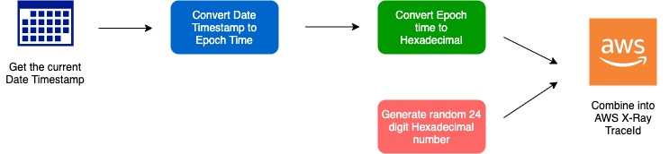

# OpenTelemetry Go SDK Components for AWS X-Ray

## Table of Contents
* [Architecture Overview](#architecture-overview)
* [Components](#components)
  * [ID Generator](#aws-x-ray-id-generator)
  * [Propagator](#aws-x-ray-propagator)
  * [ECS Resource Detector](#amazon-elastic-container-serviceecs-resource-detector)
  * [EKS Resource Detector](#amazon-elastic-kubernetes-serviceeks-resource-detector)
* [Repository Structure](#repository-structure)
* [Usage](#usage)
  * [ID Generator](#using-the-aws-x-ray-id-generator)
  * [Propagator](#using-the-aws-x-ray-propagator)
  * [ECS Resource Detector](#using-the-ecs-resource-detector)
  * [EKS Resource Detector](#using-the-eks-resource-detector)
* [Testing](#testing)
  * [Unit Testing](#unit-testing)
  * [Integration Testing](#integration-testing)
  * [Micro-benchmark Testing](#micro-benchmark-testing)
* [Future Enhancements](#future-enhancements)
* [Pull Requests and Issues](#pull-requests-and-issues)
* [Contributors](#contributors)

## Architecture Overview 


The diagram above shows how Go applications instrumented with OpenTelemetry send traces to AWS X-Ray. Inside each application, there is a `TracerProvider` created which specifies different options such as the `IDGenerator` implementation to use, `Config` properties such as the type of span processor and many more. To send traces specifically from OpenTelemetry to AWS X-Ray, inside the `TracerProvider`, options are set such as the `SpanProcessor`, AWS X-Ray ID Generator, and the collector. When traces get generated in OpenTelemetry, they use the AWS X-Ray ID Generator to generate a `TraceID`. Then this `TraceID` goes through a span processor and gets exported to the collector. The collector then exports the data to AWS X-Ray, where developers can view the traces and analyze the data. 

## Components

### AWS X-Ray ID Generator

[Link to Implementation](https://github.com/open-telemetry/opentelemetry-go-contrib/blob/master/propagators/aws/xray/idgenerator.go)

A `TraceID` is used to uniquely identify a trace. This is useful since it can be used to group together all spans for a specific trace across all processes. The `TraceID` is a 32-hex-character lower case string that is generated when a root span is created. For a spans that have a parent, the `TraceID` is the same as the parent span’s `traceID` since they both belong to the same trace. 

In OpenTelemetry, the creation of OTLP `TraceID` uses the W3C trace format, which generates a random unique 32-hex-character lower case string. However, in order to use OpenTelemetry tracing with AWS X-Ray, we needed to override the OTLP `TraceID` creation function. This is because AWS X-Ray does not use the W3C trace format; rather, it uses a different format where the first 8-hex-digits represents the timestamp at which the trace is generated and the remaining 24-hex-digits are randomly generated. 


The diagram below shows the steps in generating an AWS X-Ray `traceID`. To get the first 8 digits, we convert the current human date timestamp to an epoch timestamp which is then converted to hexadecimal. The remaining 24 digits is a randomly generated hexadecimal number. Together, the first 8 digits and the remaining 24 digits make up the 32 digit hexadecimal AWS X-Ray `traceID`.



Example:
1. A trace is generated on **November-11-2020 at 6:57:12pm GMT**
2. We convert the date and timestamp to epoch timestamp (You can use an [epoch converter](https://www.epochconverter.com/) for demo purposes in this example)
3. The epoch timestamp is converted to be **1604516232**
4. We convert the epoch timestamp to hexadecimal which turns out to be **5FA2F988** (You can use a [hexadecimal converter](https://www.rapidtables.com/convert/number/decimal-to-hex.html) for demo purposes in this example)
5. Then remaining 24 digits is randomly generated to be **a006649127e371903a2de9790**
6. The final AWS X-Ray `traceID` is **5FA2F988a006649127e371903a2de9790**

### AWS X-Ray Propagator

[Link to Implementation](https://github.com/open-telemetry/opentelemetry-go-contrib/tree/master/propagators/aws/xray)

The AWS X-Ray propagator provides HTTP header propagation for systems that are using [AWS X-Ray HTTP header format](https://docs.aws.amazon.com/xray/latest/devguide/xray-concepts.html#xray-concepts-tracingheader). Without the proper HTTP headers, AWS X-Ray will not be able to pick up any traces and it’s metadata sent from the collector. The AWS X-Ray propagator translates the OpenTelemetry SpanContext into the equivalent AWS X-Ray header format, for use with the OpenTelemetry Go SDK. By default, OpenTelemetry uses the [W3C Trace Context format](https://www.w3.org/TR/trace-context/) for propagating spans which is different than what AWS X-Ray takes in:

The following is an example of W3 trace header with root traceID.

```
traceparent: 5759e988bd862e3fe1be46a994272793 tracestate:optional
```

The following is an example of AWS X-Ray trace header with root trace ID and sampling decision.

```
X-Amzn-Trace-Id: Root=1-5759e988-bd862e3fe1be46a994272793;Sampled=1
```

As described in [specification](https://github.com/open-telemetry/opentelemetry-specification/blob/master/specification/context/api-propagators.md), a standard propagator has the following functions:

* `inject()`
   - The inject method injects the AWS X-Ray values into the header. The implementation should accept 2 parameters, the context format for propagating spans and textMapCarrier interface allowing our propagator to be implemented.
* `extract()`
    - Extract is required in a propagator to extract the value from an incoming request. For example, the values from the headers of an HTTP request are extracted. Given a context and a carrier, extract(), extracts context values from a carrier and return a new context, created from the old context, with the extracted values. The Go SDK extract method should accept 2 parameters, the context and textMapCarrier interface.
* `fields()`
    - Fields refer to the predefined propagation fields. If the carrier is reused, the fields should be deleted before calling [inject](https://github.com/open-telemetry/opentelemetry-specification/blob/b338f9f63dbf02ff8ebd100e8a847e7bf43e2682/specification/context/api-propagators.md#inject).

For example, if the carrier is a single-use or immutable request object, we don't need to clear fields as they couldn't have been set before. If it is a mutable, returnable object, successive calls should clear these fields first. This will return a list of fields that will be used by the TextMapPropagator.

### Amazon Elastic Container Service(ECS) Resource Detector

[Link to Implementation](https://github.com/open-telemetry/opentelemetry-go-contrib/tree/master/detectors/aws/ecs)

> A `Resource` is an immutable representation of the entity producing telemetry. For example, a process producing telemetry that is running in a container on Kubernetes has a Pod name, it is in a namespace and possibly is part of a Deployment which also has a name. All three of these attributes can be included in the `Resource`. The primary purpose of resources as a first-class concept in the SDK is decoupling of discovery of resource information from exporters.

To learn more about `resource` check out the [OpenTelemetry specifications page](https://github.com/open-telemetry/opentelemetry-specification/blob/master/specification/resource/sdk.md).

The objective of an ECS resource detector is to provide information about the container of a process running on an ECS environment. The ECS resource detector will first detect whether an application instrumented with OpenTelemetry Go SDK is running on ECS or not.

If the ECS resource detector successfully detects that a process is running on an ECS environment, it will populate the resource with metadata about the container the process is in. This will include the `containerID`(the docker ID of the container) and `hostName`(name of the container).

The ECS resource detector will return either an empty Resource or a Resource which is filled with metadata depending on if the application instrumented is running on ECS or not.

The resource detector contains the following functions:
* `Detect()`
  - This method is responsible for returning the resource with it's hostName and 
   containerId. In the event that the application is not running on ECS it will
   return an empty resource.
* `getContainerID()`
    - This method is responsible for returning the docker ID of the container found
    in its CGroup file. 
* `getHostName()`
    - This method will return the host name of the container the process is in.

### Amazon Elastic Kubernetes Service(EKS) Resource Detector

[Link to Implementation](https://github.com/open-telemetry/opentelemetry-go-contrib/blob/master/detectors/aws/eks/detector.go)

> A `Resource` is an immutable representation of the entity producing telemetry. For example, a process producing telemetry that is running in a container on Kubernetes has a Pod name, it is in a namespace and possibly is part of a Deployment which also has a name. All three of these attributes can be included in the `Resource`. The primary purpose of resources as a first-class concept in the SDK is decoupling of discovery of resource information from exporters.

To learn more about `resource` check out the [OpenTelemetry specifications page](https://github.com/open-telemetry/opentelemetry-specification/blob/master/specification/resource/sdk.md).

What the EKS resource detector will do, is detect whether or not the application that’s generating telemetry data is running on EKS and then populate EKS specific attributes inside the resource object. These attributes include the containerID and clusterName. This comes in handy when trying to troubleshooting a failed request by pinpointing exactly which container was the root case.


## Repository Structure

[opentelemetry-go-contrib](https://github.com/open-telemetry/opentelemetry-go-contrib) repository

    .
    ├── ...     
    │                             
    ├── detectors
    │    └── aws
    │         ├── ecs 
    │         │    ├── ecs.go
    │         │    ├── ecs_test.go
    │         │    ├── go.mod
    │         │    └── go.sum
    │         │
    │         └── eks 
    │              ├── detector.go
    │              ├── detector_test.go
    │              ├── go.mod
    │              └── go.sum
    │ 
    ├── ...    
    │
    ├── propagators
    │    └── aws
    │         └── xray
    │         │    ├── idgenerator.go
    │         │    ├── idgenerator_test.go    
    │         │    ├── propagator.go    
    │         │    └── propagator_test.go    
    │         │
    │         ├── go.mod
    │         └── go.sum        
    │
    └── ...

## Usage

See more information on how to get started in sending traces to AWS X-Ray using the Go SDK in the [getting started guide](https://aws-otel.github.io/docs/getting-started/go-sdk). 

### Using the AWS X-Ray ID Generator


In the diagram above, we show how the AWS X-Ray ID Generator is used with client applications that are instrumented with OpenTelemetry. For client applications that use the OpenTelemetry Go SDK, a `TraceProvider` is created in order to start collecting and sending trace data to other backends (eg. Prometheus, Jaeger etc.). Inside the TraceProvider object, we can specify which implementation of the IDGenerator to use. In our case, since we want to send traces to AWS X-Ray, we will use the `WithIDGenerator()` function to specify that we want to use the AWS X-Ray ID Generator. 

```go
idg := xray.NewIDGenerator()

traceprovider := sdktrace.NewTracerProvider(
    sdktrace.WithIDGenerator(idg),
    ...
)
```

Please see the [demo walkthrough in the getting started guide](https://aws-otel.github.io/docs/getting-started/go-sdk#demo-walkthrough) for a full example.

### Using the AWS X-Ray Propagator

Import the package:
```go
import(
    "go.opentelemetry.io/contrib/propagators/aws/xray"
    "go.opentelemetry.io/otel"
)
```
Set OpenTelemetry to use the AWS X-Ray Propagator:

```
otel.SetTextMapPropagator(xray.Propagator{})
```

### Using the ECS Resource Detector

To use the ECS resource detector, first, include the following import statements

```go
import (
    "context"
    "go.opentelemetry.io/contrib/detectors/ecs"
    sdktrace "go.opentelemetry.io/otel/sdk/trace"
)
```

Once everything is imported, create a new ECS resource detector and call the `detect()` function which returns a `resource` and an `error`. If there is no error, the `error` will be `nil`. 

```go
// Instantiate a new ECS Resource detector
ecsResourceDetector := new(ecs.ResourceDetector)

resource, err := ecsResourceDetector.Detect(context.Background())

//Associate resource with TracerProvider
tracerProvider := sdktrace.NewTracerProvider(
	sdktrace.WithResource(resource),
)
```

### Using the EKS Resource Detector

To use the EKS resource detector, first, include the following import statements

```go
import (
    "context"
    "go.opentelemetry.io/contrib/detectors/eks"
    sdktrace "go.opentelemetry.io/otel/sdk/trace"
)
```

Once everything is imported, create a new EKS resource detector and call the `detect()` function which returns a `resource` and an `error`. If there is no error, the `error` will be `nil`. 

```go
// Instantiate a new EKS Resource detector
eksResourceDetector := new(eks.ResourceDetector)

resource, err := eksResourceDetector.Detect(context.Background())

//Associate resource with TracerProvider
tracerProvider := sdktrace.NewTracerProvider(
	sdktrace.WithResource(resource),
)
```

## Testing 

### Unit Testing
The components can be tested using the standard Go testing library. Here's how you can use the different commands in terminal to run the tests:

```bash
# Run all tests in X_test.go files (X to the file name)
go test

# Run a specific test (X refers to the specific test)
go test -run X
```

The AWS Distribution of OpenTelemetry for Go also provides a pipeline/integration test for validating the data. This can be found on the [aws-otel-go repository](https://github.com/aws-observability/aws-otel-go/blob/master/.github/workflows/main.yml). The pipeline will automatically build the components and deploy a docker image of it against the [test framework](https://github.com/aws-observability/aws-otel-test-framework) to validate data

### Integration Testing

The integration tests consists of three parts:
* [AWS Distro for OpenTelemetry Collector](https://github.com/aws-observability/aws-otel-collector)
* [AWS OpenTelmetry Test Framework](https://github.com/aws-observability/aws-otel-test-framework)
* [Go Sample Integration app](https://github.com/aws-observability/aws-otel-go/blob/master/sampleapp/main.go)

Follow the steps below to run the integration tests locally:

#### Step 1 - Configure AWS Credentials
You will need to configure your AWS Credential profile yet, please follow these [instructions](https://docs.aws.amazon.com/cli/latest/userguide/cli-configure-quickstart.html) for setting up your AWS credentials.
#### Step 2 - Install and Start the OpenTelemetry Collector
The first step is to install and start an instance of the AWS OpenTelemetry Collector. The purpose of the collector here is to export trace data to AWS X-Ray.
```
git clone https://github.com/aws-observability/aws-otel-collector.git ; \
    cd aws-otel-collector; \
    docker run --rm -p 55680:55680 -p 55679:55679 -p 8889:8888 \
      -e AWS_REGION=us-west-2 \
      -v "${PWD}/examples/config-test.yaml":/otel-local-config.yaml \
      --name awscollector public.ecr.aws/aws-observability/aws-otel-collector:latest \
      --config otel-local-config.yaml; \
```

#### Step 3 - Start Go Sample Integration App
The second step is to start a sample HTTP server written in Go. The purpose of the app is to generate traces and send them to AWS X-Ray so that we can validate the data.
```
git clone https://github.com/aws-observability/aws-otel-go.git ; \
    cd sample apps; \
    docker build --tag "sample-app" --file sampleapp/Dockerfile .

docker run -e LISTEN_ADDRESS=0.0.0.0:8080 \
    -e OTEL_EXPORTER_OTLP_ENDPOINT=172.17.0.1:55680 \
    -e OTEL_RESOURCE_ATTRIBUTES="aws-otel-integ-test" \
    -p 8080:8080 sample-app
```

#### Step 4 - Run Integration Tests
The last step is to clone the test framework and run the integration tests.

```
git clone https://github.com/aws-observability/aws-otel-test-framework.git

cd aws-otel-test-framework &&
    ./gradlew :validator:run --args='-c go-otel-trace-validation.yml --endpoint http://127.0.0.1:8080 --metric-namespace aws-otel-integ-test -t "sample-app"
```

### Micro-benchmark Testing 

The micro-benchmark tests cover the following operations:
* start-end sampled span 
* start-end un-sampled span
* start-end nested sampled spans
* start-end nested un-sampled spans
* get current span
* add attributes to span
* X-Ray trace id generator
* X-Ray propagator - inject and extract methods

To run the micro-benchmarking tests, follow the instructions below:
1. Clone the [`aws-otel-go`](https://github.com/aws-observability/aws-otel-go) repository
2. Open up the command line interface and navigate to the `benchmark` directory inside the [`aws-otel-go`](https://github.com/aws-observability/aws-otel-go) repository
3. Navigate into the folder of tests that you want to run
    ```
    $ cd idgenerator
    $ cd propagator
    $ cd sampledspan
    $ cd unsampledspan
    ```
4. Run the following command to execute the tests
   ```
   go test -bench=.
   ```

To learn more about micro-benchmark testing using Go, please visit the [official documentation](https://golang.org/pkg/testing/#hdr-Benchmarks).

## Future Enhancements

1. Perform soak testing
2. [Exception semantic conventions and Go error return values](https://github.com/open-telemetry/opentelemetry-specification/issues/764)
3. Transform captured errors/exceptions to X-Ray format (Dependent on point above)
4. Change EKS resource detector to use Kubernetes client library ([Issue #478](https://github.com/open-telemetry/opentelemetry-go-contrib/issues/478))

## Pull Requests and Issues
* [ID Generator](https://github.com/open-telemetry/opentelemetry-go-contrib/pull/459)
* [Propagator](https://github.com/open-telemetry/opentelemetry-go-contrib/pull/462)
* [ECS Resource Detector](https://github.com/open-telemetry/opentelemetry-go-contrib/pull/466)
* [EKS Resource Detector](https://github.com/open-telemetry/opentelemetry-go-contrib/pull/465)
* [Add Integration Test Workflow](https://github.com/aws-observability/aws-otel-go/pull/1)
* [Add Micro-benchmarking Tests](https://github.com/aws-observability/aws-otel-go/pull/2)
* [Add Integration Sample App](https://github.com/aws-observability/aws-otel-go/pull/3)
* [Add DockerFile for Sample App](https://github.com/aws-observability/aws-otel-go/pull/5)
* [Provide extensibility of the SDK to support vendor specific ID Generators](https://github.com/open-telemetry/opentelemetry-go/issues/1351)
* [Use Kubernetes Client for EKS Resource Detector](https://github.com/open-telemetry/opentelemetry-go-contrib/issues/478)
* [X-Ray Exporter is treating HTTP 200 as a fault](https://github.com/open-telemetry/opentelemetry-collector-contrib/issues/1739)

## Contributors 
* [Kelvin Lo](https://github.com/KKelvinLo)
* [Wilbert Guo](https://github.com/wilguo)
