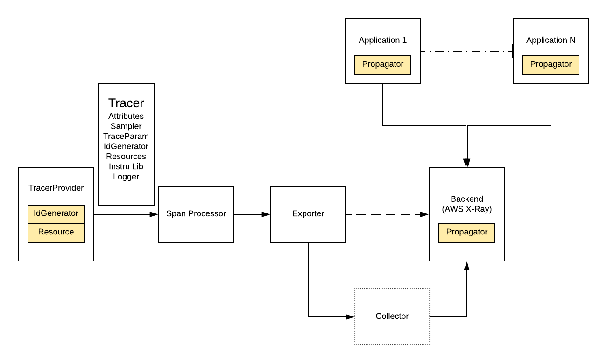
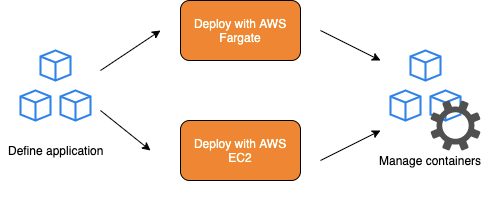
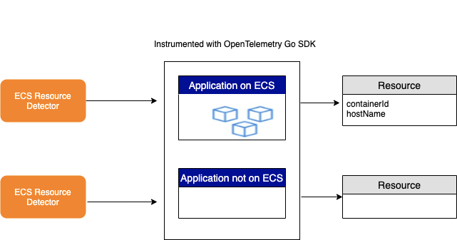

## AWS X-Ray Propagator

### Summary



The ability to correlate events across service boundaries is one of the principle concepts behind distributed tracing. To find these correlations, components in a distributed system need to be able to collect, store, and transfer metadata referred to as context. Propagators are configured inside Tracer objects in order to support transferring of context across process boundaries. A context will often have information identifying the current span and trace, and can contain arbitrary correlations as key-value pairs. Propagation is when context is bundled and transferred across services, often via HTTP headers. This is done by first injecting context into a request and then this is extracted by a receiving service which can then make additional requests, and inject context to be sent to other services and so on. Together, context and propagation represent the engine behind distributed tracing. 

### Objective

The objective of the AWS X-Ray propagator is to provide HTTP header propagation for systems that are using [AWS X-Ray HTTP header format](https://docs.aws.amazon.com/xray/latest/devguide/xray-concepts.html#xray-concepts-tracingheader). Without the proper HTTP headers, AWS X-Ray will not be able to pick up any traces and it’s metadata sent from the collector. The AWS X-Ray propagator translates the OpenTelemetry SpanContext into the equivalent AWS X-Ray header format, for use with the OpenTelemetry Go SDK. By default, OpenTelemetry uses the [W3C Trace Context format](https://www.w3.org/TR/trace-context/)for propagating spans which is different than what AWS X-Ray takes in:

The following is an example of W3 trace header with root traceID.

traceparent: 5759e988bd862e3fe1be46a994272793 tracestate:optional

The following is an example of AWS X-Ray trace header with root trace ID and sample decision.

```
X-Amzn-Trace-Id: Root=1-5759e988-bd862e3fe1be46a994272793;Sampled=1
```


### Design Tenets

1. Security - Data will not be modified during the injection and extraction of the headers, it will only inject and extract from the headers of an HTTP request
2. Test Driven Development - We will follow TDD practices established by the team and ensure proper test coverage (at least 90%).
3. Reliability - The propagator should be reliable by gracefully handling errors such as invalid traceID, empty context, etc, and empty headers. As per the [specifications](https://github.com/open-telemetry/opentelemetry-specification/blob/master/specification/context/api-propagators.md), if a value cannot be parsed from a carrier it will not throw an exception and not store a new value in Context, in order to preserve any previously existing valid value.
4. Go Best Practices - The propagator will conform to best practices for Go as described in [Effective Go](https://golang.org/doc/effective_go.html).

### Design Details

By default, OpenTelemetry uses the [W3C Trace Context format](https://www.w3.org/TR/trace-context/) for propagating spans, and out-of-the-box supports B3 and Jaeger propagation. The TextMap interface allows other propagators to be implemented, so we implement a propagator that conforms with the [X-Ray trace header format](https://docs.aws.amazon.com/xray/latest/devguide/xray-concepts.html#xray-concepts-tracingheader).

As described in [specification](https://github.com/open-telemetry/opentelemetry-specification/blob/master/specification/context/api-propagators.md), a standard propagator should have the following methods

* inject
* extract
* fields

The propagator containing the mentioned methods should be held in a struct as shown below:

```
type AWSXRay struct {
    /**
    struct used to instantiate AWS X-Ray propagator  
    */
}
```

### Fields

Fields refer to the predefined propagation fields. If the carrier is reused, the fields should be deleted before calling [inject](https://github.com/open-telemetry/opentelemetry-specification/blob/b338f9f63dbf02ff8ebd100e8a847e7bf43e2682/specification/context/api-propagators.md#inject).
For example, if the carrier is a single-use or immutable request object, we don't need to clear fields as they couldn't have been set before. If it is a mutable, returnable object, successive calls should clear these fields first. This will return a list of fields that will be used by the TextMapPropagator.


func (awsXRay AWSXRay) Fields() []string {
  /**
  returns a list of fields that will be used by the TextMapPropagator.
  */
}

### Inject

The inject method injects the AWS X-Ray values into the header. The implementation should accept 2 parameters, the context format for propagating spans and textMapCarrier interface allowing our propagator to be implemented.

```
Inject(ctx context.Context, carrier otel.TextMapCarrier) {
   /**
   * Injects values from a given `Context` into a carrier
    * as AWS X-Ray headers.
   *
   * OpenTelemetry defines a common set of format values (TextMapPropagator),
   * and each has an expected `carrier` type.
   *
   * @param context the Context from which to inect values to transmit
   *     
   * @param carrier the carrier of propagation fields, such as http request
   *     headers.
   */
}
```

### Extract

Extract is required in a propagator to extract the value from an incoming request. For example, the values from the headers of an HTTP request are extracted. Given a context and a carrier, extract(), extracts context values from a carrier and return a new context, created from the old context, with the extracted values. The Go SDK extract method should accept 2 parameters, the context and textMapCarrier interface.

```
Extract(ctx context.Context, carrier otel.TextMapCarrier) context.Context
/**
   * Given a `Context` and a carrier, extract context values from a
   * carrier and return a new context, created from the old context, with the
   * extracted values if the carrier contains AWS X-Ray headers. 
   *
   * @param context the Context from which to extract values to transmit over
   *     the wire.
   * @param carrier the carrier of propagation fields, such as http request
   *     headers.
   */
```


### Test Strategy

We will follow TDD practices while completing this project. We’ll write unit tests before implementing production code. Tests will cover normal and abnormal inputs and test for edge cases. The standard [Go testing library](https://golang.org/pkg/testing/) will be used for writing and running the unit tests. [Go cmp](https://github.com/google/go-cmp) will be used to handle comparison of the headers.

## ECS Resource Detector

### Introduction

This document outlines a proposed design for the AWS ECS Plugin Detector component in the OpenTelemetry Go SDK.

#### What is a Container?
A container is a standard unit of software that packages up code and all its dependencies so the application runs quickly and reliably from one computing environment to another.
 
#### What is AWS ECS?
Amazon Elastic Compute Service [(ECS)](https://docs.aws.amazon.com/AmazonECS/latest/developerguide/Welcome.html) is a fully managed container orchestration service that makes it easy to run, stop, and manager containers on a cluster. A container defined in a task definition can be used to run individual tasks or tasks within a service. 


As defined by OpenTelemetry specifications, a [Resource](https://github.com/open-telemetry/opentelemetry-specification/blob/b338f9f63dbf02ff8ebd100e8a847e7bf43e2682/specification/overview.md#resources) is an immutable representation of the entity producing telemetry. 
For example, a process running in a container on Kubernetes has a cluster name, pod name, and various other metadata describing the environment the process is running on. All of these attributes can be included in the Resource. The primary purpose of a resource as a concept in the SDK is to separate the discovery of resource information from exporters. This allows for independent development and easy customization for users that need to integrate with closed source environments. The SDK must allow for creation of Resources and for associating them with telemetry.

### Objective

The objective of an ECS resource detector is to provide information about the container of a process running on an ECS environment. The ECS resource detector will first detect whether an application instrumented with OpenTelemetry Go SDK is running on ECS or not.

If the ECS resource detector successfully detects that a process is running on an ECS environment, it will populate the resource with metadata about the container the process is in. This will include the containerId(the docker Id of the container) and hostName(host name of the container).

The ECS resource detector will return either an empty Resource or a Resource which is filled with metadata depending on if the application instrumented is running on ECS or not.




### Design Tenets

1. Security - When the ECS resource detector is used with distributed tracing, the returned object is associated with the TracerProvider and the association cannot be changed.
2. Scalability - The ECS resource detector will be designed such that is extendable to capture other data and fields if additional requirements arise in the future.
3. Test Driven Development - We will follow TDD practices established by the team and ensure proper test coverage (at least 90%).
4. Reliability - The ECS resource detector should be reliable by gracefully handling errors such as not running on an ECS environment, failure to read files, and failure to detect host name. As per the specifications, failure to detect a resource should not throw an error.
5. Go Best Practices - The ECS resource detector will conform to best practices for Go as described in [Effective Go](https://golang.org/doc/effective_go.html).

### Design

Resource is used to define attributes of the application itself, for example the cloud environment it is running on. This corresponds with the plugins in AWS X-Ray. We implement a  Resource detector that returns the container id and host name we expect for AWS users.

#### Environment Variables

In each AWS ECS environment, the container agent injects environment variables into each container in a task. When queried, the metadata about the process and container are available. We simply need to check whether the following environment variable exists to determine whether or not the process is running on ECS:

- ECS_CONTAINER_METADATA_URI

###  Methods

The resource detector will be held in a struct and contain the following methods:

1. Detect()

```
func (ecs *ECS) Detect(ctx context.Context) (*resource.Resource) {
   /**
   This method is responsible for returning the resource with it's hostName and 
   containerId. In the event that the application is not running on ECS it will
   return an empty resource.
   */
}
```

1. getContainerId()

```
func getContainerId() string {
    /**
    This method is responsible for returning the docker ID of the container found
    in its CGroup file. 
    */
}
```

1. getHostName()

```
func getHostName() string {
   /**
   This method will return the host name of the container the process is in.
   */
}
```

## Impact

### Performance

The ECS Resource Detector for the Go SDK will not impact overall performance for other components in OpenTelemetry because there aren’t any external library calls and doesn’t depend on any other OpenTelemetry components.

### Dependencies

The design proposed for the resource detector is a separate entity that does not depend on any other OpenTelemetry components. This is because the ECS Resource Detector only has one struct which includes global variables and struct methods. The methods defined inside the class does not call any other methods defined in external components.  


### Alternatives

An alternative solution is to have the resource detector in the OpenTelemetry Collector rather than having a specific ECS resource detector for each language. This approach is a lot faster than implementing an ECS Resource Detector for each language SDK. However, with this approach, since the resource detector is inside the Collector, this means that when the Collector runs in a separate container from the main application, the resource detector is unable to pick up certain container specific attributes such as the containerId for the application. 


## Test Strategy

The implementation for the ECS Resource Detector will use Test Driven Development where the unit tests will be written before implementing any of the functions. This will increase the test coverage and also ensure that edge cases are considered for each function. We will use the [Go test package](https://golang.org/pkg/testing/) for writing and executing unit tests. 


