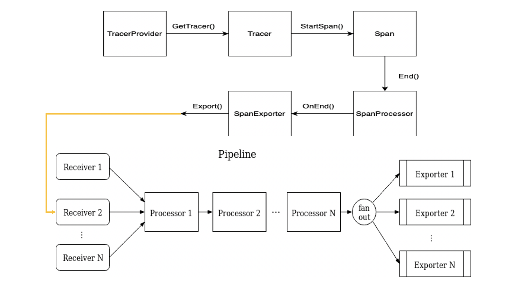

# OpenTelemetry JS SDK Components for AWS X-Ray

## Table of Contents

- [OpenTelemetry JS SDK Components for AWS X-Ray](#opentelemetry-js-sdk-components-for-aws-x-ray)
  - [Table of Contents](#table-of-contents)
  - [Architecture Overview](#architecture-overview)
    - [Components](#components)
    - [Data Path](#data-path)
  - [Usage](#usage)
  - [Repository Structure](#repository-structure)
  - [Testing](#testing)
    - [Unit Tests](#unit-tests)
    - [Integration Testing](#integration-testing)
      - [Step 1 - Configure AWS Credentials](#step-1---configure-aws-credentials)
      - [Step 2 - Install and Start the OpenTelemetry Collector](#step-2---install-and-start-the-opentelemetry-collector)
      - [Step 3 - Start JavaScript Sample Integration App](#step-3---start-javascript-sample-integration-app)
      - [Step 4 - Run Integration Tests](#step-4---run-integration-tests)
    - [Benchmarks](#benchmarks)
  - [Future Enhancements](#future-enhancements)
  - [Pull Requests Filed](#pull-requests-filed)
  - [References](#references)
  - [Contributors](#contributors)


## Architecture Overview


### Components

* AWS X-Ray IdGenerator

  * By default, OpenTelemetry is using `RandomIdGenerator` to generate 16-byte trace ID and 8-byte span ID randomly

  * In `AwsXRayIdGenerator`, we also generate 8-byte span ID randomly. But for trace ID, we first take the current time as the start time of trace, then transform the unit of timestamp from millisecond to second, finally encode timestamp to 4-byte hexadecimal string. We combine the encoded 4-byte timestamp string with randomly generated 12-byte string and get the generated trace ID

  * `AwsXRayIdGenerator` is **mandatory** for our pipeline, because AWS X-Ray will decode the first 4-byte string back to timestamp, and reject the trace data started over 30 days ago. If we use `RandomIdGenerator`, X-Ray will reject most of generated trace data

  * e.g.

    ```
    Current time is
    Mon Aug 31 2020 22:44:03 GMT-0500 (Central Daylight Time)
    
    Millisecond: 1598931843522
    
    Hexadecimal String: 5f4dc383
    
    Sample Trace ID:
    5f4da03670e8e0e63340343f13f40ea0
    ```

* AWS X-Ray Propagator

  * Cross-cutting concerns send state to next process using propagator, mainly read and write context data to and from messages exchanged by applications

  * `inject()` method first take `spanContext` from `Context`, then use the information such as `traceId`, `spanId` and `tracerFlags` held by `spanContext` to build a tracing header following AWS X-Ray standard and finally inject the tracing header into `carrier`

  * `extract()` method do the reverse thing. We first extract tracing header from `carrier`, then decompose the tracing and get the `traceId`, `spanId` and `tracerFlags`. Then we use information to build a new `spanContext` and push back to `Context`

  * Note that `carrier` is `unknown` type because it varies from protocol to protocol. For instance, if applications are using HTTP protocol, the `carrier` here is request header

  * Example `spanContext` and corresponding AWS X-Ray tracing header:

    ```
    // spanContext
      {
        traceId: 5759e988bd862e3fe1be46a994272793
        spanId: 53995c3f42cd8ad8
        traceFlags: 1
      }
      
    // Corresponding AWS X-Ray Tracing Header
    X-Amzn-Trace-Id: Root=1-5759e988-bd862e3fe1be46a994272793;Parent=53995c3f42cd8ad8;Sampled=1
    ```

* AWS X-Ray Resource Detectors
  * > A `Resource` is an immutable representation of the entity producing telemetry. For example, a process producing telemetry that is running in a container on Kubernetes has a Pod name, it is in a namespace and possibly is part of a Deployment which also has a name. All three of these attributes can be included in the `Resource`. The primary purpose of resources as a first-class concept in the SDK is decoupling of discovery of resource information from exporters.

  * To learn more about `resource` check out the [OpenTelemetry specifications page](https://github.com/open-telemetry/opentelemetry-specification/blob/master/specification/resource/sdk.md).

  * The objective of a resource detector is to provide information about the environment in which thjccncgudllkhgechujntgigdetfnblddifntvtedu
  * e process is running in. The resource detectors we implemeneted will first detect whether an application instrumented with OpenTelemetry Go SDK is running on the various environments: AWS Beanstalk, Amazon ECS, Amazon EKS, and Amazon EC2.
  
  * If the ECS resource detector successfully detects that a process is running on an ECS environment, it will populate the resource with metadata about the container the process is in. This will include the `containerID`(the docker ID of the container) and `hostName`(name of the container).
  
  * The ECS resource detector will return either an empty Resource or a Resource which is filled with metadata depending on if the application instrumented is running on the listed environments or not.


### Data Path


There are six main components in our pipeline. This is a brief overview of their functions.

* TracerProvider
  * a stateful object that holds any configuration for generating `Tracer`
  * Normally, user can instrument a global `TracerProvider` using `TracerConfig`
* Tracer
  * used to generate Span data using the configuration given by `TracerProvider`
  * `Tracer` can only inherit configuration from `TracerProvider`
  * Detailed attributes:
    * Sampler: used to do sampling for tracing data, in order to reduce the transmitting pressure and refine tracing data
    * TracerParam: define the maximum number of links, attributes and events per span
    * IdGenerator: used to generate trace ID and Span ID
    * Resources: hold the detected resource information
    * InstrumentationLibrary: record the information such as name and version for named `Tracer`/`Meter`
    * Logger: log recorder
* Span Processor (Built-in)
  * Built-in span processors are responsible for batching and conversion of spans to exportable representation and passing batches to exporters.
  * Can directly used before registering `TracerProvider`
* Exporter (Protocol-Specific)
  * Simply a data encoder and transmitter following different protocol
  * As shown in the graph, the exporter has a dash line pointing directly to backend (AWS X-Ray). Because in theory, if we have a AWS X-Ray Exporter inside JS SDK, we can take use of it and transmit our tracing data directly to AWS X-Ray
  * Since currently, there is no such component in JS SDK, we need to first transmit our data to OpenTelemetry Collector through OTLP (OpenTelemetry Protocol) Exporter. Then by Collector, we finally transmit our tracing data to AWS X-Ray
* Collector
  * The OpenTelemetry collector is a set of components that can collect traces, metrics and eventually other telemetry data (e.g. logs) from processes instrumented by OpenTelementry or other monitoring/tracing libraries (Jaeger, Prometheus, etc.), do aggregation and smart sampling, and export traces and metrics to one or more monitoring/tracing backends. The collector will allow to enrich and transform collected telemetry (e.g. add additional attributes or scrub personal information).
* AWS X-Ray
  * AWS X-Ray is a popular observability tool, providing a service that collects **tracing** data about requests that an application serves, and provides tools for a user to view, filter, and gain insights that help identify issues and opportunities for optimization
  * Users can use an X-Ray client to communicate with the X-Ray service. For any traced transaction, the user can see detailed information not only about the request and response, but also about calls that their application makes to downstream AWS resources, microservices, databases and HTTP web APIs.

In detail, the data flow in the components above is shown below:



Note that the "Pipeline" here is the internal pipeline of OpenTelemetry Collector

## Usage

See more information on how to get started in sending traces to AWS X-Ray using the JS SDK in the [getting started guide](https://aws-otel.github.io/docs/getting-started/js-sdk/trace-manual-instr).

## Repository Structure

Currently the components are seperated between the [core JS](https://github.com/open-telemetry/opentelemetry-js) and [aws-otel-js](https://github.com/aws-observability/aws-otel-js/) repos. There are issues we filed which are linked at the bottom of the README below to move all of them to the [OpenTelemetry-JS-contrib](https://github.com/open-telemetry/opentelemetry-js-contrib)


## Testing

### Unit Tests

For testing, multiple libraries were used including: `lerna`, `nock`, `sinon`, and `mocha` library.

Here's how you can use the commands in terminal to run the tests:
```bash
npm install && npm run test
```
### Integration Testing

The integration tests consists of three parts:
* [AWS Distro for OpenTelemetry Collector](https://github.com/aws-observability/aws-otel-collector)
* [AWS OpenTelmetry Test Framework](https://github.com/aws-observability/aws-otel-test-framework)
* [JavaScript Sample Integration app](https://github.com/aws-observability/aws-otel-js/tree/main/sample-apps)

Follow the steps below to run the integration tests locally:

#### Step 1 - Configure AWS Credentials
You will need to configure your AWS Credential profile yet, please follow these [instructions](https://docs.aws.amazon.com/cli/latest/userguide/cli-configure-quickstart.html) for setting up your AWS credentials.
#### Step 2 - Install and Start the OpenTelemetry Collector
The first step is to install and start an instance of the AWS OpenTelemetry Collector. The purpose of the collector here is to export trace data to AWS X-Ray.
```
git clone https://github.com/aws-observability/aws-otel-collector.git ; \
    cd aws-otel-collector; \
    docker run --rm -p 55680:55680 -p 55679:55679 -p 8889:8888 \
      -e AWS_REGION=us-west-2 \
      -v "${PWD}/examples/config-test.yaml":/otel-local-config.yaml \
      --name awscollector public.ecr.aws/aws-observability/aws-otel-collector:latest \
      --config otel-local-config.yaml; \
```

#### Step 3 - Start JavaScript Sample Integration App
The second step is to start a sample HTTP server written in JavaScript. The purpose of the app is to generate traces and send them to AWS X-Ray so that we can validate the data.
```
git clone https://github.com/aws-observability/aws-otel-js.git ; \
    cd sample-apps; \
    docker build --tag "sample-app" --file sampleapp/Dockerfile .

docker run -e LISTEN_ADDRESS=0.0.0.0:8080 \
    -e INSTANCE_ID="sample-app" \
    -e OTEL_EXPORTER_OTLP_ENDPOINT=172.17.0.1:55680 \
    -e OTEL_RESOURCE_ATTRIBUTES="aws-otel-integ-test" \
    -p 8080:8080 sample-app
```

#### Step 4 - Run Integration Tests
The last step is to clone the test framework and run the integration tests.

```
git clone https://github.com/aws-observability/aws-otel-test-framework.git

cd aws-otel-test-framework &&
    ./gradlew :validator:run --args='-c js-otel-trace-metric-validation.yml --endpoint http://127.0.0.1:8080 --metric-namespace aws-otel-integ-test -t "sample-app"
```

### Benchmarks

In our [aws-otel-js repo](https://github.com/aws-observability/aws-otel-js/), we included a series of benchmarks for the componentsand posted the results. To benchmark our components we used the [benchmarkjs library](https://benchmarkjs.com/).

The benchmarks cover the following operations:
* start-end sampled span 
* start-end un-sampled span
* start-end nested sampled spans
* start-end nested un-sampled spans
* get current span
* add attributes to span
* X-Ray trace id generator - generate trace IDs and span IDs
* X-Ray propagator - inject and extract methods

To run the benchmarks, you can run the following commands:
```bash
git clone https://github.com/aws-observability/aws-otel-js.git

cd aws-otel-js/benchmark

npm i && npm run bench
```

## Future Enhancements
* [Moving AWS X-Ray Components to JS-Contrib](https://github.com/open-telemetry/opentelemetry-js-contrib/issues/276)
* [Moving Vendor Components to Contrib](https://github.com/open-telemetry/opentelemetry-js/issues/1726)
* [Support for vendor code](https://github.com/open-telemetry/opentelemetry-js/issues/1335)
* [Attribute of resource constants](https://github.com/open-telemetry/opentelemetry-js/issues/1394)
* [Proposal for vendor-guide docs](https://github.com/open-telemetry/opentelemetry-js/issues/1422)
* Soak Tests

## Pull Requests Filed
* [Testbed README Update](https://github.com/open-telemetry/opentelemetry-collector/pull/1338)
* [IdGenerator and Propagator](https://github.com/open-o11y/aws-opentelemetry-js/pull/2)
* [AWS Beanstalk resource detector](https://github.com/open-telemetry/opentelemetry-js/pull/1385)
* [Amazon ECS resource detector](https://github.com/open-telemetry/opentelemetry-js/pull/1404)
* [Amazon EC2 resource detector](https://github.com/open-telemetry/opentelemetry-js/pull/1408)
* [Amazon EKS resource detector](https://github.com/open-telemetry/opentelemetry-js/pull/1669)
* [Update propagator and id generator to v0.13.0](https://github.com/aws-observability/aws-otel-js/pull/39)
* [Add parsing JS Exceptions to AWS X-Ray Exporter](https://github.com/open-telemetry/opentelemetry-collector-contrib/pull/1888)
* [Adding Integration Workflow](https://github.com/aws-observability/aws-otel-js/pull/34)
* [Bug Fix for AWS X-Ray Exporter](https://github.com/open-telemetry/opentelemetry-collector-contrib/pull/830)
* [Unit test for AWS X-Ray Exporter](https://github.com/open-telemetry/opentelemetry-collector-contrib/pull/390)

## References
* [ID Generator and Propagator Package location](https://github.com/aws-observability/aws-otel-js/tree/main/packages)
* [Resource Detectors Package location](https://github.com/open-telemetry/opentelemetry-js/tree/master/packages/opentelemetry-resource-detector-aws/src/detectors)


## Contributors
* [Kelvin Lo](https://github.com/Kkelvinlo)
* [Cong Zou](https://github.com/EdZou)
